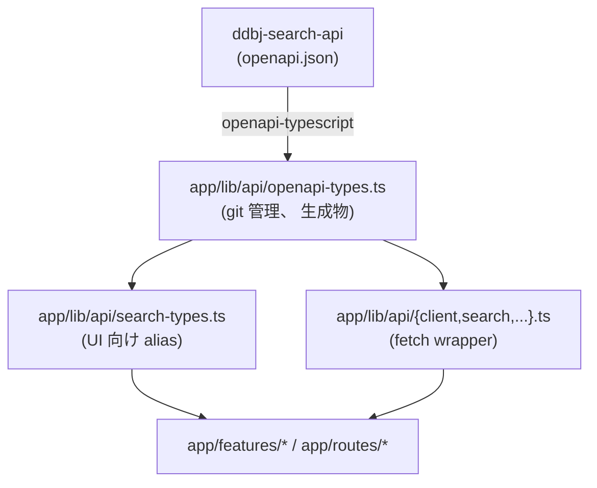
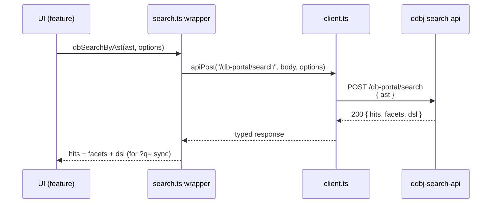
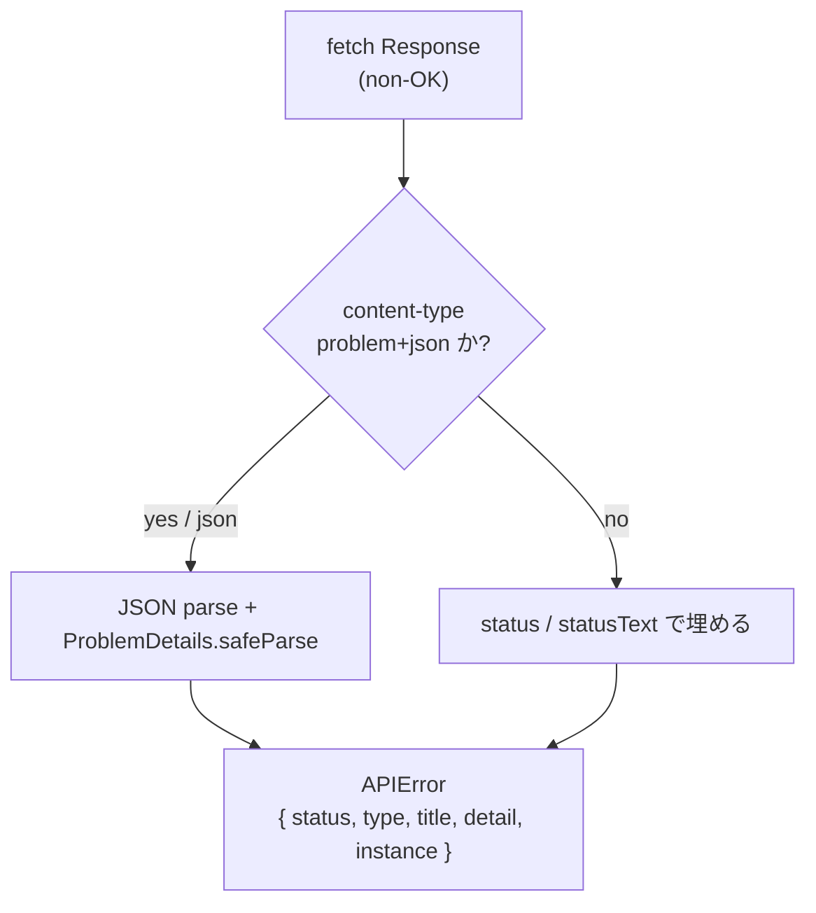

# API Types

ddbj-search-api (検索 backend) との型連携。 openapi-typescript による型自動生成、 fetch wrapper、 エラー正規化、 差分検知の運用を扱う。

## Overview

BSI は検索 backend の OpenAPI 仕様を SSOT として受け取り、 そこから派生した型 1 本で UI 層まで型を通す。 検索 AST / DSL の grammar は backend 側に閉じ込め、 BSI は AST を組み立てて HTTP で渡すだけに徹する。



生成物は `lib` zone に属し、 import 方向は [architecture.md](architecture.md) の zone 規約に従う。 BSI 側には手書きの AST / DSL 型・自前 serializer を置かない。

## openapi-typescript

検索 backend の OpenAPI 仕様を取り込んで `app/lib/api/openapi-types.ts` を上書きする pipeline。 生成は手元で行い、 生成物を git commit する。 CI で自動生成しない (理由は `## 差分検知` を参照)。

- 生成元 URL は `DB_PORTAL_OPENAPI_URL` env で切り替える
- `docker compose exec app npm run gen:api-types` で `openapi-typescript` が走る
- 出力先は `app/lib/api/openapi-types.ts` 固定
- 生成物は人間が直接編集しない (差分があればまず仕様変更を疑う)

生成型 (`paths` / `components`) は wrapper と alias 層からのみ参照する。 `app/features/*` や `app/routes/*` から直接 `openapi-types.ts` を import しない。

## 型 alias

検索 AST は backend 側の Pydantic v2 で recursive discriminator union として定義されている。 `openapi-typescript` はこれを Request 系 / Response 系の 2 系統 (`-Input` / `-Output` suffix) に分けて出力するため、 UI 層に直接見せると import が煩雑になる。 `app/lib/api/search-types.ts` がこの差を吸収する。

- UI 層は Response 系を SSOT とする 1 つの alias だけを import する
- Request 系への変換は serialize 呼び出し境界 1 箇所に閉じ込める
- ハイフン入りの生成型名 (`...-Output`) は UI 層に露出させない
- `op` discriminator で leaf / BoolOp を narrow できる形を維持する

backend 側で alias 名や suffix 規約が変わっても、 影響は `search-types.ts` 1 ファイルに閉じる。

## fetch wrapper

`app/lib/api/client.ts` は `paths` 型から operation 単位の query / requestBody / response を推論する、 型付きの fetch wrapper。 呼び出し側は path 文字列ではなく、 `app/lib/api/search.ts` 等の thin wrapper 関数を経由する。

- base URL は呼び出し側から渡す (wrapper は env を直接参照しない)
- 同一 operation の query / body / response の整合は型で保証する
- 通常コードに path string を直書きしない (補完と型推論を破る)
- 検索系の path は GET (DSL `q`) と POST (AST body) の双方が同じ形の hits / facet を返す
- POST レスポンスは入力 AST のシリアライズ済み DSL を含み、 `?q=` 同期に使える

検索 backend との 1 往復で「結果 + facet + DSL echo」 が揃うので、 client 側で serialize / parse の追加 round trip を踏まない。



## エラー正規化

HTTP エラーは `app/lib/api/errors.ts` の `APIError` クラスに揃える。 呼び出し側はこの 1 クラスだけを見れば、 HTTP status / RFC 7807 problem+json / 単なる text レスポンスの差を意識せずに済む。

- RFC 7807 `application/problem+json` を最優先で解釈する
- problem+json のフィールドが欠けたら HTTP status / statusText から埋める
- JSON でない body は status text を message に流す
- 呼び出し側は `instanceof` ではなく `isAPIError` type guard で識別する



TanStack Query の retry 規約も `APIError` を前提に組む。 query は 5xx だけ最大 2 回、 mutation は retry しない (mutation は手動再試行 UI を別途用意する)。

## 差分検知

API 仕様変更を「気付かないまま型不整合で壊れる」 のを避けるため、 生成は手元で行い、 生成物の git diff を必ず人間が見る。 この運用が成立する前提で CI 自動生成を入れない。

```bash
docker compose exec app npm run gen:api-types
git diff app/lib/api/openapi-types.ts
```

差分が出たら、 生成型を消費している wrapper / alias / feature を同一 commit で更新する。 production リリース直前の差分確認手順は [deployment.md](deployment.md) を参照。

dev / staging は staging API を共有して回す。 production リリース直前のみ production API URL で生成し直し、 staging との差分を最終確認する。

## 外向き契約

ddbj-search-api の consume 面と env の対応をここにまとめる。 個別 endpoint の I/O 形は backend 側の OpenAPI 仕様 (= `openapi-types.ts` の SSOT) で確認する。

### 利用 endpoint

`app/lib/api/search.ts` から呼ぶ ddbj-search-api endpoint は以下。 各 endpoint の query / body / response 形は `paths["..."]` から型で引く。

| Path | Method | 用途 |
|---|---|---|
| `/db-portal/cross-search` | GET / POST | cross-DB 検索 (DSL / AST 両対応) |
| `/db-portal/search` | GET / POST | per-DB 検索 (DSL / AST 両対応) |
| `/db-portal/parse` | GET | DSL → AST |
| `/db-portal/serialize` | POST | AST → DSL |

GET と POST が同形の hits / facets を返すこと、 POST が `dsl` echo を含むことは [search.md](search.md) の往復契約に従う。

### 環境変数

| 変数 | 意味 |
|---|---|
| `DB_PORTAL_OPENAPI_URL` | `openapi-typescript` の生成元 (build / dev 限定) |
| `DB_PORTAL_SEARCH_API_URL` | runtime の検索 API base URL |
| `VITE_DB_PORTAL_SEARCH_API_URL` | client zone から見える runtime base URL |

env の SSOT 規約と build-time / runtime の取り扱いは [architecture.md](architecture.md) を参照。
