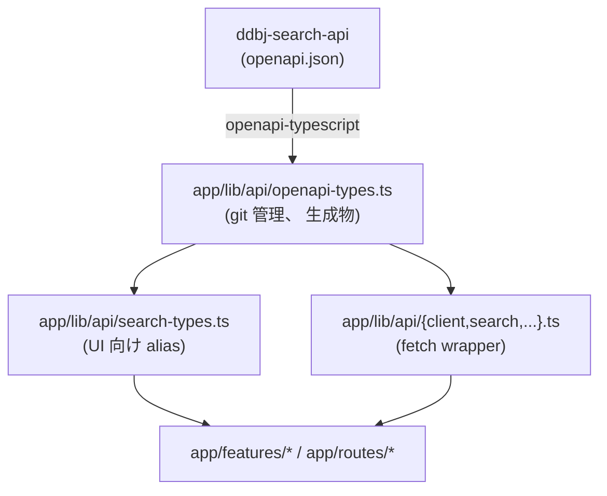
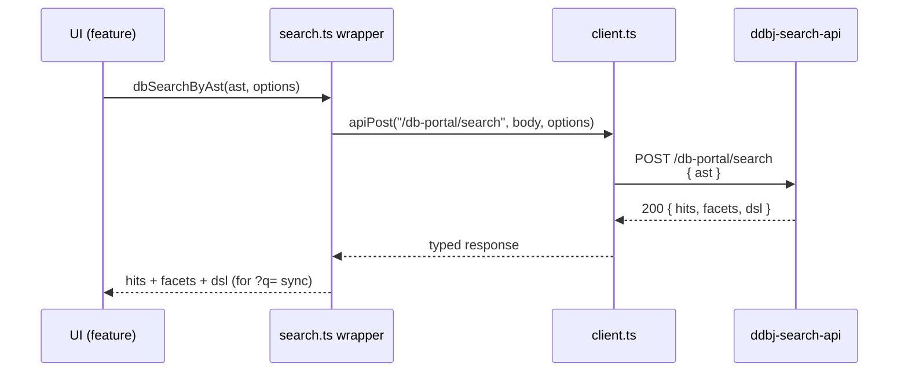
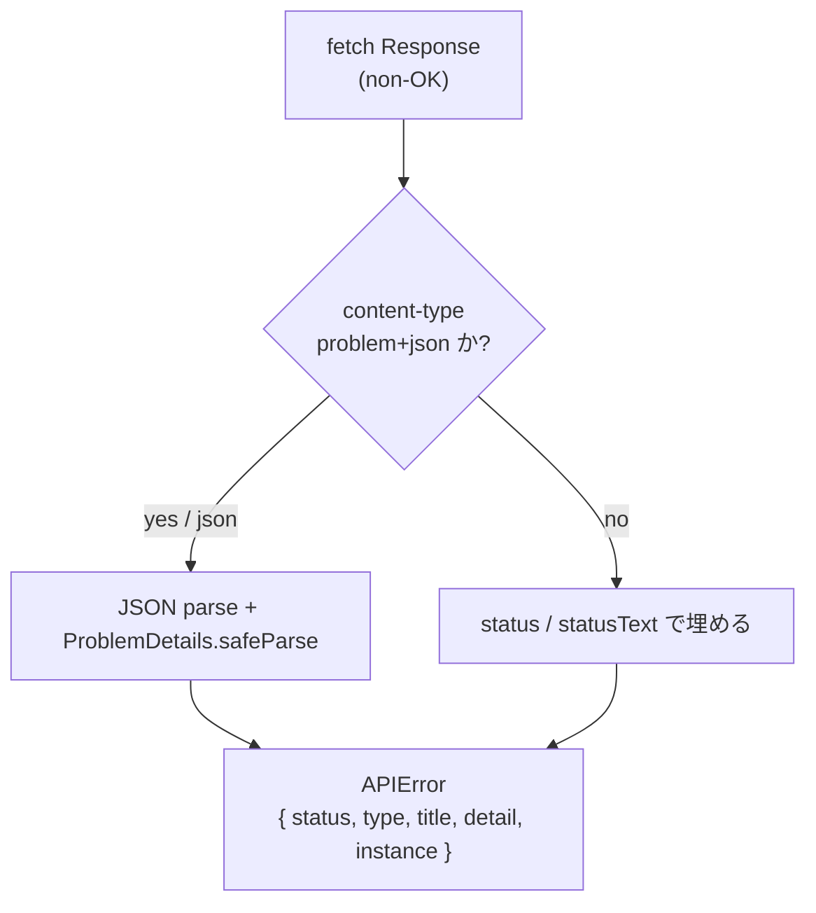

# API Types

ddbj-search-api (検索 backend) との型連携。 BSI は backend の OpenAPI 仕様を SSOT として受け取り、 派生した型 1 本で UI 層まで通す **pass-through** に徹する。 型生成、 UI 向け alias、 fetch wrapper、 エラー正規化、 そして 「手元生成 + git diff」 の運用を扱う。

## consume する endpoint

BSI は ddbj-search-api を consume するだけで、 検索 AST / DSL の **grammar 自体は backend 側に閉じ込める** ([search.md](search.md) 参照)。 BSI 側で叩く endpoint は次の 4 つに閉じる。

| Path | Method | 用途 |
|---|---|---|
| `/db-portal/cross-search` | GET / POST | cross-DB 検索 (DSL `q` / AST body 両対応) |
| `/db-portal/search` | GET / POST | per-DB 検索 (DSL `q` / AST body 両対応) |
| `/db-portal/parse` | GET | DSL → AST |
| `/db-portal/serialize` | POST | AST → DSL |

backend 型を BSI 側で扱う流れは次のとおり。



生成物は `lib` zone に属し、 import 方向は [architecture.md](architecture.md) の zone 規約に従う。 BSI 側には手書きの AST / DSL 型・自前 serializer を置かない。

## 型生成と差分検知

検索 backend の OpenAPI 仕様を取り込んで `app/lib/api/openapi-types.ts` を上書きする pipeline。 **生成は手元で行い、 生成物を git commit する** — API 仕様変更を 「気付かないまま型不整合で壊れる」 のを避けるため、 CI 自動生成を入れず、 人間が diff を読んで wrapper / alias / feature を同一 commit で更新する規律を取る。

- 生成元 URL は `DB_PORTAL_OPENAPI_URL` env で切り替える
- `docker compose exec app npm run gen:api-types` で `openapi-typescript` が走る
- 出力先は `app/lib/api/openapi-types.ts` 固定
- 生成物は人間が直接編集しない (差分があればまず仕様変更を疑う)

差分確認は次の 2 コマンド:

```bash
docker compose exec app npm run gen:api-types
git diff app/lib/api/openapi-types.ts
```

差分が出たら、 生成型を消費している wrapper / alias / feature を同一 commit で更新する。 dev / staging は staging API を共有して回し、 production リリース直前のみ production API URL で生成し直して staging との差分を最終確認する (手順は [deployment.md](deployment.md) を参照)。

生成型 (`paths` / `components`) は wrapper と alias 層からのみ参照する。 `app/features/*` や `app/routes/*` から直接 `openapi-types.ts` を import しない。

## UI 向け alias

backend の検索 AST は discriminated union として定義されているが、 `openapi-typescript` はこれを Request 系 / Response 系の 2 系統 (`-Input` / `-Output` suffix) に分けて出力する。 UI 層に直接見せると import が煩雑になるため、 `app/lib/api/search-types.ts` がこの差を吸収する。

- UI 層は **Response 系を SSOT** とする 1 つの alias だけを import する
- Request 系への変換は serialize 呼び出し境界 1 箇所に閉じ込める
- ハイフン入りの生成型名 (`...-Output`) は UI 層に露出させない
- `op` discriminator で leaf node / `BoolOp` (AND / OR / NOT) を narrow できる形を維持する

backend 側で alias 名や suffix 規約が変わっても、 影響は `search-types.ts` 1 ファイルに閉じる。

## fetch wrapper

`app/lib/api/client.ts` は `paths` 型から operation 単位の query / requestBody / response を推論する、 **型付きの fetch wrapper**。 呼び出し側は path 文字列ではなく、 `app/lib/api/search.ts` 等の thin wrapper 関数を経由する。

- base URL は呼び出し側から渡す (wrapper は env を直接参照しない)
- 同一 operation の query / body / response の整合は型で保証する
- 通常コードに path string を直書きしない (補完と型推論を破る)

backend 側の検索 endpoint は GET (DSL `q`) と POST (AST body) の双方が同じ形の hits / facets を返し、 POST レスポンスは入力 AST のシリアライズ済み DSL を含む (`?q=` 同期に使える)。 この 1 往復で 「結果 + facet + DSL echo」 が揃うため、 client 側で serialize / parse の追加 round trip を踏まない (往復契約の全体は [search.md](search.md) を参照)。



## エラー正規化

HTTP エラーは `app/lib/api/errors.ts` の `APIError` クラスに揃える。 呼び出し側はこの 1 クラスだけを見れば、 HTTP status / RFC 7807 problem+json / 単なる text レスポンスの差を意識せずに済む。

- RFC 7807 `application/problem+json` を最優先で解釈する
- problem+json のフィールドが欠けたら HTTP status / statusText から埋める
- JSON でない body は status text を message に流す
- 呼び出し側は `instanceof` ではなく `isAPIError` type guard で識別する



TanStack Query の retry 規約もこの `APIError` を前提に組む — query は 5xx だけ最大 2 回、 mutation は retry しない (mutation は手動再試行 UI を別途用意する)。

## 環境変数

| 変数 | 意味 |
|---|---|
| `DB_PORTAL_OPENAPI_URL` | `openapi-typescript` の生成元 (build / dev 限定) |
| `DB_PORTAL_SEARCH_API_URL` | server 側 (SSR / BFF) から呼ぶ検索 API base URL |
| `VITE_DB_PORTAL_SEARCH_API_URL` | client bundle に焼き込む検索 API base URL (build 時に Vite が静的置換、 runtime には変更不可) |

env の SSOT 規約と build-time / runtime の取り扱いは [architecture.md](architecture.md) を参照。
