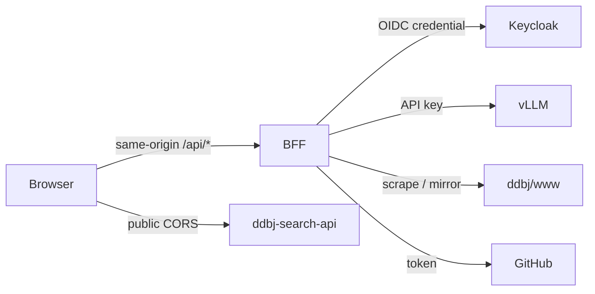
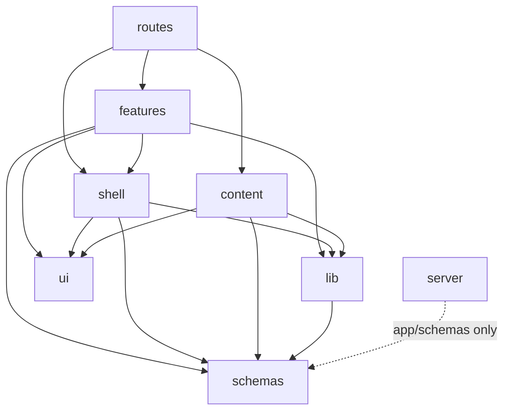

# Architecture

BSI (BioData Science Initiative) アプリ全体の構造。 ブラウザ → BFF → 外部 API の 3 段、 zone 分割と import 方向の物理強制、 SSR/CSR の経路 1 本化、 build-time と runtime の境界、 routing、 性能・セキュリティ・アクセシビリティを扱う。

## 全体構造

**ブラウザ → BFF → 外部 API** の 3 段構造を取る。 BFF (`server/`、 Backend For Frontend) が Keycloak / vLLM / DDBJ www / GitHub などの secret を要する外部接続を遮蔽し、 client (`app/`) は同一 origin の `/api/*` だけを見れば済む。 一方で public な `ddbj-search-api` はブラウザから直接呼び、 BFF を経由しない。

BFF が secret を握る規約:

- secret (Keycloak credential / LLM API key / GitHub token) を要する外部接続は BFF 経由でのみ行う
- secret を含む環境変数をブラウザ bundle に乗せない
- public な `ddbj-search-api` は client から直接呼ぶ
- 各 BFF endpoint の req / res 形は機能別 docs を SSOT とする

BFF endpoint の一覧:

| Endpoint | 機能 | SSOT |
|---|---|---|
| `/api/me` | 現在の session 情報 | [auth.md](auth.md) |
| `/api/auth/*` | OIDC ログイン / コールバック / ログアウト | [auth.md](auth.md) |
| `/api/news` | news mirror の集約レスポンス | [news.md](news.md) |
| `/api/services` | services mirror の集約レスポンス | [services.md](services.md) |
| `/api/llm/*` | LLM 検索アシスタントの SSE | [llm.md](llm.md) |
| `/api/set-lang` | 言語 cookie 更新 (303 redirect) | [i18n.md](i18n.md) |
| `/sitemap.xml` / `/robots.txt` | 検索エンジン向け外向きリソース | 本書 § sitemap.xml と robots.txt |

`app/lib/api/*` から呼ぶ ddbj-search-api の型生成・差分検知は [api-types.md](api-types.md) を参照する。

## Zone 分割

`app/` を機能単位の **zone** に分け、 zone 間の import 方向を ESLint の `import/no-restricted-paths` で物理強制する。 許可マトリクスの SSOT は `eslint.config.ts` の同 rule で、 ここに書く依存関係はその縮約。

各 zone の役割:

- `schemas` — Zod による型 + runtime validation。 他 zone に依存しない
- `lib` — 純粋ユーティリティ (HTTP wrapper / i18n runtime / content loader / query client)。 依存は `schemas` のみ
- `ui` — Tailwind primitive。 `@theme` token のみ参照
- `content` — Markdown ページ collection
- `shell` — Header / Footer / NavBar / Breadcrumb 等の画面横断 chrome
- `features` — 画面ごとの状態管理・reducer・modal
- `routes` — RR v7 framework mode の route component (薄い配線層)
- `server` — BFF (Node 専用、 `app/` の外)

許可される依存方向:

点線は例外的に許可された依存 (`server` → `app/schemas` のみ)。 zone を跨ぐ追加規約:

- `features` 同士の直接 import を禁ずる。 共通化は `lib` / `schemas` / `ui` / `shell` のいずれかに降ろす
- `app` から `server` への直接 import を禁ずる。 共用境界は `app/schemas` のみ
- `routes` は全 zone を import できるが、 ロジックを持たず薄い配線に留める
- 生 hex literal と arbitrary Tailwind value (`bg-[#...]` / `p-[3px]` 等) は `features` / `routes` / `content` で禁ずる。 色・spacing は `app/styles/tailwind.css` の `@theme` token を utility class 経由で参照する ([frontend.md](frontend.md))

## SSR-CSR 境界

React Router v7 framework mode (`ssr: true`) で **SSR + hydration** する。 同じ `app/` モジュールが Node とブラウザの両方で実行される前提のため、 DOM / `window` / `localStorage` に触れる処理は `useEffect` か client guard に閉じ込める。

どのフェーズでも import 可能な範囲は `app/` のみで共通。 ランタイムの違いは **外部 I/O 経路** にだけ現れる。

| 実行フェーズ | ランタイム | 外部 I/O 経路 |
|---|---|---|
| Server render | Node | `server/` へは `fetch(/api/*)` 経由 |
| Loader / Action (初回 SSR) | Node | `server/` へは `fetch(/api/*)` 経由 |
| Loader / Action (CSR navigate) | ブラウザ | `fetch` で `/api/*` を直接叩く |
| Client hydration | ブラウザ | ブラウザ API 限定 |

規約:

- Loader は SSR / CSR で 1 本化する。 `clientLoader` を別宣言しない
- 同一プロセス上でも `app/` から BFF を呼ぶときは `fetch(new URL("/api/...", request.url))` を経由し、 zone 境界を物理的に守る
- `app/schemas` は `app` と `server` の双方から import 可。 BFF の整形と client の表示で同一 schema を共有する

## Build-time と runtime

build artifact に確定するものと、 起動時 / リクエスト時に決まる状態を分ける。 **secret は build artifact に決して入れず、 すべて runtime で env から読む**。

build 時に確定:

- API 型 (`app/lib/api/openapi-types.ts`) — `npm run gen:api-types` で生成し commit する ([api-types.md](api-types.md))
- Content collection (`app/content/**/*.content.tsx`) — `import.meta.glob` で列挙し Zod schema で eager validate。 1 件でも parse 失敗すれば build を落とす ([content.md](content.md))
- i18n リソース (`app/lib/i18n/resources/{ja,en}.ts`) — 静的 import。 キーセット乖離は PBT で検出する ([i18n.md](i18n.md))
- Tailwind utility class — `@theme` block + JSX を Vite が走査し、 必要な class のみ出力する

runtime に確定:

- 環境変数 — 起動時に Zod schema (`server/lib/env.ts`) で validate し、 違反すれば server を起動しない。 各機能 docs は変数名と意味の表だけを持ち、 default 値や型宣言を二重に書かない
- BFF session store — in-memory。 プロセス再起動で揮発 ([auth.md](auth.md))
- News / Services mirror cache — disk persist。 起動時に再 load する
- LLM health 状態 — server memory に保持する

Client bundle と server bundle の secret 境界は接頭辞で区別する:

- server-only env は `DB_PORTAL_*`、 client-visible env は `VITE_DB_PORTAL_*`
- `DB_PORTAL_*` から `VITE_DB_PORTAL_*` への派生は `compose.yml` で行い、 secret 変数を派生先に含めない

## Routing

`app/routes.ts` が URL 全構造の SSOT。 URL から言語識別子を排除し、 BFF endpoint と client route の優先順序は `server/index.ts` の mount 順で決まる。

- URL は lang 中立とする。 言語は cookie で決まる ([i18n.md](i18n.md))
- 各 DB の解説ページや汎用 static page は `routes/page-content/route.tsx` の **catch-all** (`/*`) が引き受け、 path は `app/content/` collection 内の path に一致させる
- `/auth/*` の client route は BFF (`server/auth/routes.ts`) が 302 で抜けるため通常到達しないが、 Keycloak 側 redirect_uri 設定の fallback として保持する
- `/api/set-lang` は唯一の action 持ち resource route。 lang cookie 更新後 303 redirect で Referer に戻す
- BFF endpoint (`/api/me` / `/api/news` / `/api/services` / `/api/llm/*` / `/api/auth/*`) は `server/index.ts` で個別 mount し、 RR catch-all より優先する
- design preview (`/_design/*`) は `NODE_ENV !== "production"` のときだけ含める ([frontend.md](frontend.md))

### Route handle

各 route component module の `export const handle` で **静的 metadata** を宣言する。 loader 実行を起こさず `useMatches` から走査でき、 SSR / CSR で同値が取れる。 breadcrumb / document title / i18n 充足度などの cross-cutting metadata を route module から取り出す機構。

- breadcrumb / document title は static segment と dynamic resolver の 2 系統。 resolver dict は `app/shell/` 内で組み立てる
- en リソースに対応キーが無い page は `handle.i18n.en` を `partial` または `missing` に立てる。 立てない page は en complete と看做す ([i18n.md](i18n.md) § handle.i18n.en)
- handle key 一覧の SSOT は各 route file の `export const handle`

### エラー境界

該当 route が存在しない、 または loader が `throw new Response("Not Found", { status: 404 })` を投げたケースは `app/root.tsx` の `ErrorBoundary` が 404 専用 UI に落とす。 5xx も同 `ErrorBoundary` が generic 表示に落とし、 stack trace は env を問わず UI に出さない。

## 性能

体感に直結する 3 指標を目標値として持ち、 staging での実測を Playwright e2e から取得する。

| 指標 | 目標 |
|---|---|
| LCP (top / 検索結果) | < 2.5 s |
| TTFB (SSR) | < 600 ms |
| 検索 API → 結果描画 (95p) | < 2 s |

達成手段:

- Vite + React Router framework mode による route 単位 code splitting
- Tailwind v4 の CSS optimization
- Noto Sans JP Variable の self-host + `font-display: swap`
- 画像 lazy loading (``)
- TanStack Query の `staleTime` チューニング

計測は Playwright e2e で `performance.getEntriesByType("navigation")` を取り、 staging で複数試行の平均を取る。

## セキュリティ

全 HTTP response に security header を付与する (`server/lib/security.ts`)。 CSP の directive 値の SSOT は `buildCspHeader`。

- `Content-Security-Policy` — `script-src` は `'self'` + per-request nonce のみで `'unsafe-inline'` を持たない。 `style-src` は Tailwind v4 の inline style 出力のため `'unsafe-inline'` を含める。 `frame-ancestors` は `'none'`、 `connect-src` には `ddbj-search-api` origin を実行時に動的付与する。 dev 環境では CSP ヘッダ自体を送出しない
- `Strict-Transport-Security` — production のみ
- `X-Frame-Options` / `X-Content-Type-Options` / `Referrer-Policy` — 全 response に付与

CSP nonce の流通経路:

- per-request に生成し `res.locals.cspNonce` を経由して root loader から `<Scripts>` / `<Links>` に渡す
- inline script は nonce 経由で許可し、 `'unsafe-inline'` を `script-src` に置かない

## アクセシビリティ

WCAG AA 相当を **token 段階で担保** し、 primitive ごとに上書きしない。 視覚チェックは `/_design` route、 自動検査は primitive 単位の `vitest-axe` で行う ([frontend.md](frontend.md) § アクセシビリティ)。

- 色コントラストは `@theme` token の段階で AA を満たす
- focus ring は `*:focus-visible` に global 適用し、 primitive 単位で上書きしない
- 全画面 keyboard 操作可。 modal は focus trap を持つ
- `<html lang>` を動的出力する ([i18n.md](i18n.md))
- e2e への axe 統合は採用しない (primitive 単位 unit test で十分とする)

## sitemap.xml と robots.txt

検索エンジン向けの外向きリソース。 dev / staging では索引させず、 production のみ全面開放する。

- `GET /sitemap.xml` (`server/api/sitemap.ts`) — content collection + 静的 route について `?lang=ja` / `?lang=en` 2 URL を出力し、 hreflang を相互宣言する ([i18n.md](i18n.md))
- `GET /robots.txt` (`server/api/robots.ts`) — production は全許可 + Sitemap、 dev / staging は全 disallow
