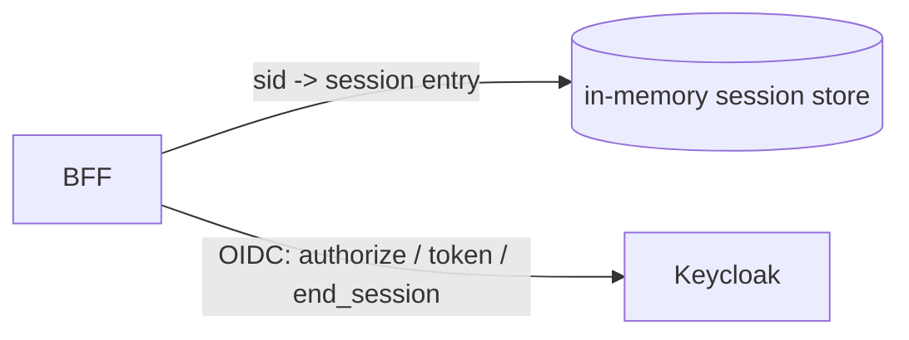

# Authentication

DDBJ Account (Keycloak) との OIDC 連携。 BFF + HttpOnly cookie パターンでブラウザ側 JS を token から完全に分離する。

## Overview

ブラウザは不透明な session id (`sid`) を持つ HttpOnly cookie だけを受け取り、 BFF (Express) は受け取った id_token のみ in-memory session store に保持し、 access token / refresh token は受け取った直後に破棄する。 Keycloak とのやりとり (authorize / token / end_session) は BFF を経由し、 React Router の loader / component は OIDC の生 protocol を知らない。 BFF が secret を遮蔽するという全体パターンは [architecture.md](architecture.md) を SSOT とし、 ここでは Keycloak 依存と session store だけを示す。



BSI は read-only で mutation API を持たないため、 CSRF 防御は cookie の `SameSite=Lax` と OIDC `state` の二段だけで成立する。 token をブラウザに出さないので XSS が起きても token は漏れず、 cookie 単独でも `HttpOnly` のため JS から読めない。

## BFF と client の境界

OIDC の code 交換・id_token 検証・cookie 発行・logout は BFF (`server/auth/`) に閉じ、 React Router 側は cookie を持って `/api/me` を叩くだけにする。 これは Keycloak 側 `Valid Redirect URIs` を React Router の routing 変更から独立させ、 SPA bundler の bug や JS 無効環境でも認証 flow が破綻しないためのレイヤ分離である。

- OIDC endpoint と URL は `server/auth/routes.ts` を SSOT とする
- `app/routes/auth/{callback,silent-callback,logout-callback}.tsx` は BFF を素通りした直叩きや 5xx 時の fallback page。 loader を持たず、 ホームへの link を表示するだけ
- client side helper (login URL の組み立て・`returnTo` validation) は `app/lib/auth/login-url.ts` に集約する
- React Router loader から認証状態を見たいときは `loadAuth(request)` 経由で BFF `/api/me` に `Cookie:` ヘッダを転送する。 `app` から `server` を直接 import しない

## OIDC PKCE フロー

Authorization Code + PKCE (S256) を BFF が完結させる。 login で生成した `state` / `code_verifier` / `nonce` / `returnTo` は pending store に積み、 callback で `state` を **1 回限り take** する。 二度取りや存在しない state は 400 で打ち切り session を作らない。

```mermaid
sequenceDiagram
  participant B as Browser
  participant S as BFF (server/auth)
  participant K as Keycloak
  B->>S: GET /api/auth/login?return_to=...
  S->>S: PKCE / nonce / state を生成し pending store へ
  S-->>B: 302 to Keycloak authorize (S256, nonce, state)
  B->>K: authorize (login UI)
  K-->>B: 302 to /api/auth/callback?code=...&state=...
  B->>S: GET /api/auth/callback
  S->>S: pending store から state を 1 回限り take
  S->>K: POST token endpoint (code + code_verifier)
  K-->>S: id_token + access_token
  S->>S: id_token claim 検証 / session 発行
  S-->>B: Set-Cookie sid; 302 returnTo
```

logout は `/api/auth/logout` から `end_session_endpoint` に `id_token_hint` 付きで 302 して Keycloak の confirm 画面を skip し、 `/api/auth/logout-callback` で session 削除と cookie clear を行う。 詳細な endpoint・status code・error 識別子は `server/auth/routes.ts` を参照。

## Cookie

session は `sid` という名前の cookie としてブラウザに渡す。 値は session id の不透明な乱数だけで、 token そのものや user info は一切載せない。 真の expiry は server 側の session TTL が持ち、 cookie は session cookie (`Max-Age` 無し) のままブラウザを閉じれば消える運用とする。 属性値の SSOT は `server/auth/cookie.ts`。

満たすべき security 要件:

- JS から cookie 値を読めない (XSS で token を露出させない)
- cross-site POST から起動する CSRF 経路を遮断する (mutation API は持たないが、 防御は二重に持つ)
- staging / production では平文 HTTP に流れない (dev は http のため例外)
- sub-path 限定にせず portal 全体の navigation で同 session を共有する

## Session

session entry は `idToken` (logout の `id_token_hint` 用) と userInfo (`sub` / `name` / `email`) と `expiresAt` だけを持つ。 access token / refresh token は BSI 側の用途がないため保持しない。 TTL は sliding (アクセスのたびに延長) で、 期限切れ entry は定期 cleanup で破棄する。

- session 全体を log に出さない。 debug log は `sub` / `name` まで
- credential 系 key の redaction は `server/lib/log.ts` の `redact` が担い、 規約は [llm.md](llm.md) § PII redaction に集約
- in-memory 単一プロセス前提。 多プロセス化する場合は store を共有 store (Redis 等) に差し替える
- TTL / cleanup 間隔の数値は `server/auth/session-store.ts` を SSOT とする。 TTL のみ `DB_PORTAL_AUTH_SESSION_TTL_SECONDS` で上書き可、 cleanup 間隔は hardcode

## id_token 検証

id_token は BFF と Keycloak の TLS 直接通信 (token endpoint) で受け取るため、 OIDC Core-6 のとおり JWT signature 検証は TLS server validation で代替する。 payload claim の検証は BFF が必ず行い、 fail なら callback を 400 で打ち切り session を作らない。

- 検証対象 claim (`iss` / `aud` / `exp` / `iat` / `nonce` 等) と検証ロジックは `server/auth/oidc.ts` が SSOT
- `email` は OIDC 上 optional な claim。 未提供のまま session に持ち、 placeholder で埋めない
- `nonce` は login 時に生成した値と完全一致を要求し、 token replay を遮断する

## URL state

login flow を貫通する一時 state は OIDC `state` と `returnTo` の 2 種類で、 どちらも server 側で独立に検証する。 client helper を経由しない直叩き (`/api/auth/login?return_to=//evil` を手書きで踏ませる等) を server 側で必ず遮断するため、 client / server の二重防御を維持する。

- OIDC `state` は authorization request と callback を結ぶ CSRF token。 login で乱数生成 → pending store へ → callback で take の流れで、 攻撃者が用意した callback を被害者に踏ませても拒否する
- `state` の take 失敗 (存在しない / 期限切れ / 二度取り) は callback を 400 で打ち切る
- `returnTo` は同一 origin の絶対パス (`/` 始まり、 `//` や `/\` を含まない) のみ受理する。 違反は `/` に正規化する
- 検証は client helper (`app/lib/auth/login-url.ts`) と server handler (`server/auth/return-to.ts`) で **独立に** 適用する
- BFF 宛先 origin は `request.url` ではなく env `DB_PORTAL_PORTAL_ORIGIN` から取り、 `Host:` ヘッダ改竄による `/api/me` 転送先逸脱を防ぐ
- client IP に依存する機能 ([llm.md](llm.md) rate limit 等) のため、 reverse proxy 越し deploy では Express の `trust proxy` を上流段数に合わせる

## `/api/me` と useAuth

ブラウザ側の認証状態は `GET /api/me` という 1 本の endpoint に集約する。 cookie の `sid` から session を引き、 有効なら 200 + `{ user: UserInfo }`、 cookie なし / session 期限切れなら 401 + `{ error: "unauthorized" }` を返す。 ブラウザ側は id_token を decode せず、 user 情報は常に server 経由で受け取る。

- response は `Cache-Control: no-store`。 client 側 cache は TanStack Query の `staleTime` で制御する
- `useAuth` は `/api/me` の状態を `loading` / `unauthenticated` / `authenticated` の 3 値に正規化する
- `<RequireAuth>` は `unauthenticated` 時に `buildLoginUrl(location.pathname + location.search)` へ navigate する
- 言語選択は cookie で維持されるため、 `/api/auth/login` / `/api/auth/logout` は言語非依存 path に置く ([i18n.md](i18n.md))

## Keycloak realm と client

BSI 側から見た Keycloak の前提を固定する。 dev / staging は同じ realm を共有して client を env 別に分け、 production は完全に独立した realm とする。 client は public type + PKCE 強制で、 client secret を保持しない。

| 項目 | 設定 |
|---|---|
| Client Protocol | `openid-connect` |
| Access Type | `public` (PKCE で代替、 client secret なし) |
| Standard Flow | ON |
| Implicit / Direct Access Grants / Service Accounts / Authorization | OFF |
| PKCE Code Challenge Method | `S256` 強制 |
| Front Channel Logout | OFF |
| Backchannel Logout URL | 空 (BFF が `end_session_endpoint` を直叩き) |

`Valid Redirect URIs` / `Valid Post Logout Redirect URIs` / `Web Origins` はワイルドカード `*` を使わず、 env ごとに `<DB_PORTAL_PORTAL_ORIGIN>` 配下の BFF endpoint を完全一致で登録する。 production client の redirect URI に staging origin を含めない (逆も同様)。 silent renew (iframe) は採用しないので 3rd-party cookie に依存しない。

要求 scope は `openid` / `profile` / `email` の 3 つに固定し、 `offline_access` は要求しない。 realm の "Client Scopes" でこの 3 scope を client の Default Client Scopes に紐づける。

BSI は `id_token` のみ保持する (`id_token_hint` 用途) ため、 Access Token / Refresh Token Lifespan は BSI 動作に影響せず realm 全体ポリシーに従う。 BSI session の実効 TTL は env `DB_PORTAL_AUTH_SESSION_TTL_SECONDS` が独立に管理し、 Keycloak の `Client Session Idle` と揃える。

## 外向き契約

BFF が公開する HTTP endpoint と、 認証で利用する環境変数を集約する。 endpoint の path・status code・redirect 先・error 識別子の SSOT は `server/auth/routes.ts`。

### HTTP endpoint

| Endpoint | 用途 | 主な response |
|---|---|---|
| `GET /api/auth/login` | login 開始。 `return_to` を受け、 Keycloak authorize へ 302 | 302 to Keycloak |
| `GET /api/auth/callback` | code を id_token に交換、 sid を Set-Cookie、 returnTo へ 302 | 302 to returnTo / 400 |
| `GET /api/auth/logout` | `end_session_endpoint` へ `id_token_hint` 付きで 302 | 302 to Keycloak |
| `GET /api/auth/logout-callback` | session 削除 + cookie clear、 home へ 302 | 302 to `/` |
| `GET /api/me` | session を引き user 情報を返す | 200 `{ user }` / 401 |

`/api/me` の response shape は `app/lib/auth/types.ts` の `MeResponse` schema (Zod) を SSOT とする。 server 側 (`server/auth/routes.ts`) は zod schema を持たず TS type のみで同 shape を返し、 ブラウザ側で `MeResponse.parse` により再検証する。

### 環境変数

| 変数 | 意味 |
|---|---|
| `DB_PORTAL_KEYCLOAK_REALM_URL` | Keycloak realm URL。 `id_token.iss` 検証にも使う |
| `DB_PORTAL_KEYCLOAK_CLIENT_ID` | client ID。 `id_token.aud` 検証にも使う |
| `DB_PORTAL_PORTAL_ORIGIN` | BSI 自身の origin。 redirect_uri と `/api/me` 転送先の SSOT |
| `DB_PORTAL_AUTH_SESSION_TTL_SECONDS` | session sliding TTL |
| `DB_PORTAL_TRUST_PROXY` | Express `trust proxy` 設定 (reverse proxy 段数) |
| `DB_PORTAL_E2E_USER_PASSWORD` | e2e 用テストユーザーの password (staging のみ) |

env 切替の方針は [development.md](development.md)、 環境ごとの実値は `.claude/docs/credentials.md` / `.claude/docs/deployment.md` を参照する。
