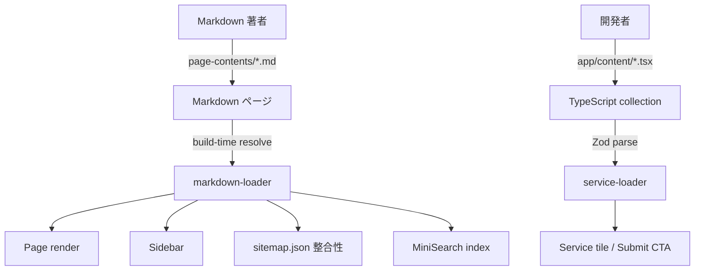
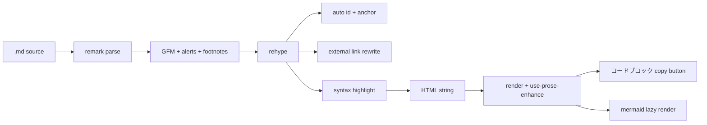
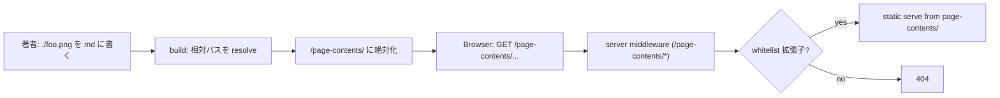
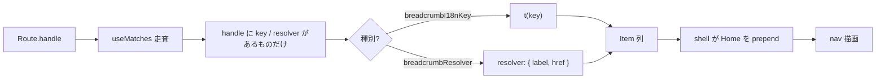
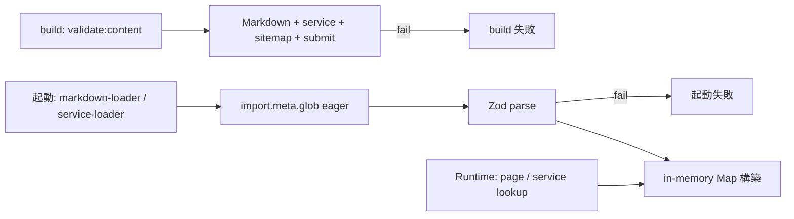

# Content

サイト内のコンテンツ系統 (Markdown ページ + TypeScript collection) と、 Sidebar / Breadcrumb / sitemap-loader の組み立て規約。 lastUpdated 運用と全文検索の境界もここで扱う。

## Overview

コンテンツは「読み物」 と「データ的に並べる要素」 を別系統で扱う。 前者は Markdown、 後者は TS で書くことで、 編集者 (非エンジニア) と開発者の境界を物理的に分ける。



Markdown ページの URL は `page-contents/<path>/index.md` → `/<path>` で素直に対応し、 著者にカテゴリ付けを要求しない。 **フォルダ構造が唯一の分類軸**。 frontmatter は `title` と `description` だけ。 更新日や外部リンク表を frontmatter に詰め込まない。

## Content collection

`app/content/` 配下は Service tile と submit feature の外部 CTA リンクを 1 collection に束ねた TypeScript ソース。 フィールドの形と検証規則は `app/schemas/content/service-content.ts` の Zod schema が SSOT。 外部サービス一覧 (DDBJ / DBCLS) は別系統で、 services mirror が担う ([services.md](services.md))。

- 1 ファイル = 1 Service。 `*.content.tsx` 形式で `app/content/services/` 以下に配置する
- collection は起動時に `import.meta.glob` で eager load + Zod parse する。 1 件でも失敗すれば起動が止まる
- collection の参照は `loader` 経由のみ。 features / shell から直接 import しない

## Markdown パイプライン

`app/lib/content/markdown-pipeline.ts` の unified pipeline で Markdown → HTML を生成する。 採用プラグインの並びは実装が SSOT。 ここでは外向き保証だけ示す。



外向きに保証するもの:

- GFM 拡張 (テーブル、 取り消し線、 タスクリスト、 脚注、 GitHub blockquote alerts `> [!NOTE]` 等)
- コードブロックのシンタックスハイライト
- 見出しに自動 `id` とアンカーリンク
- 外部リンクに `target="_blank" rel="noopener noreferrer"` を自動付与
- 本文中の生 HTML (`` 等) を hast の Element として扱う

Markdown HTML のスタイルは `app/styles/tailwind.css` の `.prose-bsi` が SSOT。 `@tailwindcss/typography` の `prose` をベースに BSI デザイントークンで上書きし、 `max-width` は `content-narrow` で中央揃え。

クライアント側拡張は `app/lib/content/use-prose-enhance.ts` が hydration 後に DOM を走査して付ける。 コードブロックのコピーボタン (hover で右上に出現、 クリックでフィードバック) と、 ` ```mermaid ` ブロックを SVG に lazy load で描画する 2 つ。

## Asset 配信

著者は `.md` の隣 (同 dir / サブ dir) に画像 / PDF を置き、 相対パスで参照する。 著者は public/ 階層を意識せず、 ページ単位で asset が完結する。



- 相対パス (`./foo.png` / `subdir/foo.png`) は build 時に md dir 基点で絶対 path 化される (`/page-contents/<full path>`)
- 外部 URL (`https://...`)、 root-relative (`/foo.png`)、 anchor (`#...`)、 `mailto:` / `tel:`、 ページ間リンク (拡張子なし) は触らない
- 配信は `server/index.ts` の `/page-contents/<asset>` middleware で `page-contents/` から static serve
- 配信対応の拡張子 whitelist は `server/index.ts` の `PAGE_ASSET_EXTENSIONS` が SSOT。 whitelist 外は 404。 `.md` 本文や非対応ファイルは露出しない
- dev / prod とも同じ middleware
- 未解決の相対参照 (`./not-exist.png` 等) は **build 時エラー** で fail-fast

ページ間リンクは絶対パス (`/databases/dra` 等) で書く。

## Sidebar

全 content ページ (`/docs` 直下 と `databases/:slug`) で共通の左サイドバーを使う。 操作モデルは Confluence / Notion 型 — キャレットは展開専用、 名前リンクは navigate + 自動展開という意図区別を持つ。

操作:

- キャレット `▸ / ▾` (dir 行先頭) click → 展開 / 折りたたみのみ
- ノード名リンク click → そのページを開く + 自動展開
- `# {h2Count}` トグル (h2 を持つ dir / doc) click → そのページの h2 一覧を行の下に inline 展開
- 見出し行 click → `/path#anchor` に遷移 (同ページならスクロール)

### 設計判断

- `category` 行は **描画しない**。 子をトップレベルに並べ、 グループ間は余白だけで区切る (情報密度優先)
- フォルダ / ドキュメント種別のアイコンを使わない。 種別はキャレットの有無で識別する
- ネスト表現は左の縦ガイドライン (`border-l border-border-soft`) で行う
- アクティブページ / アクティブ見出しは brand 系トークン (`border-l-2 border-brand` 等) でハイライト
- 上部にツリー内絞り込み入力 (debounce 付き)。 マッチしないノードは隠し、 マッチした doc の親 dir は自動展開して残す
- h2 は `#` トグル経由で tree に統合する。 h3 以下は本文ページに頼り、 sidebar には載せない

### ノード種別

`app/lib/content/content-tree.ts` が `listAllPages()` からセクション別にグループ化したツリーを起動時に 1 度構築してキャッシュする。 `_dev/` セクションは除外する。

| 種別 | URL を持つ | 子ノード |
|---|---|---|
| `category` | 持たない (UI 非描画) | dir / doc を束ねる |
| `dir` | 持つ (`index.md` がページ実体) | doc を持てる |
| `doc` | 持つ | 持たない |

## Breadcrumb

Content 側に breadcrumb を **書かない**。 Route handle に i18n キー (static) または resolver 名 (dynamic) を持たせ、 `app/lib/content/breadcrumb.ts` の `useBreadcrumb` が `useMatches` を走査して構築する。 shell (`app/shell/breadcrumb.tsx`) は hook 結果を `<nav aria-label>` で wrap するだけ。



handle の 2 系統:

| handle | ラベル解決 | 用途 |
|---|---|---|
| `breadcrumbI18nKey: "breadcrumb.databases"` | `t(key)` | 中間 segment (static) |
| `breadcrumbResolver: "database-content"` | resolver dict から関数を引いて `{ label, href }` | 末尾 segment (dynamic) |

不変量:

- `useMatches` を順に走査し、 handle に `breadcrumbI18nKey` か `breadcrumbResolver` を持つ match だけを処理する
- 未定義の i18n キーは item を skip せず、 i18next default に従いキー文字列をラベルとして返す (dev で早期に気付かせる)
- resolver が `null` を返した match は item を生やさない
- hook が返すのは **handle 由来の item 列のみ**。 Home entry は shell の wrapper が prepend する
- prepend 後の合計が Home のみ (handle item 0 件) のとき何も render しない

resolver は features / lib のヘルパに依存しない。 shell 側で `app/lib/content/loader` の database / service lookup を直接読んで組み立てる。

## Sitemap

`/docs` 上の「目次 (サイトマップ)」 ブロックは **`page-contents/sitemap.json` を SSOT** とする手書き構造。 `content-tree.ts` の自動派生は使わない。 dir 構造の alphabetical sort では意図した順序とグループ分けが表現できず、 外部リンク行も並べられないため。

- セクションは `sections[]` の順序どおりに描画する (sort なし)
- 各 item は `kind: "internal" | "external"` の discriminated union
  - `internal` は `path` だけ持ち、 ラベルは `page-contents/` の frontmatter `title` から合流する
  - `external` は `url` と `label.{ja,en}` を JSON 側で持ち、 外部リンクアイコン付きで描画する
- 各 section は `id` を持ち React key として固定する
- スキーマと loader は `app/schemas/content/sitemap.ts` / `app/lib/content/sitemap-loader.ts` が SSOT

### 双方向 orphan 検査

`sitemap.json` は module-load 時に次を検証して throw する:

- JSON 内の `internal.path` が `page-contents/` の page と一致しない → エラー
- `page-contents/` の page (`_dev` 除く) が JSON のどこにも参照されていない → エラー
- 同一 `internal.path` が複数 section に出現 → エラー
- `section.id` の重複 → エラー

これで「ページ追加 = `sitemap.json` 更新」 が強制される。 sidebar / 検索は自動派生で網羅されるが、 サイトマップは恣意的に並べる以上、 追加忘れを CI で止める。

## lastUpdated

各 `.md` の最終更新日時は build 時に `git log -1 --format=%cI -- <file>` で取得し、 `{ urlPath: ISO8601 }` の JSON を生成して `markdown-loader.ts` から合成する。 `PageContent.lastUpdated?: string` として page lookup の戻り値に乗る。 著者は frontmatter に日付を書かない — git commit が日付の SSOT。

- 生成スクリプト: `scripts/gen-last-updated.ts`
- 出力: `app/lib/content/gen/last-updated.json` (gitignore 対象、 build 成果物)
- 起動: `package.json` の `dev` / `build` の前段に `gen:last-updated` を挟む
- CI: `.github/workflows/ci.yml` の `actions/checkout` に `fetch-depth: 0` を設定する (shallow clone では古いコミット履歴を引けない)
- 取得失敗時は `lastUpdated` を `undefined` とする。 UI は「更新日不明」 として扱う

## TOC と h2 anchor

各 h2 見出しは `/<page>#<anchor>` の個別 URL を持つ。 anchor の slug 規約は `rehype-slug` + `github-slugger` (GitHub 風) を採用し、 本文 HTML の `<h2 id>` と TOC の `id` が一致することを `app/lib/content/heading-extractor.ts` が保証する。 TOC の出力は Sidebar の h2 inline 展開と、 全文検索の section 単位 doc の両方で再利用される。

## 全文検索

`/docs` の全文検索インデックスは `app/lib/content/search-index.ts` が MiniSearch でクライアントサイドに構築する。 ja / en 別にインデックスを持ち、 title (boost 3) > description (boost 2) > body (boost 1) でランク付けし、 prefix 検索と fuzzy 検索に対応する。

`/docs` ハブは `?q=` の有無で `mode = "map" | "search"` の 2 状態を URL から導出する。 SearchBox に入力すれば `?q=xxx` で search に入り、 空にすれば map に戻る。 状態を URL に持つので reload / shareable / ブラウザの戻るが効く。

- index の粒度はページ単位 doc と h2 セクション単位 doc を同一 index に混在させ、 `kind: "page" | "section"` で識別する
- section hit は親ページタイトル + 見出しピル + section スニペットを 1 行にまとめ、 `/page#anchor` に直接ジャンプする
- 1 ページあたり section hit は最良 score の 1 件に集約する
- スニペットは UI 側の `<Mark>` primitive でハイライトし、 `dangerouslySetInnerHTML` を使わない

## TSX fragment の zone 境界

`app/content/` 配下の TSX ファイル (`services/*.content.tsx` 等) は content zone に属し、 import 可能範囲を ESLint `no-restricted-paths` で物理強制する。 Markdown ページ (`page-contents/`) には適用されない (そもそも TS でない)。

- `content` zone は `ui` / `lib` / `schemas` / `content` を import 可
- `features` / `shell` への import は禁止

content fragment が features / shell の関数を呼ばないことで、 collection は副作用なく Zod parse 可能になり、 起動時の eager load が安全に終わる。

## i18n の境界

i18n の実体は [i18n.md](i18n.md) が扱う。 content 側で守るべき境界だけここに置く。

- Markdown ページ: `index.md` = 日本語 (デフォルト)、 `index.en.md` = 英語。 各ファイルはモノリンガル。 `index.en.md` が存在しない場合、 日本語にフォールバック + 翻訳未提供バナーを表示する
- TypeScript collection (`ServiceContent` 等): `{ ja, en }` 構造で各フィールドに ja / en の両方を持たせる。 一方が欠けるとき null を許容するかは schema で個別に決める
- `/docs` ハブの UI 文言: i18n namespace は `docs.*`。 ja / en 同一キーセットの不変量は [i18n.md](i18n.md) が SSOT

## Build と runtime の境界

content 系の Zod parse は **すべて build 時か起動時に終わる**。 Runtime に parse overhead を残さない。



| フェーズ | 何が起きるか |
|---|---|
| Build 時 | `validate:content` が Markdown ページ + service collection + sitemap.json + submit-routing catalog を Zod parse、 1 件でも失敗で fail |
| 起動時 | `markdown-loader` / Service collection の `loader` が `import.meta.glob` で eager load + Zod parse、 1 件でも失敗で起動失敗 |
| Runtime | page lookup / service lookup は in-memory の Map から引く (起動時に 1 度だけ初期化) |

`npm run dev` / `npm run start` / `npm run build` の前段で `npm run validate:content` を必ず通すことで、 collection 不整合を起動前に検出する。

## Routing

`/docs` ハブと `databases/:slug` 等の content ページは同じ pathless layout に束ねるが、 URL はフラットに保つ。

- `/docs` は pathless layout (`app/routes/docs/layout.tsx`) の子として登録する。 `databases/:slug` も同じ layout に収容するが URL はフラットのまま (`/docs/` にネストしない)
- パンくず: `Home → ナレッジベース (/docs) → ページタイトル`
- `server/api/sitemap.ts` の `STATIC_PATHS` に `/docs` を含める。 Markdown content page (`/databases/bioproject` 等) は `listContentPaths()` が `page-contents/` から自動列挙する
- 末尾スラッシュは付けない (dir / doc 両方とも `/path` 形式)
