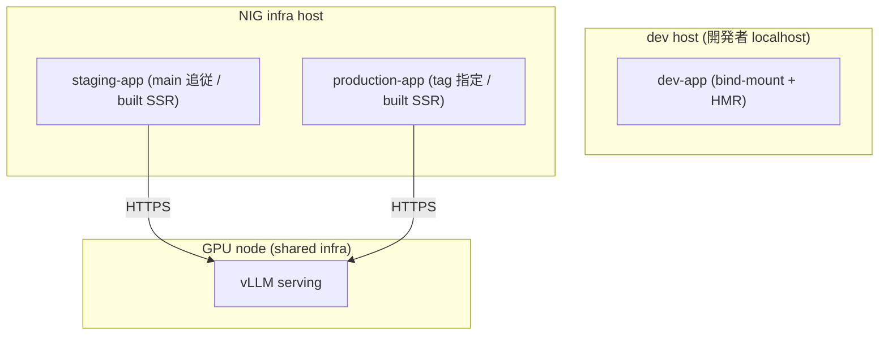
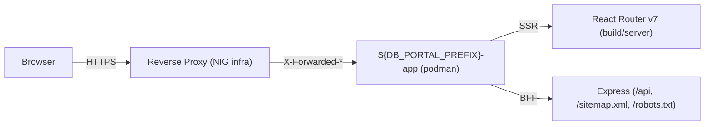
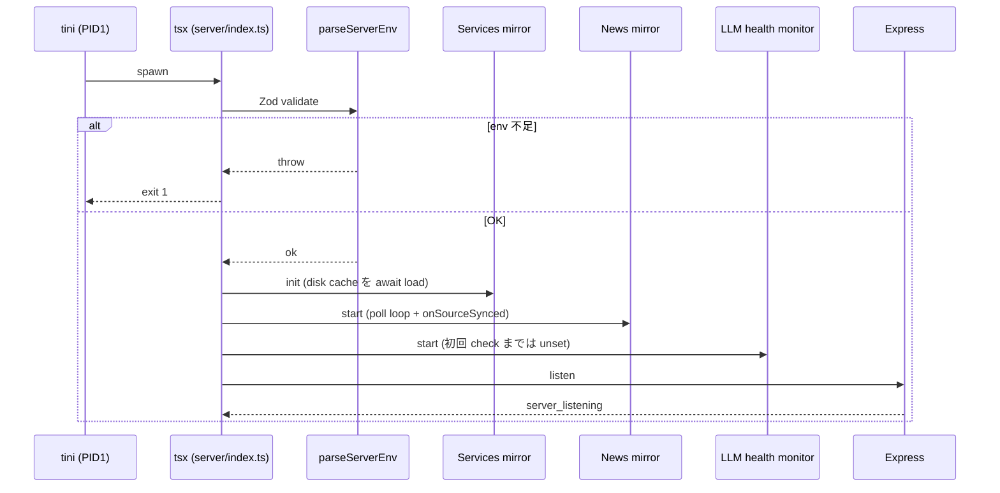

# Deployment

dev / staging / production の 3 環境を同一 host に並列起動する運用方法。 リリース手順・ログ規約・監視・secret rotation を扱う。

## Overview

BSI は同じ image / 同じ compose ファイル群から 3 つの環境を作る。 dev は開発機の localhost、 staging と production は NIG infra 上の同一 host に並走する。 ライフサイクルが違う LLM serving (vLLM) は別 host の shared infra として外に出し、 staging と production の app から同じものを叩く。

| 環境 | 起点 | 起動形態 |
|---|---|---|
| dev | 開発者 localhost | bind-mount + HMR |
| staging | NIG infra host | image 焼き込みの built SSR、 main 追従 |
| production | NIG infra host | image 焼き込みの built SSR、 tag 指定 |

具体的な host / path / env 差分は git 管理外 (`.claude/docs/deployment.md` / `.claude/docs/llm-node.md`)。

## Compose 構成

base となる `compose.yml` は production 形 (immutable image / source bind-mount なし) で書く。 dev では `compose.dev.yml` を重ねて bind-mount と HMR を有効化し、 staging / production では `compose.podman.yml` を重ねて rootless 化する。 同一 host 上で staging と production を並走させるため、 `container_name` / `image` / `volume` / `network` 名は `${DB_PORTAL_PREFIX}` を含めて衝突を避ける。

- `compose.yml` が SSOT。 overlay は差分だけを表現する
- `${DB_PORTAL_PREFIX}` は env ごとに別値 (例 `staging` / `production`)。 これを欠くと 2 環境間で名前が衝突して起動不能になる
- `env.dev` / `env.staging` / `env.production` は git 管理。 secret は `CHANGE_ME` プレースホルダで commit する
- 実値は host 側の `.env.<env>.local` に置き、 起動時に compose の `env_file` で merge する。 `.env.*.local` は `.gitignore` で git に出さない

## 起動アーキテクチャ

reverse proxy 1 段の背後で podman container 1 つが SSR + BFF を兼任する構成。 同一プロセス内で React Router v7 framework mode の SSR と Express の BFF (`/api/*` / `/sitemap.xml` / `/robots.txt`) が同居する。

container の `command` は npm を介さず `tsx server/index.ts` を直接 PID1 (`init: true` の tini) の子として起動する。 これは `SIGTERM` を node に直接届け、 graceful shutdown 経路 (背景 timer 停止 → idle keep-alive 落とし → in-flight drain → exit) を成立させるための規約。 npm を間に挟むと SIGTERM が node まで届かず、 強制 kill になる。

build と `validate:content` は image build 時に走り、 1 件でも fail すれば image build 自体が fail-fast する。 runtime stage は焼き込み済みの `build/` をそのまま起動するため、 container 起動時に再 build / 再 validate しない。 runtime cache (news / repos / services) のみを `./cache:/app/cache` で deploy をまたいで保持する。

reverse proxy 1 段の背後で動くため、 `X-Forwarded-*` を信頼する trust proxy hop 数は env で設定する。 ホップ数を誤ると per-IP rate limit と client IP ログが壊れる。

## 起動シーケンス

container 起動から listen までの順序は固定。 env 検証が最初に走り、 失敗すると process exit する。 mirror と health monitor は listen 前に起動し、 cache hot の状態で外部 request を受ける。

Services mirror は init で disk cache を await load し、 News mirror の sha 変化通知を受けて該当 source を rebuild する。 News mirror は disk cache を即時 load するため、 cache が残っていれば `/api/news` は起動直後から item を返す。 LLM health は初回 check が完了するまで `unset` を返す。

## リリース

staging deploy は main 追従、 production deploy は SemVer git tag (`v<MAJOR>.<MINOR>.<PATCH>`) を打ってから行う。 deploy は同一 host port への in-place swap で、 旧 container 停止 → 新 container listen の窓だけ HTTP が落ちる。

- session は in-memory で永続化しない (deploy / rollback / 再起動でユーザーは再ログインになる)
- rollback は前安定 tag への checkout で行う
- staging は問題 commit を `git revert` で main に押し戻す方が tag 戻しより安全
- production の `openapi.json` と BSI 側型の差分はリリース直前に `npm run gen:api-types` を production env で再実行し、 差分があれば反映後に tag を打つ
- News disk cache は schema 不一致時に空 cache へ fallback する (詳細は [news.md](news.md))

deploy の実コマンド (SSH 接続先 / podman 操作) は git 管理外。

## CI 境界

`.github/workflows/ci.yml` は PR / `main` push のたびに Docker Compose 内で typecheck / lint / unit + PBT / `npm audit --audit-level=high --omit=dev` を回す。 deploy・e2e・openapi 差分検知・性能計測は CI から自動実行しない。

| 種類 | 自動 (CI) | 手動 |
|---|---|---|
| typecheck / lint / unit / PBT / audit | ◯ | -- |
| deploy (staging / production) | -- | ◯ |
| e2e (staging URL 叩き) | -- | ◯ (`tests/e2e/notes.md`) |
| openapi 差分検知 (`gen:api-types`) | -- | ◯ (リリース直前) |
| 性能計測 | -- | ◯ |

## 監視

外部 uptime monitor は health endpoint 3 種を分単位で叩き、 連続失敗で alert を出す。 deploy 中の swap 窓と区別するため、 alert は連続失敗閾値で発火させる。

- `GET /api/me` — session 確認 (`Cache-Control: no-store` で必ず origin に届く)
- `GET /api/news` — News mirror の生存
- `GET /api/llm/health` — vLLM 疎通 (`Cache-Control: no-store`、 `status` の意味は [llm.md](llm.md))

deploy swap の時刻照合は `server_shutdown` / `server_listening` log の `ts` を突合する。 alert 発火時にこの 2 event の間にいるなら deploy 中、 そうでなければ実障害。

endpoint の response 形・status コードは `server/index.ts` 参照。

## トラブルシュート

各症状は「切り分け軸」 を辿って原因に到達する。 具体的な podman コマンド / host 上手順は git 管理外。

| 症状 | 切り分け軸 |
|---|---|
| News mirror が動かない (`/api/news` 空、 `news_mirror_failed` 頻発) | host から `git ls-remote` で疎通、 env の repo URL / branch、 disk cache 整合性 (rename して再構築)、 source repo の history |
| vLLM が unreachable | endpoint 疎通 (`/v1/models`)、 `llm_health_transition` 推移、 vLLM プロセス稼働、 timeout / base URL の env |
| LLM rate limit 誤発火 (`429 {error: "rate_limited"}`) | per-IP / per-session limit の env、 共有 NAT の有無 |
| 認証 callback の state 不一致 | tab の古さ / replay / Keycloak `Valid Redirect URIs` のドリフト |
| login redirect ループ | `DB_PORTAL_PORTAL_ORIGIN` と Keycloak `Valid Redirect URIs` の一致 |
| session が頻繁に切れる | session TTL env と Keycloak `Client Session Idle` の短い方が実効、 deploy 時の全切れは `server_shutdown` / `server_listening` の突合 |
| CSP 違反 (ブラウザ console) | 新規 3rd-party origin の有無、 inline `<script>` / `<style>` への nonce 付与 (詳細は [architecture.md](architecture.md)) |

mirror の cache 構造と schema migration は [news.md](news.md)、 認証フローの全体像は [auth.md](auth.md) を参照。

## Secret rotation

secret は git に commit しない。 実値は host 側 `.env.<env>.local` か作業者 ssh client にのみ置く。 rotation 後は対応する log event か次回シナリオの成功で完了を確認する。

| Secret | 保管 | 周期 | 完了確認 |
|---|---|---|---|
| `DB_PORTAL_LLM_API_KEY` | host `.env.production.local` | vLLM 側 key 更新時 | `llm_health_transition` が `to: "ok"` |
| Keycloak client secret | 存在しない (public client + PKCE) | -- | -- |
| `DB_PORTAL_E2E_USER_PASSWORD` | リリースマネージャ作業環境 | 半年毎 / incident 時 | 次回 e2e の auth シナリオ pass |
| Deploy host SSH 鍵 | リリースマネージャ `~/.ssh/` | 半年毎 / incident 時 | 次回 deploy の SSH 接続成功 |

News mirror は HTTPS git protocol で動くため、 GitHub PAT 等の secret を持たない。

## 定期メンテナンス

| 周期 | 作業 |
|---|---|
| 週次 | `*_failed` event の集計上位確認 |
| 月次 | News disk cache サイズ確認 |
| 半年毎 | SSH 鍵 / e2e user password rotation |
| リリース毎 | release announcement 公開、 production の `gen:api-types` 差分確認 |

## 外向き契約

deploy 環境が外に対して持つ I/O 契約。 endpoint 仕様は code SSOT (`server/index.ts`) なので一覧表は持たず、 log と env だけここに集める。

### ログ

`server/lib/log.ts` の logger は stdout に構造化 JSON を 1 行 1 レコードで流す。 reverse proxy / podman / journald は stdout をそのまま収集すれば良い。

| Field | 型 | 意味 |
|---|---|---|
| `ts` | string (ISO8601) | log 時刻 |
| `level` | `debug` / `info` / `warn` / `error` | severity |
| `msg` | string | snake_case event name |
| ...payload | 任意 | event 固有のフィールド (redact 済み) |

イベント名は snake_case。 全 event の列挙は `git grep 'logger\.\(info\|warn\|error\|debug\)' server/` で取得する。 `accessToken` / `refreshToken` / `idToken` / `cookie` / `authorization` 系フィールドは `[REDACTED]` に置換して出す (詳細は [auth.md](auth.md))。 session entry を丸ごと log に出すコード経路は作らない。

### 環境変数

deploy 時に追加で意識する env (機能別 env は各 docs 参照)。

| 変数 | 意味 |
|---|---|
| `DB_PORTAL_PREFIX` | container / image / volume / network 名 prefix。 同一 host 並走のため env 毎に別値 |
| `DB_PORTAL_PORTAL_ORIGIN` | 自分自身の外向き origin。 Keycloak の `Valid Redirect URIs` と一致させる |
| `DB_PORTAL_TRUST_PROXY` | `X-Forwarded-*` を信頼する Express `trust proxy` 設定。 hop 数 (`1`) のほか `loopback` / `true` / IP リスト等の preset も受け付ける |
| `DB_PORTAL_LLM_API_KEY` | vLLM への認証 key (rotation 対象) |

全 env の列挙と意味は [architecture.md](architecture.md) の build-time / runtime 境界の章を参照。
