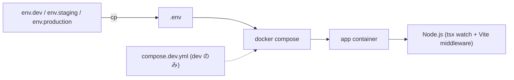

# Development

BSI を開発するためのローカル環境セットアップと運用。 `compose.yml` 1 本 + `.env` 切替で dev / staging / production を分け、 すべてのコマンドをコンテナ内で叩く。

## 初回セットアップ

clone → `.env` 配置 → コンテナ起動 → 依存解決 → API 型生成、 まで一気に通す。 `env.dev` は git に commit 済みなのでそのままコピーして良い。

```bash
git clone git@github.com:ddbj/db-portal ~/git/github.com/ddbj/db-portal
cd ~/git/github.com/ddbj/db-portal

cp env.dev .env
docker compose up -d --build
docker compose exec app npm install
docker compose exec app npm run gen:api-types
```

dev origin は `env.dev` の `DB_PORTAL_PORTAL_ORIGIN` が指す URL。 API 型生成 (`gen:api-types`) は upstream OpenAPI から `app/lib/api/openapi-types.ts` を生成する手続きで、 詳細は [api-types.md](api-types.md) を参照。

## env と Compose

開発も本番も同じ `compose.yml` を共有し、 `.env` の中身だけで環境を切り替える。 dev のみ `compose.dev.yml` を override で重ね、 source bind-mount と dev server を起動する。 `DB_PORTAL_PREFIX` が container / image / volume / network 名に展開されるため、 同一ホストで dev / staging / production を並列起動しても衝突しない。



commit する env は `env.dev` / `env.staging` / `env.production` の 3 つだけ。 開発者はそのいずれかを `.env` にコピーして編集する。 `.env` / `.env.*` 自体は ignore で git 管理外。

- env の値域・default・型は `server/lib/env.ts` の Zod schema が SSOT。 build-time と runtime の境界規約は [architecture.md](architecture.md) を参照
- 開発者は staging credential までしか触らない。 production 実値は `.env.production.local` から merge する ([deployment.md](deployment.md))
- secret らしき値が `VITE_DB_PORTAL_` prefix に紛れていないかを必ず確認する (ブラウザ bundle に焼かれる)
- `.env` の差し替えには `docker compose down -v && up -d --build` が必要。 `restart` では新 env が反映されない

切替例:

```bash
cp env.staging .env
docker compose down -v
docker compose up -d --build
```

dev / typecheck / lint / test / build / 依存追加は **すべてコンテナ内** で動かす。 ホストに Node を直接入れない。 本番は podman + podman-compose で同一 `compose.yml` を起動する。

- dev のみ `COMPOSE_FILE` で `compose.dev.yml` を合成し、 source bind-mount + `node_modules` named volume + `build.target: dev` を重ねる
- publish 先の bind host は `DB_PORTAL_APP_BIND_HOST` で切り替える。 dev は loopback に閉じ、 staging / production は別ホストの reverse proxy から届く必要があるため全 interface に開く
- staging / production は build を image に焼いた runtime stage を起動する
- 依存解決をホスト環境に縛らないため、 ホストでの `npm install` は禁止
- 新規依存追加後は `package.json` と `package-lock.json` を必ず一緒に commit する

## 開発コマンド

開発で叩くコマンドはすべて `docker compose exec app npm run ...` を経由する。 ホスト側で動かすコマンドは無い。

```bash
docker compose exec app npm install
docker compose exec app npm install <pkg>
docker compose exec app npm install -D <pkg>

docker compose exec app npm run typecheck
docker compose exec app npm run lint
docker compose exec app npm run lint:fix

docker compose exec app npm test
docker compose exec app npm run test:unit
docker compose exec app npm run test:pbt
docker compose exec app npm test -- --watch

docker compose exec app npm run build

docker compose exec app npm run gen:api-types
docker compose exec app npm run validate:content
docker compose exec app npm run news:repos:sync
```

e2e は dev コンテナで回さない。 staging deploy 後に staging ホスト上の e2e 専用コンテナで実行する ([tests/README.md](../tests/README.md))。

## ファイル変更の反映

dev では `tsx watch` が server を、 Vite middleware が SSR / CSR の bundle を担当する 2 系統構成。 変更したファイルの種類で自動反映か手動再起動かが決まる。

| 変更箇所 | 反映方法 |
|---|---|
| `app/**` / `server/**` の TS / TSX | `tsx watch` が自動再起動 |
| `app/styles/tailwind.css` | Tailwind v4 plugin が即反映 |
| `app/content/**/*.content.tsx` の追加・削除 | 起動時に eager validate するため server 再起動が要る ([content.md](content.md)) |
| `app/lib/api/openapi-types.ts` | `npm run gen:api-types` を手動再実行 |
| `package.json` | `docker compose exec app npm install` |
| `Dockerfile` / `compose*.yml` / `env.*` / `.env` | `docker compose down -v && up -d --build` |

`.md` の `lastUpdated` は build 時に git commit から自動生成する (詳細は [content.md](content.md))。 手書きしない。

## CI

`.github/workflows/ci.yml` を SSOT とし、 typecheck / lint / test / 監査をコンテナ内で回す。 開発者は同じコマンドを PR 前に手元でも実行する。

```bash
docker compose exec app npm run typecheck
docker compose exec app npm run lint
docker compose exec app npm test -- --run
docker compose exec app npm audit --audit-level=high --omit=dev
```

監査対象は production dependencies の high+ severity のみ。 大きな変更時は `validate:content` / `build` / `gen:api-types` も手元で回し、 `openapi-types.ts` の差分は同一 commit に含める。

## 環境変数

env の定義 / 型 / default は `server/lib/env.ts` の Zod schema が SSOT、 環境別の値は `env.dev` / `env.staging` / `env.production` が SSOT。 build-time と runtime の境界規約は [architecture.md](architecture.md) を参照。 開発でよく触る prefix:

- `DB_PORTAL_PREFIX` — container / image / volume / network 名 namespace
- `DB_PORTAL_PORTAL_ORIGIN` — アプリの自己 origin。 Keycloak の Valid Redirect URIs と一致させる
- `DB_PORTAL_OPENAPI_URL` — ddbj-search-api の OpenAPI document 取得先 (`gen:api-types` 用)
- `DB_PORTAL_KEYCLOAK_*` — Keycloak realm / client 設定 ([auth.md](auth.md))
- `DB_PORTAL_AUTH_SESSION_TTL_SECONDS` — BSI session の sliding TTL ([auth.md](auth.md))
- `DB_PORTAL_LLM_*` — LLM BFF 接続設定 ([llm.md](llm.md))
- `VITE_DB_PORTAL_*` — ブラウザ bundle に焼かれる public 値 (secret を入れない)

container 内で実効値を確認する:

```bash
docker compose exec app sh -c 'env | grep ^DB_PORTAL_ | sort'
docker compose exec app sh -c 'env | grep ^VITE_DB_PORTAL_ | sort'
```

## トラブルシュート

切り分けは **env と volume を疑ってから個別事象** の順で進める。

env と volume の一次対応:

- **依存・volume の不整合** — `docker compose down -v` で named volume を破棄し、 `up -d --build` から再構築する
- **env 不一致** — 上の env 検証コマンドで container 内の実効値と `env.*` ファイルを突き合わせる

個別事象:

- **zones 違反 (lint)** — `app/features/*` 横断 import や `app/lib` → `app/features` の禁止方向。 共通化が必要なら `app/lib` / `app/schemas` へ降ろす ([architecture.md](architecture.md) の zone 規約参照)
- **API 型生成失敗** — `DB_PORTAL_OPENAPI_URL` の container 内到達と upstream の疎通を確認する ([api-types.md](api-types.md))
- **Keycloak ログインのリダイレクトループ** — `DB_PORTAL_PORTAL_ORIGIN` と Keycloak client の Valid Redirect URIs を突き合わせる ([auth.md](auth.md))
- **dev server の HMR が来ない** — `vite.config.ts` の `server.host` / `server.port` と compose の port mapping が dev 既定 (両端同一) になっているか確認する
