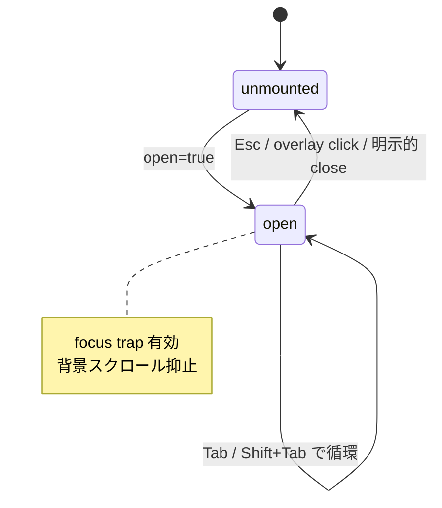

# Frontend

`app/ui/` の primitive デザインシステムの設計原則。 zone 分割を土台に、 設計トークン、 primitive 規約、 個別 primitive の規約 (Forms / Modal / Layout 系)、 アクセシビリティの横断土台、 アイコン、 視覚カタログを扱う。

## zone 分割

zone 全体の境界と依存方向は [architecture.md](architecture.md) § Zone 分割 が SSOT。 本書では `app/ui/` (primitive zone) と `app/{features,routes,content}/` (上位 zone) に課す **追加制約** だけを扱う。

ESLint (`eslint.config.ts`) で物理強制する規約:

- `app/ui/` 内部は primitive と util だけで閉じる (他 zone を import しない)
- `app/{features,routes,content}/` は操作可能 native タグ (`<button>` / `<a>` / `<input>` / `<select>` / `<textarea>`) を直接書けず、 primitive 経由で使う
- `app/{features,routes,content}/` は生 hex literal と arbitrary Tailwind value (`bg-[#...]` / `text-[14px]` / `p-[3px]`) を禁ずる
- `app/{ui,shell}/` は arbitrary value 禁止から除外

## 設計トークン

色 / font / spacing / radius / shadow / tracking / leading の値は `app/styles/tailwind.css` の `@theme` block が SSOT。 Tailwind v4 が `--color-brand` → `bg-brand` / `text-brand` 等の utility class を自動生成し、 アプリ側は token 名でのみ参照する。

- token を参照するときは utility class 経由で書き、 px 値・hex literal を docs / 実装コードに散らさない
- 新しい色 / spacing が必要になったら、 まず `@theme` に token を追加してから token utility 経由で参照する
- 半端値 (0.5px 刻み等) は token に置かない

`app/{ui,shell}/` だけは arbitrary value を限定的に許容する — token 化する価値が薄い hairline、 1 箇所限定の layout 値、 `style={{}}` で動的に渡す値、 `app/shell/` の vh / rem 単位がここに含まれる。 「複数箇所で同じ値が出てきた」 と感じたら `@theme` へ昇格する。

## primitive

**primitive** は `app/ui/` 内の最小単位の UI コンポーネント。 単一の責務 (button / input / modal 等) を持ち、 上位 zone は native タグの代わりに primitive を使う。 `app/ui/*.tsx` を **1 primitive = 1 ファイル** で配置し、 `app/ui/index.ts` で re-export する。 外部 module からは `import { Button, Tag, Modal } from "~/ui"` で参照する。 個別 primitive の Props 型 / variant / class 構成は実装と 視覚カタログ (§ /_design) が SSOT。

### className 規約

primitive は `className?` を **受けない**。 variant は `kind` / `tone` / `size` / `mono` / `selected` / `as` 等の semantic prop で表現する。 token を経由しない色 / spacing の注入は ESLint で物理禁止する。

レイアウト微調整は wrapper を 1 段被せるか、 レイアウト primitive を組み合わせて表現する。 `...rest` の spread は許容するが `className` だけは pick して破棄する。

### state 網羅

各 primitive で次の state を実装 + テストする。 操作可能な primitive が抜けなく定義通り反応することを保証する。

- default
- hover (clickable な場合。 surface 階調 1 段の背景色変化 / interactive アイコンの tone shift は許容。 brand 色への大きな塗り変えは global focus ring に任せて避ける)
- focus (global `:focus-visible` の yellow ring に頼る)
- disabled (`aria-disabled` + `disabled` HTML 属性を lockstep)
- checked / selected (該当 primitive)
- loading (該当 primitive)

### カテゴリ

primitive は責務でカテゴリ分けする (役割が重複する primitive を増やさないため)。 詳細な aria / focus / 高さ規約を持つカテゴリは右列に節 pointer を示す。

| カテゴリ | 内容 | 詳細節 |
|---|---|---|
| Page chrome | ページ wrapper、 H1 + eyebrow、 Top / Search / results 共通の検索 input | — |
| Layout wrapper | 垂直リズム + 中央寄せ + 横余白。 段階の token は `--spacing-section-*` | — |
| Headings & Labels | main column 用は装飾の左バー付き、 sidebar 用はバー無しで切り分け | § Layout 系 |
| Forms | native `<button>` / `<input>` の thin wrapper、 native `<select>` 代替の `Select` / `Combobox` | § Forms |
| Tags & Chips | Tag は非インタラクティブ label、 Chip はインタラクティブ pill | — |
| Facets | sidebar facet UI | — |
| Callout | inline notice (role を consumer が制御) | — |
| Modal | dialog 一族 (`Modal` root + Header / Body / Footer + Preview) | § Modal |
| Pagination / LinkCard | ページ送り / カード型 link | — |
| TextLink | 内部 link (RR `<Link>`) と外部 link を 1 primitive に統一 | — |
| InfoHint | ⓘ トリガで補足を出す (native `title` を使わない) | — |
| Segmented | 2 値以上の即時切替トグル | — |
| StableLabel | 取り得るラベルの最大幅を確保し、 テキスト差替でリサイズしない | — |

## 個別 primitive の規約

### Forms

入力 primitive (`Button` を除く form control) は視覚的エラーと screen reader 向けの aria 関連付けを同時に satisfy する。 入力 primitive は `state` prop に `default` / `warn` を取り、 `disabled` は別 boolean prop で表現する。

- `state="warn"` 指定時に `aria-invalid=true` と `aria-describedby` を **primitive が自動付与** する
- `aria-describedby` は consumer 側が渡せるよう prop を開ける
- error message を表示する側は **必ず id を持ち**、 input の `aria-describedby` に流す
- `FormGroup` は `<fieldset>` + `<legend>` で実装し、 radio / checkbox 群が単一の質問として announce される (1 input を子に持つ場合も `<fieldset>` で囲んで構わない)
- `IconButton` は AA の target size を満たす default を持つ
- placeholder は state を担わず、 surface 上でコントラスト比 4.5:1 を満たす

### Modal

`Modal` 一族は dialog UI を 1 set で完結させる。 open=false で何も render せず、 mount は親が制御する。 focus トラップ・背景スクロール抑止・aria 属性付与をすべて self-contained で持つ。

- focus を dialog 内に閉じ込める (open で内部先頭へ移動、 Tab / Shift+Tab で循環、 close で trigger に復元)。 外部 dependency なしで自前実装
- Esc キー・overlay click で `onClose` (`closeOnEscape={false}` / `closeOnOverlay={false}` で無効化)
- overlay は pointerdown / click 併用で drag-out closure を防ぐ
- `role="dialog"` + `aria-modal="true"` + `aria-labelledby` (+ 渡されれば `aria-describedby`)
- open 中は背景スクロールを抑止し close で復元

### Layout 系

main column と sidebar は heading の **左バーの有無** で視覚的に切り分ける。 検索 input まわりは入力モード切替で高さがガタつかないよう固定 variant で揃える。

- main column 用 heading は装飾の左バー付き、 sidebar 用 heading はバー無し
- 検索 input は入力モード切替 (キーワード / 構造化条件) でボックス高さが変わらないよう固定 variant で揃える (使い分けの主筋は [search.md](search.md) 側で扱う)
- query builder 行 (Select / TextInput / Combobox) は固定高さ variant で揃える

## アクセシビリティ

primitive 個別の aria 契約 (Forms の `aria-invalid` / Modal の `aria-modal` など) は § 個別 primitive の規約 で扱う。 ここでは **横断の土台規範** に絞る。

- 操作可能要素は § zone 分割 で列挙した native タグで実装する。 div / span に `role` を後付けしない
- focus 表現は global `:focus-visible` の yellow ring に統一する。 primitive 個別の focus class は書かない
- icon-only button は `ariaLabel` 必須 (型レベルで強制)
- `aria-disabled` を `disabled` HTML 属性と lockstep
- table は `<caption className="sr-only">` + `<th scope="col" / scope="row">`
- 自動検査は primitive 単位 unit test で role / aria 属性を assert する (axe 等の専用ライブラリは使わない)

色だけで意味を伝えない。 status の意味は text label で担保し、 tone (色) は補強として用いる。 error / warning / 完了など状態を強調する面では icon・shape を併用して salience を上げる。

## アイコン

`app/ui/icons/` 配下に SVG を集約する。 装飾と機能で role 属性の付け方を分ける。

- 装飾 SVG は `aria-hidden="true"`
- 機能 SVG は親 `<button aria-label>` に内包し、 button 側でラベルを担う
- フォルダ / ドキュメントの dir 種別を表す general purpose icon は使わない。 種別はキャレットや context で識別する

## /_design

`/_design` route が全 primitive の variant × state を並べる。 primitive の挙動が変更されたとき、 ここを開けば全 state が描画され回帰確認ができる。

- production 以外の env (`NODE_ENV !== "production"`) で生成する
- production build では `app/routes.ts` で除外する
- primitive を新規追加・変更したら `/_design` で全 state が描画されることを確認する
