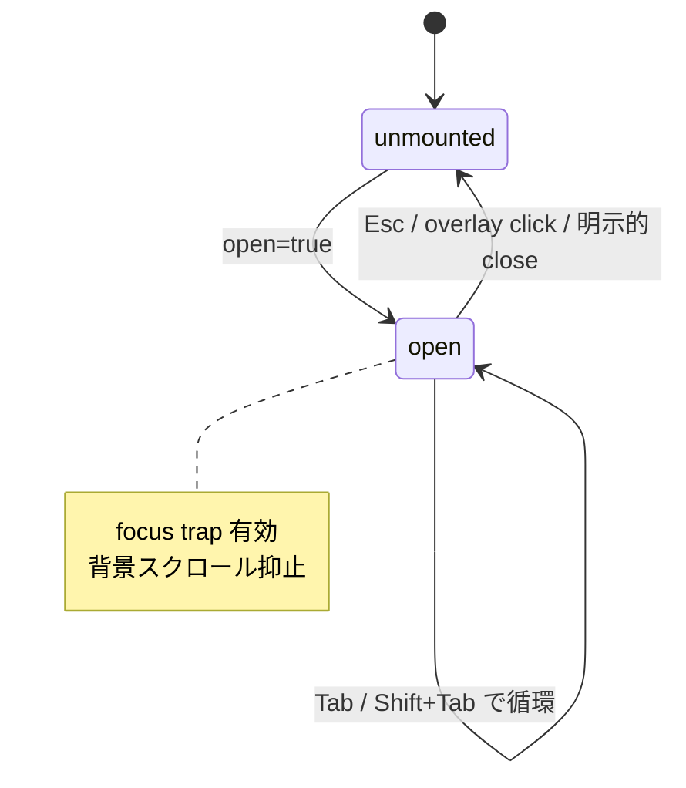

# Frontend

`app/ui/` 配下の primitive デザインシステムの設計原則と横断ポリシー。 設計トークン・state 網羅・アクセシビリティ・アイコン規約を扱う。

## 設計トークン

色 / font / spacing / radius / shadow / tracking / leading の値は `app/styles/tailwind.css` の `@theme` block が SSOT。 Tailwind v4 が `--color-brand` → `bg-brand` / `text-brand` 等の utility class を自動生成し、 アプリ側は token 名でのみ参照する。

- token を参照するときは utility class 経由で書き、 px 値・hex literal を docs / 実装コードに散らさない
- `app/{features,routes,content}/` 配下は ESLint で次を物理禁止する
    - 生 hex literal
    - arbitrary Tailwind value (`bg-[#...]` / `text-[14px]` / `p-[3px]`)
- 新しい色 / spacing が必要になったら、 まず `@theme` に token を追加してから token utility 経由で参照する
- 半端値 (0.5px 刻み等) は token に置かない

`app/{ui,shell}/` だけは arbitrary value を限定的に許容する。 token 化する価値が薄い hairline、 1 箇所限定の layout 値、 `style={{}}` で動的に渡す値、 `app/shell/` の vh / rem 単位がここに含まれる。 「複数箇所で同じ値が出てきた」 と感じたら `@theme` へ昇格する。

## Primitive

`app/ui/*.tsx` を 1 primitive = 1 ファイルで配置し、 `app/ui/index.ts` で re-export する。 外部 module からは `import { Button, Tag, Modal } from "~/ui"` で参照する。 個別 primitive の Props 型 / variant / class 構成は実装と `/_design` route が SSOT。

### className 規約

primitive は `className?` を **受けない**。 variant は `kind` / `tone` / `size` / `mono` / `selected` / `as` 等の semantic prop で表現する。 token を経由しない色 / spacing の注入は ESLint で物理禁止する。

レイアウト微調整は wrapper を 1 段被せるか、 レイアウト primitive を組み合わせて表現する。 `...rest` の spread は許容するが `className` だけは pick して破棄する。

### state 網羅

各 primitive で次の state を実装 + テストする。 操作可能な primitive が抜けなく定義通り反応することを保証する。

- default
- hover (clickable な場合。 ホバーで色変化はしない)
- focus (`:focus-visible` の yellow ring に頼る)
- disabled (`aria-disabled` + `disabled` HTML 属性を lockstep)
- checked / selected (該当 primitive)
- loading (該当 primitive)

### カテゴリ

primitive は責務でカテゴリ分けする。 役割が重複する primitive を増やさないための分類。

| カテゴリ | 責務 |
|---|---|
| Chrome | ページ wrapper、 H1 + eyebrow、 Top / Search / results 共通の検索 input |
| Layout | 垂直リズム + 中央寄せ + 横余白を担う wrapper。 段階の token は `--spacing-section-*` |
| Headings & Labels | main column 用は装飾の左バー付き、 sidebar 用はバー無しで切り分け |
| Forms | native `<button>` / `<input>` の thin wrapper、 native `<select>` を代替する `Select` / `Combobox` |
| Tags & Chips | Tag は非インタラクティブ label、 Chip はインタラクティブ pill |
| Facets | sidebar facet UI |
| Callout | inline notice、 `role="status" \| "alert"` を consumer が制御 |
| Modal | dialog 一族 (`Modal` root + Header / Body / Footer + Preview) |
| Pagination / LinkCard / TextLink / InfoHint / Segmented / StableLabel | 内部 link (RR `<Link>`) と外部 link を 1 primitive に統一 |

Chrome の検索 input は提案レビュー型 (`/search`) と生成→遷移型 (top / results) を上位の feature 層で包む。 `InfoHint` は native `title` を使わず ⓘ トリガで補足を出す。 `Segmented` は 2 値以上の即時切替トグル。 `StableLabel` は取り得るラベルの最大幅を確保し、 テキスト差し替えでコントロールがリサイズしないようにする。

## Forms

入力 primitive (`Button` を除く form control) は視覚的エラーと screen reader 向けの aria 関連付けを同時に satisfy する。 placeholder は state を担わず、 surface 上でコントラスト比 4.5:1 を満たす。

- `aria-invalid` は **state ベース** で primitive が自動付与する (`state="warn"` で true)
- `aria-describedby` は consumer 側が渡せるよう prop を開ける
- error message を表示する側は **必ず id を持ち**、 input の `aria-describedby` に流す
- `FormGroup` は `<fieldset>` + `<legend>` で実装し、 radio / checkbox 群が単一の質問として announce される
- 1 input を子に持つ場合も `<fieldset>` で囲んで構わない
- `IconButton` は AA の target size を満たす default を持つ
- state は `idle` / `warn` / `disabled` の 3 値で、 `state="warn"` 指定時に `aria-invalid=true` と `aria-describedby` を自動付与する

## Modal

`Modal` 一族は dialog UI を 1 set で完結させる。 open=false で何も render せず、 mount は親が制御する。 focus トラップ・背景スクロール抑止・aria 属性付与をすべて self-contained で持つ。

- focus を dialog 内に閉じ込める (open で内部先頭へ移動、 Tab / Shift+Tab で循環、 close で trigger に復元)。 外部 dependency なしで自前実装
- Esc キー・overlay click で `onClose` (`closeOnEscape={false}` / `closeOnOverlay={false}` で無効化)
- overlay は pointerdown / click 併用で drag-out closure を防ぐ
- `role="dialog"` + `aria-modal="true"` + `aria-labelledby` (+ 渡されれば `aria-describedby`)
- open 中は背景スクロールを抑止し close で復元

## Layout

main column と sidebar は heading の左バー有無で視覚的に切り分ける。 検索 input まわりは入力モード切替で高さがガタつかないよう固定 variant で揃える。

- main column 用 heading は装飾の左バー付き、 sidebar 用 heading はバー無し
- 検索 input は scope スロットを隠してもボックス高さを保ち、 キーワード ⇄ AI クエリビルダーの切替で高さが変わらない
- query builder 行 (Select / TextInput / Combobox) は固定高さ variant で揃える

## アクセシビリティ

操作可能要素は native `<button>` / `<a>` / `<input>` / `<select>` で実装する。 div / span に `role` を後付けしない。 axe 違反を CI で 0 件に保つ。

- focus 表現は global `:focus-visible` の yellow ring に統一する。 primitive 個別の focus class は書かない
- icon-only button は `ariaLabel` 必須 (型レベルで強制)
- `aria-disabled` を `disabled` HTML 属性と lockstep
- modal は `role="dialog"` + `aria-modal="true"` + `aria-labelledby`
- table は `<caption className="sr-only">` + `<th scope="col" / scope="row">`
- `app/ui/*` と `app/shell/*` は `vitest-axe` で axe violation 0 件を保証

色だけで意味を伝えない。 status の意味は text label で担保し、 tone (色) は補強として用いる。 error / warning / 完了など状態を強調する面では icon・shape を併用して salience を上げる。

## アイコン

`app/ui/icons/` 配下に SVG を集約する。 装飾と機能で role 属性の付け方を分ける。

- 装飾 SVG は `aria-hidden="true"`
- 機能 SVG は親 `<button aria-label>` に内包し、 button 側でラベルを担う
- フォルダ / ドキュメントの dir 種別を表す general purpose icon は使わない。 種別はキャレットや context で識別する

## Zones の境界

`app/ui/` は他の zone を import せず、 純粋に primitive と util だけで閉じる。 chrome 系 (`Header` 等) は `app/shell/` に置き、 feature / route / content からは primitive 経由でしか native タグを使わせない。 zone 全体の依存方向は [architecture.md](architecture.md) の Zone 分割章を参照。

ESLint (`eslint.config.ts`) が物理強制を担う:

- `app/ui/` 内部は primitive 同士・util (`cn` helper や icon 集約) で閉じる
- `app/{features,routes,content}/` で生 `button` / `a` / `input` / `select` / `textarea` を禁止し、 primitive 経由を強制する
- `app/{ui,shell}/` はこの禁止から除外

## 視覚カタログ

`/_design` route が全 primitive の variant × state を並べる。 primitive の挙動が変更されたとき、 ここを開けば全 state が描画され回帰確認ができる。

- dev および `DB_PORTAL_ENABLE_DESIGN_PREVIEW=true` を有効化した env でのみ生成する
- production build では `app/routes.ts` で除外する
- primitive を新規追加・変更したら `/_design` で全 state が描画されることを確認する
