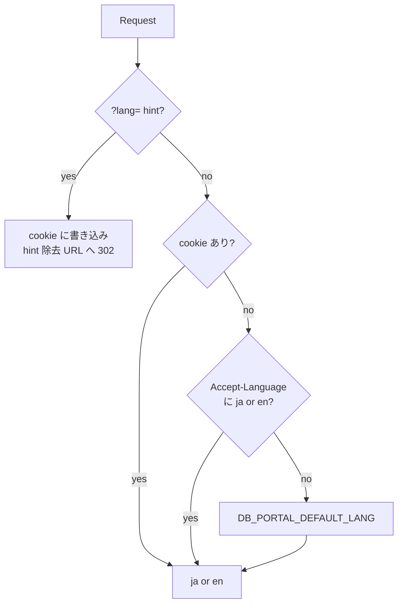
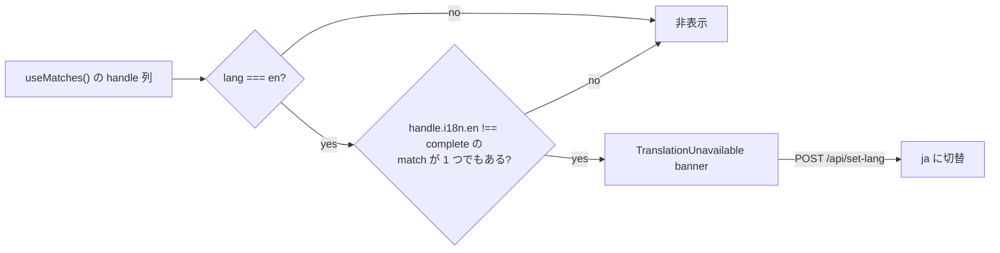

# Internationalization (i18n)

日本語 (`ja`) と英語 (`en`) の 2 言語サポート。 URL に言語識別子を入れず cookie で持ち、 root loader が決定して Provider 経由で全 component に配る。 翻訳なし fallback、 言語切替、 crawler 向け宣言も扱う。

## 言語解決

リクエストごとに 1 言語を決定する。 root loader が **`resolveLang()`** で 「`?lang` hint → cookie → Accept-Language → default」 の chain を評価し、 最初に解決できた値を loaderData に乗せる。 解決値は `LangProvider` が全 component に配り、 翻訳本体は request ごとに作る i18next instance が返す。 切替は専用 resource route (§ 言語切替) への POST で行い、 React Router の revalidate で in-place に画面が ja / en へ差し替わる。

```mermaid
flowchart LR
  Req[Browser request] --> Loader[root loader]
  Loader -- "resolveLang()" --> Lang[ja | en]
  Lang --> LD[loaderData]
  LD --> Provider[LangProvider]
  Provider --> Cmp[全 component]
  Switch[SwitchLang UI] -- "POST /api/set-lang" --> Resource[set-lang route]
  Resource -- "Set-Cookie + 303" --> Req
```

### resolveLang

`resolveLang()` は cookie / Accept-Language / default の **3 段だけ** を評価する純粋関数。 `?lang` hint は root loader が前段で処理して cookie に書き込み、 hint を除いた URL に 302 redirect してから 3 段 chain に入る (chain 関数自体は hint を引数に取らない)。 最初に解決できた段で確定し、 後段は評価しない。 最終的に必ず `ja` または `en` のいずれかになる。



- `?lang` hint は root loader でしか扱わない。 cookie に書き込んだ上で hint を除いた URL に 302 redirect する
- 不正値 (`ja` / `en` 以外) は無視して chain を継続する
- 実装は `app/lib/i18n/resolve-lang.server.ts`

### Cookie

決定した言語は `db_portal_lang` cookie で sticky に保持する。 sub-domain 横断はせず、 ブラウザの JS からも参照可能なように `HttpOnly` は付けない。

- 値は `ja` / `en` の 2 値のみ。 他値が来たら無視して chain を継続する
- `SameSite=Lax` で cross-site POST から保護する
- `Secure` は runtime 環境で切替 (production / staging で付ける)
- `Path=/`、 サブドメイン共有なし
- 寿命は年単位の長期 sticky
- 属性値の SSOT は `app/lib/i18n/lang-cookie.server.ts`

### Provider

`LangProvider` は root loaderData の決定値を React context として全 component に配る。 Provider 外で `useLang` を呼ぶと throw する (SSR / CSR 双方で参照元を 1 つに固定するため)。

- `useLang()` — 現在の言語 (`ja` | `en`) を返す
- `useT()` — i18next の翻訳関数を返す
- 実装は `app/lib/i18n/lang-context.tsx` / `use-lang.ts` / `use-t.ts`

### i18next instance

`useT` が返す翻訳関数の本体は、 **request ごとに新規生成する i18next instance**。 module-level の global を持たず、 SSR 並列 request での `changeLanguage` race を避ける。

- resource は静的 import (ja / en の 2 言語、 初期描画で必ず使う)
- fallback 言語は ja に固定 (次節の runtime fallback がここに乗る)
- 初期化の SSOT は `app/lib/i18n/index.ts`
- runtime は `app/lib/i18n/` に集約し、 server 専用は `.server.ts` suffix で client bundle から除外する
- リソース本体は `app/lib/i18n/resources/{ja,en}.ts` に同階層で置き、 ja を SSOT、 en を ja と同一キー構造に保つ
- a11y 文言は `a11y` namespace 配下に隔離する

## 翻訳なし fallback

en 表示中の翻訳欠落は **2 つの独立した機構** で扱う。 一方は i18next の runtime fallback (キー単位の即時降格)、 もう一方は route handle ベースの banner (page 単位の事前宣言) で、 互いの状態を参照しない。

### runtime fallback

en 描画中にキーが en リソースに無い場合は、 i18next が初期化時の `fallbackLng: "ja"` 設定に従って ja の値を返す。 UI は空にならず、 開発者の見落としで page が壊れることを防ぐ。

- 発火単位はキー (1 文字列)
- 発火条件は en リソースに該当キーが無いこと
- ja を default 言語に固定することで ja リソースは常に full set、 en は subset でも UI が崩れない構造になる
- ja / en のキーセット同一性は PBT (`tests/pbt/lib/i18n/`) で網羅率を測り、 fallback の発火そのものを未然に検出する

### TranslationUnavailable banner

route の `handle.i18n.en` が `complete` 以外の場合、 page 上部に `<TranslationUnavailable>` banner を描画し、 ja への切替動線を提供する。 「この page は en 訳が未整備」 を著者が明示的に宣言する機構で、 キー単位ではなく page 単位で発火する。 runtime fallback とは独立しており、 fallback が起きたかどうかは banner の表示判定に関与しない。



- 判定は active な全 match を走査し、 1 つでも `complete` 以外があれば banner を出す
- `handle.i18n.en` 宣言の無い route は判定から除外する (未宣言を 「未整備」 とは扱わない)
- 実装は `app/shell/translation-unavailable.tsx`

### handle.i18n.en

各 route module で `handle.i18n.en` を 3 値のいずれかで宣言する。 banner の発火条件はこの値だけで決まり、 runtime fallback の状況は参照しない。

| 値 | 意味 | banner |
|---|---|---|
| `complete` | en 訳が page 全体で揃っている | 非表示 |
| `missing` | en 訳が 1 行も用意されていない | 表示 |
| `partial` | en 訳の一部のみ用意されている | 表示 |

宣言例 (route module):

```ts
export const handle = { i18n: { en: "complete" } } as const
```

新規 page は `complete` を default にし、 en 訳の整備が間に合わない場合だけ `partial` / `missing` を宣言する。 宣言を省略した場合は banner 判定から除外されるため、 en 訳の整備状態を明示したい page では必ず宣言する。

## 言語切替

`POST /api/set-lang` resource route で言語を切り替える。 Header の SwitchLang ボタンも、 翻訳なし banner の 「Switch to Japanese」 動線も、 共通でこの route に POST する。 cookie だけを書き換えて URL は変えず、 fetcher submit が全 active loader を revalidate し、 Provider 値の入れ替えで in-place に再 render される。

- request は `multipart/form-data` または `application/x-www-form-urlencoded`。 `lang` field を Zod (`"ja" | "en"`) で parse、 不正値は 400
- 任意の `redirectTo` form field を受け付ける。 same-origin の safe path (`/` 始まり、 `//` や `/\` 不可) のみ採用する
- response は 303 redirect。 `Location` の優先順は (1) `redirectTo` form field、 (2) Referer header (same origin の場合のみ pathname + search を採用)、 (3) `/`
- `Set-Cookie: db_portal_lang=...` を同 response に乗せる

## crawler 向け endpoint

crawler に対する宣言を担う HTTP endpoint。 i18n に閉じる話ではないが、 hreflang / sitemap が言語別 URL を出力する点でここに同居させる。

### hreflang link

root の `meta()` は現 path について `ja` / `en` / `x-default` の 3 つの `<link rel="alternate">` を出力する。 href は現 path + `?lang=` hint 付き URL とし、 crawler 着地後の root loader redirect で cookie に変換される。 `x-default` は ja を指す。

### sitemap.xml の hreflang

sitemap.xml は content collection と静的 route について `?lang=ja` / `?lang=en` の 2 URL を `xhtml:link` で相互宣言する。 endpoint 仕様は [architecture.md](architecture.md) § sitemap.xml と robots.txt が SSOT。 base origin の env は § 環境変数。

## ページタイトル

document の `<title>` は UI 言語に関わらず **英語固定** とする (ブランド表記の一貫性)。 i18n と直交する例外としてここに集約する。 leaf route から root に向かって segment を集め、 逆順に並べて末尾に `BSI` を付ける形式 (逆パンくず) を採用する。

- 各 route の `handle.titleSegments` (static) / `handle.titleResolver` (dynamic) を leaf-first に走査する
- 宣言の無い route では `BSI` 単体になる
- 解決ロジックの SSOT は `app/lib/content/page-title.ts`
- handle 規約は [architecture.md](architecture.md) を参照

## 環境変数

env の定義 / 型 / default は `server/lib/env.ts` の Zod schema が SSOT、 値は `env.staging` 等が SSOT。 本 doc に関わる env:

- `DB_PORTAL_DEFAULT_LANG` — 言語解決 chain 最終段の default 言語
- `DB_PORTAL_PORTAL_ORIGIN` — sitemap / hreflang の `<loc>` base origin
