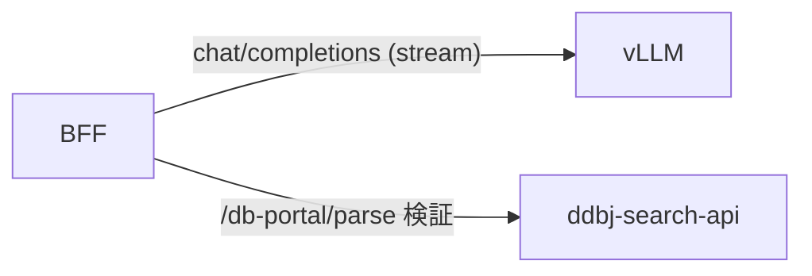
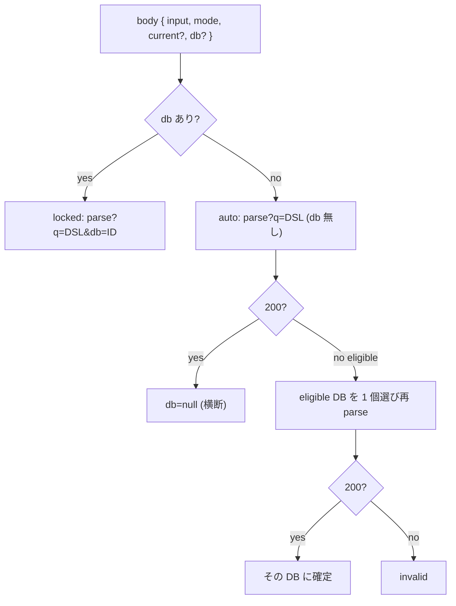
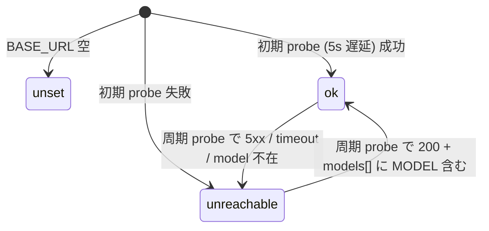
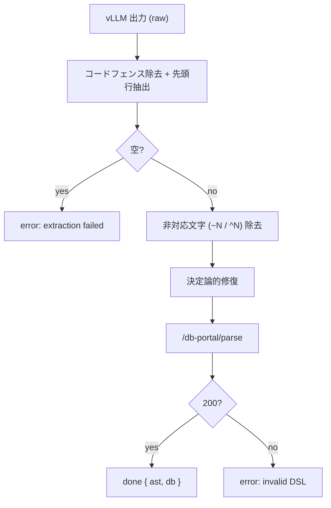
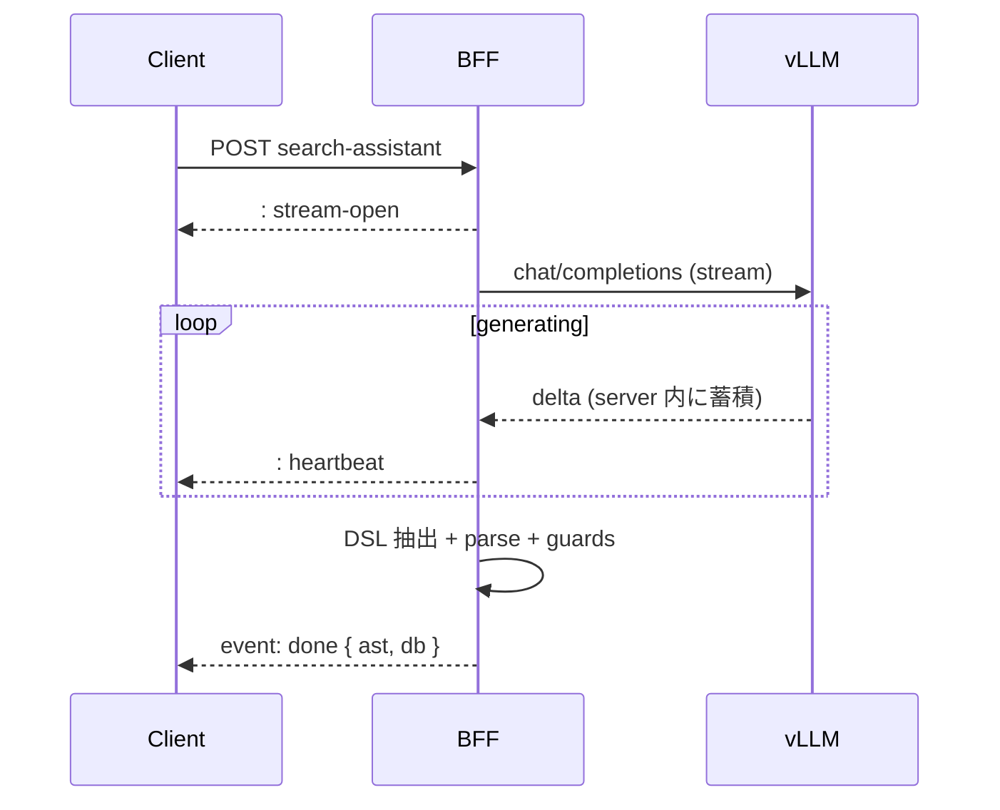

# LLM Integration

vLLM を内部 BFF 経由で利用する検索アシスタント。 SSE による段階的応答、 health 判定、 rate limit、 PII redaction、 DSL 検証を扱う。

## Overview

ブラウザは vLLM の URL も API key も知らない。 BFF が到達確認・SSE 中継・rate limit・log redaction だけを担い、 vLLM serving 自体 (GPU 割当・モデル起動) は別ライフサイクルの GPU node 側責務として `llm/README.md` に切り出す。 staging と production の app は同一 vLLM インスタンスを共有する。 ブラウザ ↔ BFF の一般則は [architecture.md](architecture.md) を参照。



モデルの逐次 delta は server 内のみで蓄積し client へ転送しない。 client が受け取るのは検証済み AST と DB slug が乗った 1 度の `done` event だけ。 BFF は open LLM proxy として振る舞わない。

LLM を使う新機能を増やすときは BFF endpoint と prompt を `/api/llm/<feature>` と `server/llm/<feature>/prompt.ts` の対で持ち、 client → BFF → vLLM の段を共通化する。

## Db スコープ

`/api/llm/search-assistant` request body の `db` 有無で 2 mode に分かれ、 prompt の field 選択と DSL 検証経路が変わる。

- **locked** — body に `db` がある (per-DB ページ起点)。 cross + その DB の Tier-3 を使い、 その DB で valid な DSL を返す
- **auto** — `db` 不在 (top / cross 起点)。 cross 中心で組み立て、 明確に 1 DB の構造化概念を述べた入力に限り Tier-3 を使う。 BFF が DSL 中の Tier-3 field から db を導出する



eligible DB の選択は problem `detail` の名指しを `DB_PRIORITY` (`server/llm/assistant/search-api.ts`) でタイブレークする。 再 parse は 1 回限りで、 再び弾かれたら invalid に倒す。

## Health

`DB_PORTAL_LLM_BASE_URL` の設定値と upstream の `/v1/models` 応答から、 機能が使えるか・upstream に届くかの 3 状態 (`unset` / `ok` / `unreachable`) を持つ。 状態は server in-memory に保持し、 `/api/llm/health` handler は記録値を返すだけで request ごとに vLLM を叩かない。

初期状態は、 BASE_URL が空なら即 `unset` に確定する。 設定済なら server 起動から 5 秒遅延後の最初の probe 結果で `ok` / `unreachable` に確定し、 以降は周期 probe で `ok` ↔ `unreachable` 間を遷移する。



- `unset` のとき `/api/llm/search-assistant` は 503 `{ error: "llm_unset" }` を返し、 UI は AI 補助機能を hide する
- `unreachable` のとき UI は表示し、 送信時の SSE error 経路へ委ねる
- 周期 / 初期遅延 / probe timeout 上限は `server/llm/health.ts` + `server/llm/client.ts` のハードコード定数。 値は env から外し、 deploy 環境で動かさない
- client (`app/features/search/assistant/llm-availability.ts` の `useLlmAvailability`) は TanStack Query で周期 polling し、 `ok` → `ready=true`、 `unset` → 機能 hide、 `unreachable` → 表示 + 送信時委譲を行う
- dev では `DB_PORTAL_LLM_BASE_URL` を空にすると `unset`、 dummy URL にすると `unreachable` を再現できる

## Rate limit

per-IP と per-session の 2 軸を両方適用し、 先に超過した軸で 429 を返す。 SSE 開始前の HTTP 段で弾くので SSE error 経路は通らない。

- per-session 軸は `sid` cookie 保持時のみ追加で適用する
- 固定 window 1 分粒度のカウンタを in-memory Map に持つ。 1 instance + in-memory store の前提で window 境界 burst は許容する
- 超過時の response は HTTP 429 + `Retry-After` ヘッダ + body `{ error: "rate_limited", axis: "ip" | "session" }`
- client は他 error と同じ inline エラー文言で出す (専用文言は持たない)
- 閾値・window 幅・cleanup 間隔の SSOT は `server/llm/rate-limit.ts` + `server/lib/env.ts`

multi-instance 化や共有 store 採用のときは sliding window への切替を併せて検討する。 切替トリガは [auth.md](auth.md) の session store と同じ。 reverse proxy 越し deploy では Express の `trust proxy` を [auth.md](auth.md) の `DB_PORTAL_TRUST_PROXY` で実段数に揃えないと per-IP bucket が全 client 共有に退化する。

## PII redaction

user input は素のまま prompt に組み立てて vLLM へ送る。 redact が走るのは server log に出す直前のみで、 モデルに渡る入力は変えない。

- 共通 log redaction (`server/lib/log.ts` の `redact`) は **key 名一致** (case-insensitive、 snake_case 表記揺れ含む) と **値パターン backstop** (`Bearer` ヘッダ形 / JWT 形) の 2 層
- LLM 用は `server/llm/redaction.ts` の `redactUserInput(input)` を user input log 直前に適用する。 置換 token はカテゴリ別の `[REDACTED_*]` 形式
- 対象カテゴリと regex pattern の SSOT は `server/llm/redaction.ts`。 新パターン追加は PBT (`tests/pbt/server/llm/redaction-coverage.pbt.test.ts`) で「生 PII が出力に残らない」「安全な文字列は変化しない」 の 2 不変量を足す

## DSL 検証

vLLM 出力 (1 行の Advanced-Search DSL 文字列) は ddbj-search-api `/db-portal/parse` で文法 allowlist と Tier-3 → DB 判定にかけ、 AST と確定 DB slug を得る。 BSI 側に field→DB マップは持たず、 verdict を信頼する。



- DSL は `AND` / `OR` / `NOT` / グルーピングのフルスペック。 抽出は `server/llm/assistant/parse.ts`
- 非対応文字 (fuzzy `~N` / boost `^N`) はモデルが稀に残すための backstop として除去する
- allowlist 外 field や構文エラーは `error` event に落とし、 AST 化できない出力は client に届かない。 `error.message` は要求元自身の入力に対する検証結果なので cross-user 漏洩経路にはならない
- parse base URL は `DB_PORTAL_SEARCH_API_URL` (search API と共用)

## 決定論的後処理

vLLM 出力を `done` に乗せる前に、 prompt で防ぎ切れない取りこぼし (Qwen の field マッピング prior 由来) を 0 件化させないための 2 段の決定論的修復を挟む。 修復が失敗したら元の parse 結果に degrade する。

### Field availability ガード

ddbj-search-api は一部 DB の Tier-1/2 cross field を index に持たない (`_TIER12_UNAVAILABLE_DBS`)。 検索時は count=null として UI から落とすが、 parse は厳格で 400 `field-not-available-for-db` を返すため、 locked / auto-解決済の db で非対応 cross field を出した top-level AND conjunct を決定論的に落として同 db で 1 度だけ再 parse する。

- OR-group 内など bare leaf でない箇所は触らない
- 全 conjunct が非対応なら元の 400 に degrade する
- 固定値 field (`accessibility` 等の public-access に畳まれるもの) は対象外
- SSOT は `server/llm/assistant/field-availability-guard.ts`

### Subtype plane ガード

sra / jga は subtype 別の独立 doc で、 異なる plane の field を AND すると 0 件になる ([search.md](search.md) § subtype plane)。 db が sra / jga に確定した AST が cross-plane のとき、 sample plane (organism 等) + cross field を残し、 experiment / analysis plane の field を落とし、 落とした主 sequencing 概念を free-text 1 語として畳み込む。

- 降格規約は system prompt のものと同形
- 修復後の AST は `/db-portal/serialize` → 元スコープで `/db-portal/parse` し直し、 canonical な `{ ast, db }` を得る
- 再 serialize / 再 parse が失敗したら元の parse 結果に degrade する
- SSOT は `server/llm/assistant/plane-guard.ts`

## 外向き契約

BFF endpoint は 2 つ、 いずれも `/api/llm/` 配下。 環境変数は app が読む BFF 用と GPU node 側 serving 用に分かれ、 一部だけが両者で共有される。

### `POST /api/llm/search-assistant`

natural language → DSL の SSE endpoint。

request:

```http
POST /api/llm/search-assistant
Content-Type: application/json
Accept: text/event-stream

{
  "input":   "<natural language>",
  "mode":    "new" | "append",
  "current": <ParseNode AST>,
  "db":      "<db slug>"
}
```

`mode` 省略時は `new`。 `append` のとき `current` 必須で BFF が DSL に serialize して prompt に差し込む。 `db` 在 = locked、 不在 = auto。

response (SSE) は 2 event のみ:



- `message` event (モデル逐次出力) は出さない。 生成中は `: heartbeat` だけを流す
- `done.data.ast` は `/db-portal/parse` で検証済みの ParseNode、 `db` は確定 DB slug もしくは `null` (cross 横断)
- `error.data` は `{ code, message }` (RFC 7807 の field 名を借用)。 `code` の値域は `server/llm/assistant/{route,parse}.ts`、 `message` は human readable
- `error` 送出後 server は stream を close する。 client は同 event id を再 subscribe せず毎回新規 POST する
- stream open 直後に `: stream-open` を 1 度、 以降周期的に `: heartbeat` を流し、 中継 proxy の idle timeout で接続が切れるのを防ぐ。 間隔値は `server/llm/sse.ts`
- BFF rate-limit 超過は SSE 開始前に HTTP 429 で返す
- client (`useAssistantStream`) は `done` を proposal state へ、 `error` を inline エラー文言へ落とす

### `GET /api/llm/health`

`Cache-Control: no-store`。 200 で `LlmHealth` (discriminated union) を返す。 schema の SSOT は `app/schemas/api-bff/llm.ts` (client / server 共用)。

### 環境変数

BFF が読む env (app 起動時) と GPU node の serving 側が読む env (`llm/compose.yml` + `entrypoint.sh`) は別管理。 health probe の周期 / 初期遅延 / timeout 上限はハードコード定数で env から外す。

| 変数 | 用途 | 読む側 |
|---|---|---|
| `DB_PORTAL_LLM_BASE_URL` | vLLM の base URL。 空のとき機能 hide | BFF |
| `DB_PORTAL_LLM_MODEL` | 使用 model 名。 BFF と serving で同値を参照 | BFF + serving |
| `DB_PORTAL_LLM_API_KEY` | vLLM API key。 BFF と serving で同値を参照 | BFF + serving |
| `DB_PORTAL_LLM_TIMEOUT_MS` | upstream request の timeout (probe は 10s 上限で再 clamp) | BFF |
| `DB_PORTAL_LLM_RATE_LIMIT_*` | per-IP / per-session の閾値 / window | BFF |
| `DB_PORTAL_SEARCH_API_URL` | `/db-portal/parse` 等の base URL ([api-types.md](api-types.md) と共用) | BFF |
| `DB_PORTAL_TRUST_PROXY` | Express `trust proxy` 段数 ([auth.md](auth.md)) | BFF |

serving 変数は GPU node の `llm/compose.yml` + `entrypoint.sh` だけが読み、 app は参照しない。 dev は GPU が無いため `env.dev` に serving 変数を置かない。
