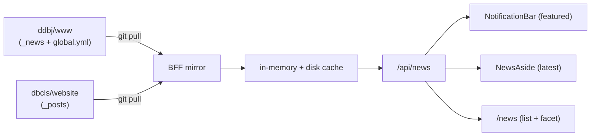
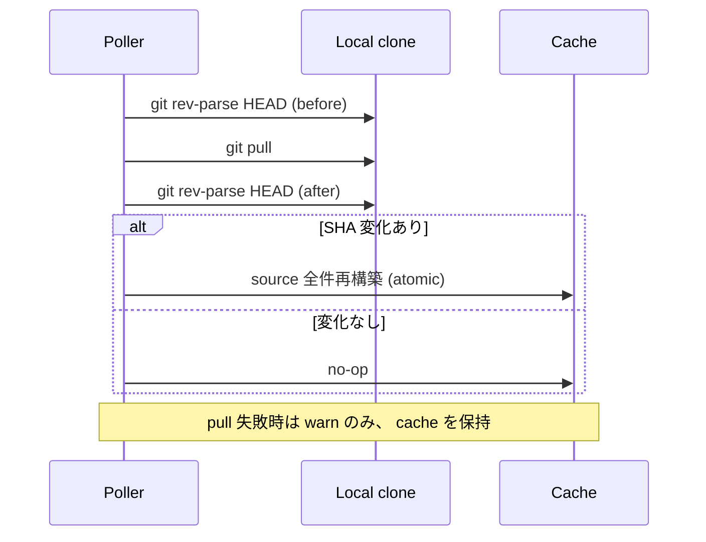

# News

news は ddbj/www と dbcls/website の 2 リポジトリを local clone として保持し、 `git pull` で sync して `/api/news` 1 endpoint から 3 つの表示先 (NotificationBar / NewsAside / /news 一覧) に同じ cache を配る。

## news の役割

upstream を 1 次情報として外部 API を踏まないため、 BFF が ddbj/www と dbcls/website を local clone で持ち、 定期的に `git pull` して全件再構築する。 ブラウザは `/api/news` だけを叩き、 upstream / git clone / 永続 cache のいずれにも直接触れない。 同じ cache を 3 つの UI が振り分け軸を変えて引く: **NotificationBar** (featured のみ・上部 stack)、 **NewsAside** (最新 N 件)、 **/news 一覧** (facet 付き全件)。

cache レイヤーには出現順 / featured 判定 / facet グルーピングのいずれも持ち込まない。 表示軸はすべて downstream (UI / `/api/news` query) で導出する。

## mirror と sync

source ごとに **独立した poller** が走り、 一方の失敗が他方の更新を止めない。 GitHub REST API は使わず、 HTTPS 経由の git protocol で pull するので rate limit とは別枠で運用できる。

- 変更検出は `git rev-parse HEAD` の pull 前後比較だけを根拠とする。 差分 commit を走査しない
- SHA 不一致のときは partial update を行わず、 当該 source の全件を再構築する
- pull 失敗 (network / branch 不在 / 破損) は warn にとどめ、 既存 cache をそのまま提供する
- source 別の repo URL / branch / clone 先 / file 配置は `server/news/sources.ts`、 ポーリング駆動は `server/news/mirror.ts`、 git 操作 wrapper は `server/news/git-sync.ts` が SSOT

## cache

cache は entity list 機構の 2 段 cache 規約 ([entity-list.md § 2 段 cache](entity-list.md)) に従う。 永続層の path は `<DB_PORTAL_NEWS_CACHE_DIR>/news.json`、 atomic 差し替えの単位は ddbj / dbcls の 2 source。

`NewsCache` / `NewsItem` の schema と `schemaVersion` の値は `app/schemas/api-bff/news.ts`、 永続化と atomic 差し替えは `server/news/cache.ts` が SSOT。

## NewsItem の正規化

cache が持つ各 `items` 要素 (`NewsItem`) は、 ja / en の同一記事を **1 件の pair** にまとめた中間構造。 front matter (`tags` / `db` / `published` 等) と本文 Markdown から組み立てる。 各 item は言語ごとの title / summary / url を持つ。

### ja/en pair の束ね方

- source 単位で slug を key に `LangRawMap` で束ね、 `NewsItem` の `id` は `${source}-${slug}` から導出する (= 「内部 slug」)
- 片方の言語しかない slug は、 反対側の title を空文字で持ち、 UI 側の lang fallback で表示する
- `published: false` の slug は両言語側ともに非公開な場合に限り cache から落とす。 片方でも公開されていれば残す
- URL は front matter に持たず、 source / lang / slug から BFF が組み立てる。 該当 file がない言語側は `url.ja` のみ / `url.en` のみで返す

### 分類軸 (種別とサービス)

`tags` は機能軸の `NewsCategory` 型に正規化し、 mapping にヒットしない tag は `other` に落とす (UI を壊さない)。 これが facet sidebar の **「種別」** 軸になる。

ddbj source の Database 区分 (BioProject / BioSample / DRA 等) は `tags` ではなく `db` フィールドから取り、 `NewsCategory` とは独立した **「サービス」** 軸として扱う。

front matter parse / pair 結合 / mapping / summary 抽出 / `publishedAt` 合成は `server/news/normalize.ts` と `server/news/pair.ts` が SSOT。

## 3 つの表示先

同じ cache を引きながら、 振り分けの軸が異なる 3 つの UI がある。 3 つは同一 TanStack Query key で `/api/news` を共有 fetch する。

### NotificationBar

`featured=true` の item を **全 page 共通 layout の上部**に新しい順に stack する (`app/shell/notification-bar.tsx`)。 個別 close 可能。 services 側の `featuredTop` (top page の services セクション限定) とは別軸。

- featured の入力は ddbj source の `_data/global.yml` の `top_news.{ja,en}` (2 言語別の path 列)
- dbcls source は常に `featured=false`
- featured 軸は `NewsCategory` (tag/category 体系) と直交する。 featured なら category を問わず NotificationBar に出し、 featured でなければ category を問わず出さない
- 判定 (path と内部 slug の照合) の SSOT は `server/news/featured.ts` の `isFeaturedSlug`

### NewsAside

`featured` の有無を問わず、 最新 N 件を compact に並べる。

### /news 一覧

`/news` route は SSR loader を持たず、 **URL から facet state を組み立てて** client が `/api/news` を 1 回 fetch し、 集計は cache 全件 (当該言語で title を持つ item) から client 側で行う。 page / sort も同じ URL state に乗る。

facet sidebar は 4 グループ — **種別** (NewsCategory, enum) / **ソース** (ddbj / dbcls, enum) / **年** (publishedAt, number) / **サービス** (db フィールド, string) — で構成する。 件数の集計、 グループ間の AND / OR、 URL serialize の規約は [entity-list.md § URL state と件数](entity-list.md) に従う。

URL state の parse / serialize は `app/features/news/facet-url-state.ts` が SSOT。

## /api/news と環境変数

### `GET /api/news`

cache を filter して返す。 全 query を AND で適用する。 lang を指定したときは 「当該言語で title を持つ item」 だけを返し、 summary の有無は判定に使わない。 response には `Cache-Control: public` を付ける (`max-age` の値は `server/api/news.ts` が SSOT)。

query 仕様 / response schema / lang fallback の規約は `server/api/news.ts` と `app/schemas/api-bff/news.ts` が SSOT。

### 環境変数

`server/lib/env.ts` の Zod schema が SSOT、 値は `env.staging` 等を参照する。 本 doc は `DB_PORTAL_NEWS_*` で統一する:

- `DB_PORTAL_NEWS_{DDBJ,DBCLS}_REPO_URL` / `_MIRROR_{DDBJ,DBCLS}_BRANCH` — 各 source の clone 元 URL と branch
- `DB_PORTAL_NEWS_REPOS_DIR` / `_CACHE_DIR` — local clone と永続 cache の配置先
- `DB_PORTAL_NEWS_MIRROR_INTERVAL_SECONDS` — source 別 poller の周期

`git pull` は GitHub の HTTPS git protocol で動くため、 認証なしで運用する。 services が同じ clone を借りる規約は [services.md](services.md) を参照。
