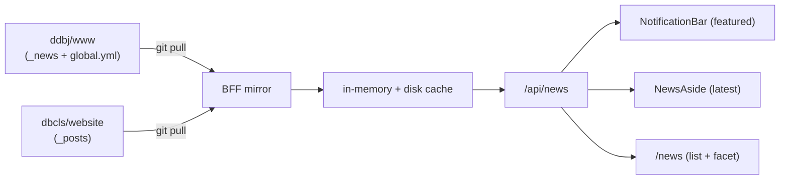
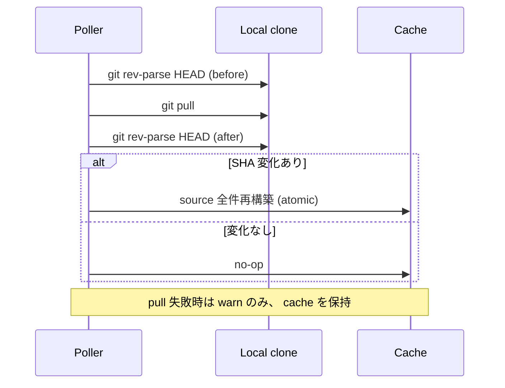

# News

DDBJ/DBCLS の Web サイトから news 記事を mirror し、 cross-source で facet 集計可能な一覧と、 featured 記事を NotificationBar に表示する仕組み。

## Overview

upstream を 1 次情報として外部 API を踏まないために、 BFF が ddbj/www と dbcls/website の 2 リポジトリを local clone として保持し、 定期的に `git pull` して再構築する。 ブラウザは `/api/news` だけを叩き、 上流に直接触れない。

NotificationBar の振り分けと facet 集計は同じ cache から導出する別軸で、 cache レイヤーには出現順 / featured 判定 / facet グルーピングのいずれも持ち込まない。

## データソースと sync

source ごとに独立した poller が走り、 一方の失敗が他方の更新を止めない。 GitHub REST API は使わず、 HTTPS 経由の git protocol で pull するので rate limit とは別枠で運用できる。

- 変更検出は `git rev-parse HEAD` の pull 前後比較だけを根拠とする。 差分 commit を走査しない
- SHA 不一致のときは partial update を行わず、 当該 source の全件を再構築する
- pull 失敗 (network / branch 不在 / 破損) は warn にとどめ、 既存 cache をそのまま提供する
- source 別の repo URL / branch / clone 先 / file 配置は `server/news/sources.ts`、 ポーリング駆動は `server/news/mirror.ts`、 git 操作 wrapper は `server/news/git-sync.ts` が SSOT

## Cache

汎用 mirror cache 規約はこの章を SSOT とし、 services の cache 層も同規約に従う ([services.md](services.md))。

cache は in-memory の `items` 配列と disk の JSON ファイルの二段構成で、 両者を atomic に同期する。 起動時に disk cache を即 load して応答可能にしてから、 initial sync を背後で開始する。

- disk file 不在 / parse 失敗 / `schemaVersion` 不一致のいずれも空 cache から start する。 cold start を待たせない
- `schemaVersion` は cache 形が breaking change したときに bump する。 旧 cache を後方互換でロードしない
- atomic 差し替えの単位は source。 source A の再構築中に source B の items を喪失してはならない
- 永続層は `<DB_PORTAL_NEWS_CACHE_DIR>/news.json` に temp file + rename で書き、 中途半端な JSON を read してしまう状態を作らない

`NewsCache` / `NewsItem` の schema と `schemaVersion` の値は `app/schemas/api-bff/news.ts`、 永続化と atomic 差し替えは `server/news/cache.ts` が SSOT。

## NewsItem の正規化

front matter (`tags` / `db` / `published` 等) と本文 Markdown から `NewsItem` を組み立てる。 ja / en の同一記事は 1 件の item として束ね、 言語ごとの title / summary / url を持つ pair として保持する。

- source 単位で slug を key に `LangRawMap` で束ね、 `NewsItem` の `id` は `${source}-${slug}` から導出する
- 片方の言語しかない slug は、 反対側の title を空文字で持ち、 UI 側の lang fallback で表示する
- `published: false` の slug は両言語側ともに非公開な場合に限り cache から落とす。 片方でも公開されていれば残す
- URL は front matter に持たず、 source / lang / slug から BFF が組み立てる。 該当 file がない言語側は `url.ja` のみ / `url.en` のみで返す
- 写像の値域は `NewsCategory` 型に正規化し、 mapping にヒットしない tag は `other` に落とす (UI を壊さない)
- ddbj source の Database 区分 (BioProject / BioSample / DRA 等) は `tags` ではなく `db` フィールドから取り、 `NewsCategory` とは独立した「サービス」 軸として扱う

front matter parse / pair 結合 / mapping / summary 抽出 / `publishedAt` 合成は `server/news/normalize.ts` と `server/news/pair.ts` が SSOT。

## NotificationBar と NewsAside

top page には NotificationBar (上部 stack) と NewsAside (右ペイン compact list) の 2 つの news 表示がある。 同じ cache を引きながら、 振り分けの軸が異なる。

- **NotificationBar** — `featured=true` の item を新しい順に stack する。 個別 close 可能。 featured の判定は ddbj source の `_data/global.yml` の `top_news` slug whitelist が SSOT で、 dbcls source は常に `featured=false`
- **NewsAside** — 最新 N 件の compact list。 `featured` の有無を問わない
- featured 軸は `NewsCategory` (tag/category 体系) と直交する。 featured なら category を問わず NotificationBar に出し、 featured でなければ category を問わず出さない

featured の SSOT 抽出は `server/news/featured.ts`、 NotificationBar / NewsAside / `/news` は同一 TanStack Query key で `/api/news` を共有 fetch する。

## /news 一覧と facet 集計

`/news` route は SSR loader を持たず、 URL から facet state を組み立てて client が `/api/news` を 1 回 fetch する。 集計は cache 全件 (当該言語で title を持つ item) から client 側で行う。

facet sidebar は 4 グループ (種別 / ソース / 年 / サービス) で構成する。 件数の集計規約は以下に従う。

- 同 facet グループ内の複数選択は OR、 異なる facet グループ間は AND で結ぶ
- グループ G の option v の件数は、 **G を除く全 facet を適用した結果集合のうち v を持つ件数** とする (self-exclusion)
- G 内での選択は G 自身の件数に影響しない。 他グループの絞り込みは G の件数に連動する
- pagination と facet を同時に変えた場合、 URL は 1 回で更新する (履歴を分割しない)

URL state の parse / serialize は `app/features/news/facet-url-state.ts` が SSOT。 複数値は `,` separated、 順序は alphabet sort で安定化する。

## 外向き契約

ブラウザは `/api/news` だけを叩き、 upstream / git clone / 永続 cache のいずれにも直接触れない。

### `GET /api/news`

cache を filter して返す。 全 query を AND で適用する。 lang を指定したときは「当該言語で title を持つ item」 だけを返し、 summary の有無は判定に使わない。 response には `Cache-Control: public, max-age=60` を付ける。

query 仕様 / response schema / lang fallback の規約は `server/api/news.ts` と `app/schemas/api-bff/news.ts` が SSOT。

### 環境変数

`DB_PORTAL_NEWS_*` で統一する。

| 変数 | 意味 |
|---|---|
| `DB_PORTAL_NEWS_DDBJ_REPO_URL` | ddbj source の clone 元 URL |
| `DB_PORTAL_NEWS_MIRROR_DDBJ_BRANCH` | ddbj source の branch |
| `DB_PORTAL_NEWS_DBCLS_REPO_URL` | dbcls source の clone 元 URL |
| `DB_PORTAL_NEWS_MIRROR_DBCLS_BRANCH` | dbcls source の branch |
| `DB_PORTAL_NEWS_REPOS_DIR` | local clone の配置先 |
| `DB_PORTAL_NEWS_CACHE_DIR` | 永続 cache (`news.json`) の配置先 |
| `DB_PORTAL_NEWS_MIRROR_INTERVAL_SECONDS` | source 別 poller の周期 (秒) |

`git pull` は GitHub の HTTPS git protocol で動くため、 認証なしで運用する。 services は `DB_PORTAL_NEWS_*` の clone を read-only で再利用するため、 services 用の clone / poller を別に持たない ([services.md](services.md))。
