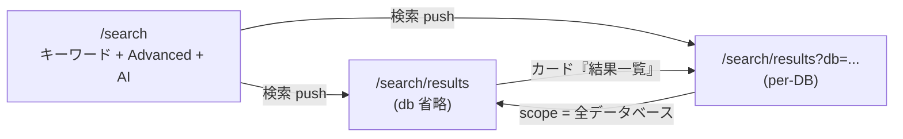
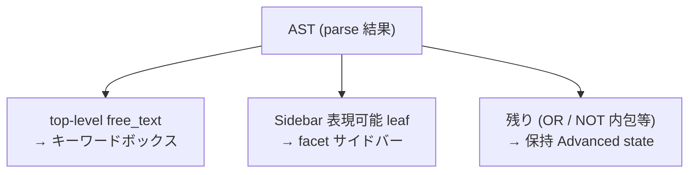
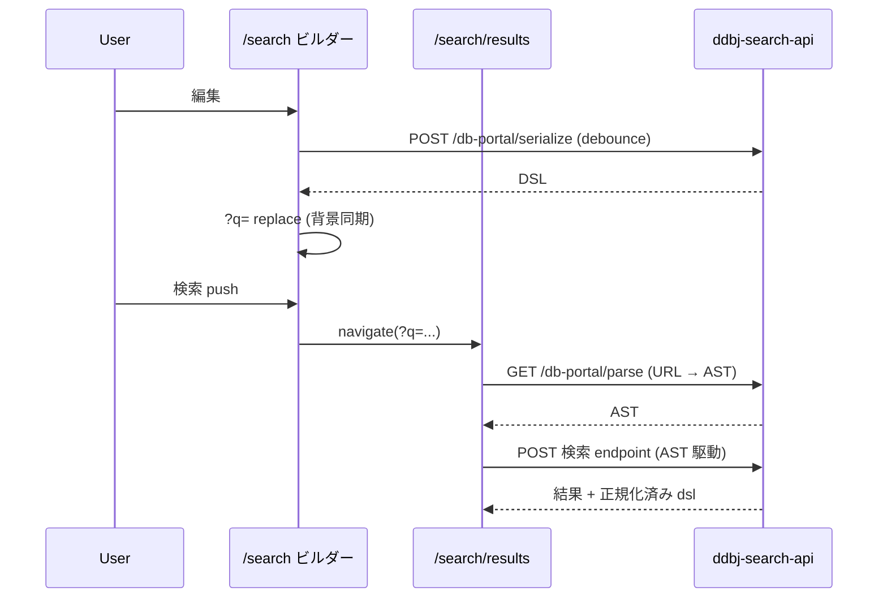

# Search

検索 UI の設計。 cross-DB と per-DB の 2 モード、 Sidebar facet、 Advanced builder、 AI クエリビルダー、 DSL の往復契約を扱う。

## Overview

BSI の検索面は **cross-DB** (全 DB 横断のヒット件数と上位 hit) と **per-DB** (1 DB に絞ったレコード一覧 + 詳細 facet) の 2 モードでだけ動く。 ビルダー `/search` で条件を組み、 結果ページ `/search/results` で `db` パラメタの有無により 2 モードを切り替える。

- cross-DB は ddbj-search-api `/db-portal/cross-search` を、 per-DB は `/db-portal/search` を呼ぶ
- `/search/results` の右ペインは Sidebar facet で、 Advanced builder を出さない (ビルダーは `/search` 側に集約する)
- DB 軸の値域 / per-page 値 / sort key は `app/lib/search-scope.ts` が SSOT

## ドメイン語彙

検索 docs 全体で前提とする語彙を、 search.md で使う範囲で 1 行ずつ定義する。 field 別の所属 tier と scope 配分は `app/features/search/field-registry.ts` が SSOT。

- **Tier 1**: 全 DB が共通で持つ field (organism / 識別子 / 日付 等)。 cross と全 per-DB の双方で使える
- **Tier 2**: ES backend の複数 DB が共通で持つ field (`accessibility` / `description` 等)。 cross + 該当 per-DB で使え、 Tier 1 と合わせて「cross で使える全 field」 を構成する
- **Tier 3**: 1 DB だけが持つ field (BioProject の `project_type`、 SRA の `library_strategy`、 JGA の `dataset_type` 等)。 cross では使えず、 当該 per-DB scope でのみ提供される
- **subtype plane**: 同一 DB index 内で「互いに doc を共有しない部分集合」。 SRA は experiment / study / sample / run / analysis、 JGA は dataset / study / sample 等に分かれ、 1 doc は 1 plane に属する。 異なる plane の Tier 3 field を AND すると DSL parse は通っても hit 0 になる
- **facet**: 候補値と count を API 側集計で並べる値域確定 filter。 field-registry の `facetName` で ddbj-search-api の facet 名と結ばれる
- **accession**: 各 DB の主キー (BioProject `PRJDB...`、 BioSample `SAMD...`、 SRA `DRA/DRP/DRR...`、 GEA `E-GEAD-...` 等)。 完全一致のときだけ `suppressed` レコードが解禁される
- **INSDC status**: レコードの公開状態 (`public` / `private` / `suppressed` / `withdrawn`)。 通常検索は `public` のみがヒットする

## URL state

URL は検索状態の共有・復元形。 任意の URL から client state を復元でき、 共有・ブックマーク・リロード・戻る/進むが破綻なく成立する。 値域・default は `app/lib/search-url.ts` / `search-scope.ts` を参照。

- `q` (DSL 文字列、 URI encoded)、 `db` (省略で cross、 値ありで per-DB)、 `page` / `perPage` / `sort` が URL に載る
- `q` 不在は match_all。 cross / per-DB とも `q` を省いて検索 API を呼ぶ
- `/search/results` の対話中は **client が持つ AST が源泉**、 URL `?q=` はその射影として背景同期される
- facet / Advanced / paging 変更は `replace`、 検索ボタン / Enter / クリアは `push`
- per-DB → cross の scope 変更は別 route 遷移 (`?db=` を delete)

### URL からの復元

`/search/results` loader は `?q=` を `GET /db-portal/parse` で AST 化し、 route component が AST を 3 つの面 (キーワードボックス / Sidebar facet / 保持 Advanced state) に分解して state を再構築する。

`/search` ビルダーも `?q=` で開くと同じ parse → split を行い、 free_text は keyword 行、 残りは Advanced builder 状態として復元する。 Sidebar / Advanced builder で表現できない構造は **保持 state 側に倒す**。 `q` が空のときは parse を行わず ast=null のまま 3 面とも初期状態にする。

### parse の失敗

ユーザーが直せる失敗 (キーワード構文エラー) と、 system 側の失敗 (serialize / 同期失敗) を区別して扱う。 retry policy は `app/lib/query/client.ts` (query は再試行、 debounced serialize の mutation は再試行なし)。

- `/search` のキーワード parse 失敗 — ボックスを invalid 表示、 プレビュー位置に warn の `<Callout>` (排他)、 「この条件で検索」 button を disable。 results へ遷移させず、 その場で直せる
- `/search/results` の URL `?q=` parse 失敗 — loader が `parseError` を返し、 route component が warn `<Callout>` (「再試行」 = `navigate(0)`)。 throw / ErrorBoundary 経路は通らない
- system 側の serialize / 同期失敗 — 警告も disable も伴わず、 sync chip だけが示す。 表示中の検索結果は古いまま使える

## Sidebar facet

`/search/results` の右ペインで、 scope 固有の絞り込みを担う唯一の編集可能 filter。 行構成 (どの scope で何を facet / text / range として出し、 どの DSL field を emit するか) は `app/features/search/field-registry.ts` が SSOT。 Advanced builder と共通の registry を引く。

- 各行は AND 結合のみ。 OR / NOT を持てる条件は保持 Advanced state に倒す
- 各行は値域に応じて 3 種類の制御 (facet / text / range) で出し分ける。 種別判定は distinct 件数の実測 (静的閾値を docs に焼かない)
- **cross は Tier 1/2 のみ** — Tier 3 を出すと `field-not-available-in-cross-db` で 400
- **Solr scope は degenerate 行を抑制** — ddbj / taxonomy の submitter / organism facet 等は API が集計しないため出さない
- 行順は意味順 (subject → 識別 / 内容 → 分類 → access / provenance → 数値 → 日付)。 facet を render kind だけを理由に上部へ持ち上げない
- accession (`identifier`) 行は Sidebar / Advanced builder のどちらにも出さない — eq exact で絞り込みにならないため、 keyword box の free_text と cross-DB 完全一致検出が担う

### candidate と count

facet の候補値と count は **ddbj-search-api の facet 集計**から取る。 BSI 側に hardcoded 静的リストを持たない。 集計の外向き契約 (`facets` / `facetsSize` / `facetSelfExclude` パラメタ、 response 形、 facet 名 → DSL field の再注入規約) は ddbj-search-api `docs/db-portal-api-spec.md § facet 集計` が SSOT。

- 集計母集団は **self-exclusion** — 各 facet `F` の bucket は、 `q` のうち `F` 自身のフィルタだけ除外した集合から算出。 hits 本体は `q` 全フィルタ適用のまま
- accession 完全一致で suppressed が解禁される場合の母集団は hits と同一 `status_mode`
- `organism` の bucket は taxID で集計、 表示は学名ラベル、 再注入は `organism_id:<taxID>`

### date 行

date 行は「すべて / 1年 / 5年 / 10年」 のプリセットボタン + FROM/TO date input を併せ持つ。 内部状態は `active` (プリセット種別 or `custom`) + FROM/TO で表す。

- プリセットは FROM/TO を空で持ち、 emit / 表示時に**現在日から都度算出**する (絶対日付を state に焼き込まない)
- FROM/TO 手編集で `custom` に遷移し、 プリセット選択表示は外れる
- URL は絶対 between しか持たないため、 復元時にプリセット 1y / 5y / 10y と照合してプリセット選択を round-trip 越しに保つ

## Advanced builder

`/search` のビルダー側で、 ネストした group / condition の tree を組む UI。 field 候補は scope 依存で `field-registry.ts` から導き、 op affordance は field type から `app/features/search/advanced/field-catalog.ts` が導出する (Sidebar と共通)。

- group / root の結合は **`innerCombinator` を 1 つだけ**選ぶ (Airtable / Notion 流。 AND / OR の混在はネストで表現する)
- UI は group / root ごとに AND / OR セグメントトグルを 1 つ出す。 行間に連結語 (「かつ」 / 「または」) は出さない
- 否定 (NOT) は**演算子 (述語) に統合**する (`を含む` / `を含まない` のペアでドロップダウンに並べ、 negated は AST 上 condition を NOT で包む)。 独立した「除外」 トグルは持たない
- **先頭行を含む全 condition が独立に否定可能**。 先頭固定は行わない
- `FreeText` は Advanced builder に載せない (Simple query / keyword 行が扱う)
- 表現できない構造 (OR/NOT 内の free_text 等) は `toAdvanced` で drop し、 保持 state 側に倒す

### round-trip

AST ↔ AdvancedState の往来 (`toAdvanced` / `fromAdvanced`) は canonicalize 込みで PBT 固定する。

- `toAdvanced(fromAdvanced(s))` は `canonicalize(s)` に等しい
- `fromAdvanced(toAdvanced(ast))` も `canonicalize(ast)` に等しい

`canonicalize` は (a) 空 condition / 空 range 除去、 (b) AND/OR の子 1 件は親に flatten、 (c) 同 combinator の入れ子は flatten。

### state reducer

state 遷移 (追加 / 削除 / 内部結合切替 / 否定切替 / field・op・value・range 更新 / URL 復元時の root 置換 / 全消去) は `app/features/search/advanced/reducer.ts` が SSOT。 PBT で固定する不変量は次の 2 つ。

- 同じ id を 2 つ持つ node が同時に木に存在しない
- root 以外の任意 node を削除した結果が valid AdvancedState である

## AI クエリビルダー

自然言語入力から Advanced builder への提案 (新規生成 / 既存への融合) を出す UX。 提案はフルスペック DSL を表す ParseNode AST。 server 側 SSE 実装と prompt 設計は [llm.md](llm.md) を参照。

### availability

`/api/llm/health` を `useQuery` で取得し、 `status` ごとに `ready` を導く (`app/features/search/assistant/llm-availability.ts`)。 配置面は top / cross-DB results / per-DB results / `/search` のキーワードボックス。

- `unset` のときだけ UI を**物理的に出さない**
- `unreachable` のときは UI を出して、 送信時に SSE error 経路で fail を伝える
- `ready` のときのみ submit が enable になる

### 経路ごとの反映先

呼び出し面によって、 提案カードを介すか直接 navigate するかが分かれる。

| 経路 | 反映先 | 生成モード |
|---|---|---|
| `/search` ビルダー | 提案カードを read-only で見せ、 適用で AST を split (free_text → keyword、 構造化 → builder) | new / append |
| cross-DB / per-DB results | 提案カードを出さず、 done AST を serialize して `/search/results` へ navigate | new / append |
| top | 同上 | new 固定 |

### db スコープ

生成 db は呼び出し面で決まる。 SSE `done` の `{ ast, db }` で運び、 client はそれに従って遷移する。

- top / cross-search ビルダー / cross-DB results — **auto** (db を送らず、 生成 DSL の Tier-3 field から BFF が db を導出)
- per-DB results — **locked** (現 `db` を送り、 生成はその DB 内で完結する)。 モデルが DB 外 Tier-3 を出した場合は parse が `invalid_dsl` を返し、 別 DB へ勝手に遷移しない

### 生成モード

cross-search ビルダーは **新規生成 (new) と既存に追加 (append)** を**生成前**に選ぶ (prompt がモードで変わるため)。 default はビルダーの件数 (keyword 行 0/1 + 構造化条件数) で決まる — 1 件以上で append、 0 件で new。

- **append**: 現在のビルダー DSL を `current` として送る。 モデルが既存条件を保持したまま融合した完全な DSL を返す
- **new**: `current` を送らず、 提案だけの新規クエリにする。 keyword も初期化する
- append の AST は既存条件を内包するため、 client 側の graft は不要

### sync status

`/search` のみ `SyncStatus` chip を出す (state 種別は `app/features/search/sync-status.tsx`)。 chip は**状態を示すタグのみ**で操作を持たず、 再試行はクエリプレビュー上の warn `<Callout>` に集約する。 `/search/results` は serialize-sync を持たないため chip を出さない。

## キーワード結合

検索語の結合は**入力の区切り文字**で決まる。 BSI は `keywordOperator` を送らず API default (`OR`) に従い、 区切り文字 (スペース / カンマ / クオート) で AND / OR / phrase を表現する。

- スペース区切り (`cancer mouse`) → AND (DSL 文法が値内空白を AND 連結する)
- カンマ区切り (`cancer,mouse`) → OR (`keywordOperator` の default)
- クオート (`"Homo sapiens"`) → phrase 一致 (順序保持)
- 末尾の bare word は前方一致でも拾う (`Huma` → `Human`)。 クオートには掛からない (API `compile_free_text` が末尾トークンを phrase_prefix に展開する)

キーワードボックスは**自由文として案内する**。 ddbj-search-api 文法は `field:value` (allowlist 制) も解釈するが、 BSI は宣伝しない。 不明 field や解釈できない構文は parse が 400 を返すので、 invalid 表示で知らせる。

キーワード (free_text) が照合する default field 集合は ddbj-search-api `compile_free_text` の `_FREE_TEXT_DEFAULT_FIELDS` が SSOT。 「すべての項目」 ではないので UI もそのように表示する (「おもな項目を全文検索」 + ⓘ で field 名を明示)。 BSI は `keywordFields` 相当の絞り込みパラメタを送らない。

## 外向き契約

AST / DSL の grammar SSOT は ddbj-search-api 側 (`/db-portal/{parse,serialize}` 仕様)。 BSI 側に thin serializer を持たない。 BSI は AST を 3 経路 (Simple query / Advanced builder / Sidebar facet) で組み立て、 merge して送るだけ。

### AST と DSL の往来

`/search` ビルダーは AST → DSL を serialize sync で背景同期し、 `/search/results` は AST 駆動で検索する。 URL `?q=` は GET cold load 用に残す。

- `serialize` / `parse` / AST 駆動の検索は現在の **`db` scope を渡して呼ぶ** (per-DB は当該 DB、 cross は省略)。 Tier 3 field を含む AST を scope 無しで送ると `field-not-available-in-cross-db` で 400 になるため
- `/search` の serialize sync は 1 本の debounce で `parse → merge → serialize` し、 単調増加トークンで古い応答を捨てる (request はキャンセルしない)
- 失敗時は URL を書き換えない。 表示中の結果は古い URL のまま使える

### AST merge

3 経路の AST を AND で結合する純粋関数 `mergeAstAnd` と空 AST `identityAst` は `app/features/search/ast/` が SSOT。 結合則・単位元・平坦化は PBT で固定する。

- **結合律**: `merge(merge(a, b), c) ≡ merge(a, merge(b, c))` (canonicalize 後)
- **単位元**: `merge(a, identityAst) ≡ a`
- **空消滅**: `merge() ≡ identityAst`
- **保存性**: 結果の rule 集合は入力の rule 集合の和 (重複あり) に等しい
- **平坦化**: 結果が `BoolOp(AND, [...])` のとき、 子に `BoolOp(AND, ...)` は現れない
- 冪等ではない (同じ node を 2 回渡すと重複した child が生成される)。 等価判定は構造比較 (`astEquals`)

### データ可視性

INSDC status (`public` / `private` / `suppressed` / `withdrawn`) で検索可視性が変わる。 判定 SSOT は ddbj-search-api 側 (`db-portal-api-spec.md § データ可視性`)。 BSI は DSL を送るだけで、 解禁判定や status フィルタを持たない。

- 通常検索 (キーワード / facet) は `public` のみがヒットする
- accession 完全一致 (top-level が単一 accession の free_text / identifier、 または直下に持つ AND) のとき backend が `suppressed` を解禁する。 OR / NOT 配下・ワイルドカードは解禁しない
- BSI が表示で区別するのは `suppressed` のみ (Suppressed バッジ)。 cross-DB 結果ではこの完全一致を**表示用にのみ**検出する
