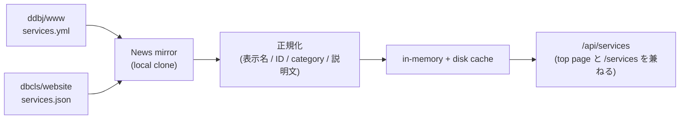

# Services

services は News mirror が clone した local repo を read-only で借りて、 `/api/services` 1 endpoint で top page セクションと `/services` 一覧の両方を返す。 2 source の正規化、 cache、 featuredTop、 Facet を扱う。

## services の役割

services は **独自の git clone もポーリングも持たず**、 News mirror が維持する local clone を read-only で借りる。 source ごとに正規化して in-memory + disk の両 cache に流し込み、 `/api/services` 1 endpoint で **top page セクション** (`featuredTop === true` のみ) と **`/services` 一覧** (全件 + facet) の両方を返す。 BFF と外部 API / secret 遮蔽の一般則は [architecture.md](architecture.md) を参照。

source ごとの実ファイル / 抽出条件は `server/services/sources.ts`、 写し方は `server/services/normalize.ts` を参照。

## 入力 source と cache

clone / pull は News に委譲し、 services 側は HEAD 変化を契機に当該 source 分だけ再構築する。 2 source (DDBJ `services.yml` / DBCLS `services.json`) の責務は重ねず、 重複 entry は filter で落として disjoint に保つ。

- services 専用の git 操作 (`git clone` / `git pull`) を持たない
- 独自のポーリング間隔を持たない。 News mirror の sha 変化通知を起点にする
- `ddbj-www/services.yml` から DBCLS 提供 entry を除外し、 source 間の disjoint 性を保つ

### cache

二段 cache (in-memory + disk) / disk cache 即 load / `schemaVersion` 不一致時の空 cache fallback / source 単位 atomic 差し替え といった汎用 mirror cache 規約は [news.md](news.md) を SSOT として継承する。 services 固有の差分は 3 点に絞る。

- 再構築の起点は独自 poller ではなく **News mirror の sha 変化通知**。 受領 sha と `lastSyncSha[source]` が一致するときは no-op
- atomic 差し替えの単位は source (DDBJ / DBCLS) の 2 系統。 片方の再構築中に他方の items は触らない
- ファイル read / normalize 失敗は warn にとどめ、 既存 items を維持する

配置先 / `schemaVersion` の bump 規約 / 差し替え手順は `server/services/cache.ts` と `server/services/mirror.ts` が SSOT。

## 正規化

各 source の生 entry は語彙が違ったり、 表記揺れがあったりするため、 同じ shape に揃えてから cache に入れる。 順序は **表示名 override → ID 採番 → category 写像 → 説明文** のチェーンで、 後段ほど前段の結果に乗る (ID は override 後の名前から、 category は両 source 別個に写像)。

### 表示名 override

upstream の英名は冗長 / 和名混在の item が混じるため、 BSI 側で override 表を持って表示名を揃える。 `id` 生成と `featuredTop` 判定は override 後の名前から行い、 表示と判定の入口を 1 つにする。 override 表は `server/services/sources.ts` が SSOT。

### ID 採番

`id` は機械的に `${source}-${nameSlug(英名)}` で生成し、 `^[a-z0-9-]+$` を満たす。 安定性は PBT で固定し、 upstream の表記揺れを吸収する。

### category 写像

各 source の原語彙を BSI 共通の `ServiceCategory` (機能軸) に写像し、 結果は複数値の `categories` として持つ。 写像に乗らない語彙は UI を壊さないよう `other` に落とす。

- `categories` は dedupe 済みの `ServiceCategory[]`、 空なら `["other"]` を返す
- 写像前の原語彙は `rawCategories` に保持し、 デバッグ可能にする
- domain 軸 (Genome / Gene / Gene expression / Disease 等) は機能軸の `ServiceCategory` に寄与させない
- `ServiceCategory` enum と response Zod schema は `app/schemas/api-bff/service.ts` が SSOT
- source 別 mapping (`DDBJ_TAG_MAP` / `DBCLS_CATEGORY_MAP` / `DBCLS_CATEGORY_OVERRIDES`) と domain 軸判定は `server/services/normalize.ts` が SSOT

### 説明文

`description` は upstream で末尾句点の有無が混在する。 cache / API の生データは upstream 忠実なまま保持し、 表示時に言語別の句点 (ja `。` / en `.`) を補って統一する。 補完は表示用 helper (`app/lib/api/services.ts`) でのみ行い、 storage 層には漏らさない。

## /api/services の 2 用途

`/api/services` は **1 endpoint で 2 用途を兼ねる**。 SSR loader は持たず、 client が TanStack Query で 1 回 fetch し、 top page と /services で同じ query key を共有する。 使い分けは client 側で `featuredTop` フラグの絞り込みや facet 選択で行い、 別 endpoint を増やさない。

### top page

top page の services セクションは `featuredTop === true` の item だけを表示する。 判定規約は source ごとに異なる (DDBJ は name whitelist、 DBCLS は name prefix) が、 client から見れば boolean フラグ 1 本で扱える。 whitelist / prefix の SSOT は `server/services/sources.ts`。

### /services 一覧と Facet

`/services` 画面の facet sidebar は `category` (`categories`) と `source` の 2 グループで構成する。 値域は cache から実出現分のみ拾い、 サイト全体の enum を全部出して 0 件を並べることはしない。

- 複数選択は OR、 異なる facet 同士は AND
- facet count は self-exclusion 集計 ([news.md](news.md) と同規約)
- source 色点は News と同じ規約 ([news.md](news.md))
- 一覧の並びは name のアルファベット順 (Toolbar で昇順 / 降順切替)
- 日付軸を持たないため year facet / date sort は出さない
- URL params との同期は `,` separated、 順序は alphabet sort で安定化する

### `GET /api/services`

| query | 動作 |
|---|---|
| `source` | comma separated。 いずれかに一致する item |
| `category` | comma separated `ServiceCategory`。 `categories` がいずれかを含む (OR) |
| `featured` | `true` で `featuredTop === true` のみ |

- 全 query は AND で適用する
- response header に `Cache-Control: public, max-age=60` を付ける
- response 形は `app/schemas/api-bff/service.ts` の Zod schema が SSOT

### 環境変数

| 変数 | 意味 |
|---|---|
| `DB_PORTAL_SERVICES_CACHE_DIR` | disk cache のディレクトリ |

repo clone 先 / branch / ポーリング間隔は News (`DB_PORTAL_NEWS_*`) を再利用する。
