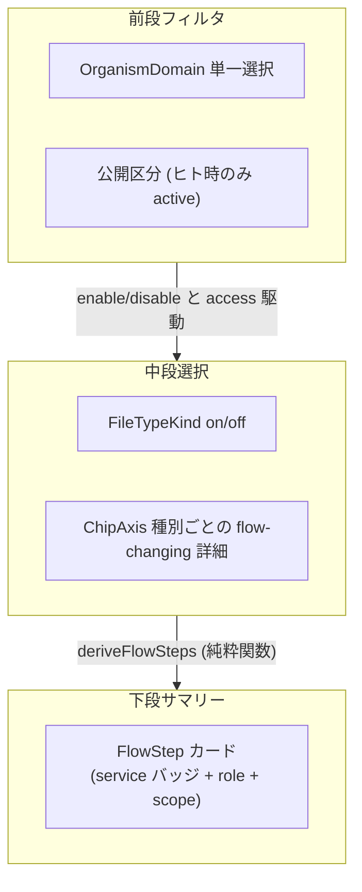
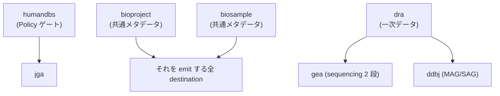
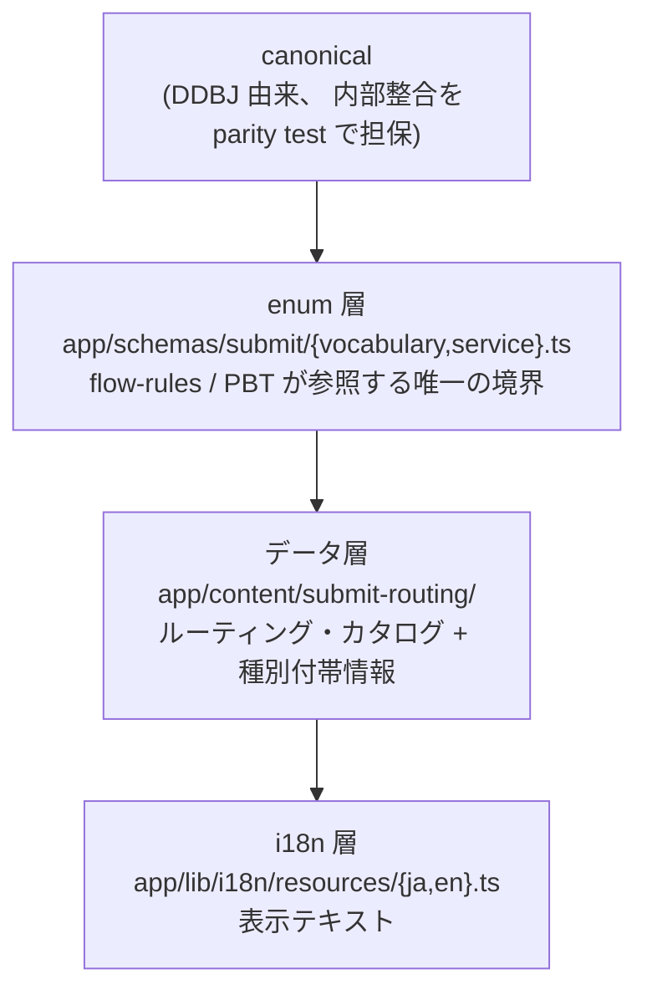
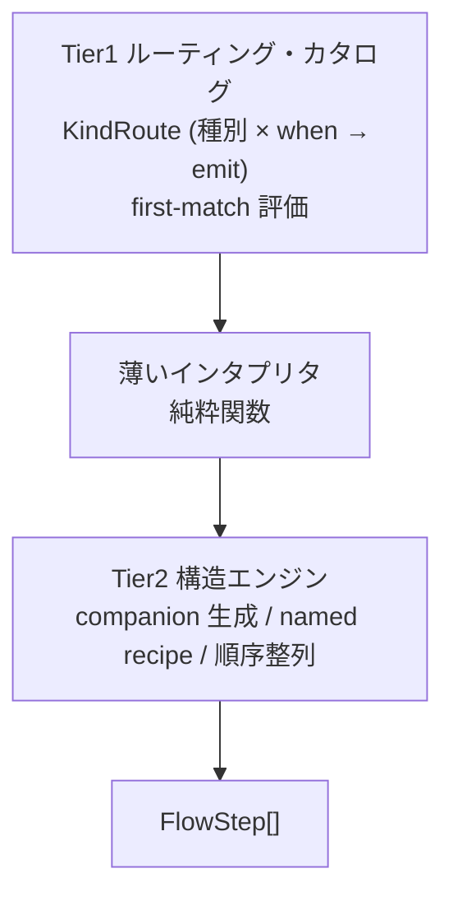

# Submit

submit features は **navigator** として、 ユーザーがデータの性質を答えた結果から 「どの service に何を出すか」 を導出する。 入力の 4 軸、 ヒト時の公開区分、 出力の FlowStep カードと service / role / Step 依存、 経路導出の Tier1 カタログ × Tier2 エンジンを扱う。

本書での 「service」 は submit の destination / companion / external 役割を持つ enum (`app/schemas/submit/service.ts`) を指す。 同名語で扱う別概念があるので注意:

- 内部 Service tile / 詳細ページ → `app/content/services/*.content.tsx` ([content.md](content.md) § TS collection)
- 外部 DDBJ / DBCLS サービス mirror → `server/services/*` ([services.md](services.md))

## navigator の役割

ユーザーが手元データの性質を **4 軸** (次章で詳説) に答えた結果から、 「どの service に何を出すか」 を導出する。 各 service の細目 (BioSample 生物種・package、 DRA Library Strategy 等の **Intra-DB Tag**) には踏み込まない — それは登録ウィザード側で埋める。 navigator は **全体俯瞰** と **詳細ページへの導線** に徹する。

UI は **前段フィルタ + 中段選択 + 下段サマリー** の 3 段。 下段は中段の純粋関数で、 ユーザーは下段を直接編集しない。 サマリーは **FlowStep** カードの並びで、 各カードは `{ service, role, scope }` を持つ — どの service に対して、 どの役割 (§ destination / companion / external の 3 役割) で、 submission のどの部分集合 (groupIds / entryIds) を扱うか、 を一枚で示す。

導出は `deriveFlowSteps(submission)` 一本に集約され、 副作用なし・入力 `Submission` を変更しない。 実装は `app/features/submit/flow-rules/derive-flow-steps.ts`。 中身 (Tier1 カタログ × Tier2 エンジン) は § 経路導出 で扱う。

## 入力 4 軸と AccessSection

submission は **4 軸** で表現する。 それぞれが **flow-changing** な意味 — 答えが destination 集合 / 必須 step / scope の束ね方を変えるもの — だけを担い、 表現できない細部は Intra-DB Tag に降ろす。 値域と enum は `app/schemas/submit/vocabulary.ts` / `service.ts` 参照。

- **OrganismDomain**: submission 全体に対する単一選択の生物軸。 種・属レベルの phylogeny は持たず、 BioSample の Intra-DB Tag に委ねる。 `human` のみが公開区分セクションの active 化と JGA への分岐起点になる
- **FileTypeKind**: 真の一次登録単位だけを値域とする中段トグル単位。 附随メタデータ (表現型・サンプル属性) は BioSample の Intra-DB Tag、 付随ファイル (processed 画像・可視化オブジェクト) は主データ step の追加ファイル枠で扱い、 `FileTypeKind` には含めない
- **Access**: `open` / `restricted` の 2 値で per-file の混合を持たず種別単位で扱う。 `restricted ∧ OrganismDomain = human` の組合せが JGA への唯一の分岐起点で、 非ヒトの非公開は INSDC が制限公開を持たないため DRA に embargo (公開予定日) を付ける
- **ChipAxis**: 前段で表現できず、 かつ flow-changing な細部だけを種別ごとに持つ。 出る service を変えない区分は ChipAxis にせず Step カードの Intra-DB Tag に降ろす

flow-changing 軸だけを 4 軸に持つ規約により、 答えても経路に反映されない死んだ質問と、 経路を変える要因が pulldown に隠れる事故の両方を防ぐ。

### AccessSection

公開区分は `AccessSection` から **種別ごとに** 純粋関数で導出する。 ヒト時のみ active で、 非ヒト OrganismDomain は常に全種別 `open` を返す。 優先度と if/else 順序は `app/features/submit/access.ts` の `deriveAccess` が SSOT、 種別ごと既定値は `vocabulary.ts` の `IDENTIFIABLE_KINDS` が SSOT。

UI 構成 (上部トグル 2 + サブトグル 3 + 種別ごと ChipAxis):

| 位置 | control | 役割 |
|---|---|---|
| 上部 | トグル × 2 | 「制限公開を希望する」 (主観的希望) と 「個人識別符号を含む」 (法令上の該否)。 いずれも全 restricted トリガ |
| サブ | トグル × 3 | 「倫理指針に沿ったヒト研究」 「一般入手可能な試料の解析」 「微生物自体の分析 (ヒト配列除去済み)」 |
| 種別ごと | ChipAxis | per-file の反転 (`identifiability`) — `Yes` 時は当該種別だけ open、 `No` 時は当該種別だけ restricted |

各 control の TS 識別子と既定値は `app/schemas/submit/submission.ts` (`AccessSection`) を参照。

導出規約:

- 「制限公開を希望する」 と `hasIdentifier = Yes` は下のサブ条件 (倫理指針 / 一般入手 / 微生物) を強制 disable する強い意思表示として扱う
- サブ 3 つは意味的に排他で、 同時 ON を UI で機械的に禁ずる
- 同一 submission 内で `restricted` / `open` の混在を許す (種別ごと導出のため)
- `restrictedPreference` と `hasIdentifier` はいずれも全 restricted トリガだが、 主観的希望と客観的事実 (法令上の該否) を表す別軸として並置する

## 出力 FlowStep カード

下段サマリーは `FlowStep[]` を Step 依存グラフのトポロジカル順に並べたもの。 各 FlowStep の `service` enum 値・`role` 割当・accession 形式・slug 解決は `app/schemas/submit/service.ts` が SSOT、 外部 URL は `app/content/services/*.content.tsx` が SSOT。

### destination / companion / external の 3 役割

`Service` は単一 enum で、 各値が role を 1 つ持つ。

- **destination**: ユーザーのデータの最終格納先。 § 経路導出 § Tier1 の `emit.service` に出る
- **companion**: submission 全体に共通する導出物 (BioProject / BioSample / Umbrella BioProject)。 § 経路導出 § Tier2 が submission 集約から生成する
- **external**: DDBJ 外の登録窓口への誘導。 一部は登録エンドポイント (jpost / eva)、 一部は前提ゲート (humandbs)

### DDBJ サービス一覧

`Service` enum の全要素と role 割当・accession 形式・具体的な slug 一覧の SSOT は `app/schemas/submit/service.ts`。 本 doc では 3 つの role が担う概念だけを保持し、 slug 一覧を持たない (追加時に docs と code が drift する原因)。

| role | 担うもの |
|---|---|
| companion | 全 destination の前提として 1 件添付する共通メタデータ (BioProject / BioSample 等) |
| destination | データを最終的に受け入れる DDBJ の登録 service (DRA / JGA / DDBJ / GEA / MetaboBank / NSSS 等) |
| external | DDBJ 外部の登録窓口・Policy ゲート (NBDC humandbs / jPOST / EVA 等) |

サマリーカードのバッジ色は role と notes の warning / error 有無から `serviceBadgeColor` 純関数で決め、 色値は `app/styles/tailwind.css` の `@theme` トークンが SSOT。 「詳細を見る」 link は内部詳細ページ (`/<slug>` の catch-all route) を持つ service にだけ出す (判定は `service.ts` の `internalDetailHref` / `hasInternalDetailPage` が SSOT)。

### Step 依存とカード順序

service 間の前提関係を **ステップ依存グラフ** として宣言し、 カード順序と 「先に済ませること」 ブロックの両方を共通駆動する。 辺の集合は `service.ts` の `SERVICE_DEPENDENCIES` が SSOT。

- カード順序はこの依存グラフのトポロジカル順で、 前提ステップが依存ステップより前に出る
- 線形化は 「前提ゲート (humandbs) → 共通メタデータ (bioproject → biosample) → 一次データ (dra) → 主登録先 → 外部リポジトリ (jpost / eva)」
- 各 step の 「先に済ませること」 ブロックは、 依存先のうち **そのフローに実在する** 前提ステップだけを参照する
- 同一 service の scope は union して 1 step にまとめる
- `FlowStep.scope` は `groupIds` か `entryIds` の少なくとも一方が非空でなければならない

### アカウント誘導ステップ

`FlowStep[]` の外側にある UI 上のガイダンスとして、 未ログイン時に「DDBJ アカウントの取得」を促す step 0 を表示する。 表示条件は `flow-summary-card` が `SERVICE_ROLE` を参照して決める:

- **表示する**: `!isAuthenticated` かつ、 `steps` に role が `destination` か `companion` の service が 1 つでもある (= DDBJ 管轄の登録先を含む)
- **表示しない**: 全 step が role = `external` のみ (`humandbs` / `jpost` / `eva`)。 例: proteome → `jpost` only、 非ヒト variant → `eva` only。 これらの登録先は DDBJ アカウントを使わないため誘導を出さない

JGA フローは humandbs (external gate) と jga (destination) を含むため、 誘導は表示される。

## controlled vocabulary の 4 層

navigator が扱う語彙は DDBJ 由来の **canonical** から派生する 4 層構造を持ち、 層境界を起動時 Zod + parity test で機械検証する (codegen は使わない)。 enum を増減すると意味論が変わるため、 enum 層の編集は人間レビュー必須。

- カタログの `note.messageKey` は i18n key 集合と完全一致でなければならない
- データ層の `when` DSL (§ 経路導出 で詳説) は単一 FileEntry / 単一 FileGroup / 前段属性に対する controlled vocabulary 等値だけを参照でき、 submission 集約・算術・文字列マッチ・動的 emit を持たない。 ネスト深さの上限は 3
- DSL で表現できない例外は DSL に逃さず Tier2 の named recipe を足す (escape の最終形 = コード)
- named recipe の集合は allowlist (`RECIPE_ALLOWLIST`) 内に閉じ、 勝手に増えない
- i18n は ja / en parity を PBT で担保し、 揃わない文言は出さない
- INSDC 共通 vocabulary (DRA `Library Strategy` 等) の更新は enum 値の差替えで吸収する

## 経路導出

経路導出は 2 層に分離する。 **Tier1** は DDBJ が編集できるルーティング・カタログ (種別ごとに 「この `when` 条件で この service を emit」 を first-match で並べる)、 **Tier2** は コードと PBT で固定する構造エンジン (companion 生成 / named recipe / 順序整列)。 判定基準は 「単一種別の選択を見れば宛先が決まる軸は Tier1、 submission 全体の集約や 1 種別 → 複数 archive を要する軸は Tier2 の named recipe」。 実装は `app/features/submit/flow-rules/` 配下。

### entry と group

経路導出の入出力で使う Submission の基本単位は **entry** (1 種別 × 1 ファイル / ファイル組) と **group** (複数 entry のまとまり)。 各 entry は `entryId`、 各 group は `groupId` を持ち、 `FlowStep.scope` はそのカードが対象とする `groupIds` / `entryIds` を保持する。

### Tier1 のルーティング・カタログ

Tier1 は **KindRoute** の集合で、 1 つの KindRoute は 「1 種別の `when` 条件と `emit` 候補」 を宣言する。

- `KindRoute = { kind, candidateRepos, rules: [{ when, emit }] }`
- `rules` は **first-match** 評価。 各 rule の `when` (controlled vocabulary 等値の DSL、 ネスト 3 まで、 § controlled vocabulary 参照) に entry が合致した時点で `emit.service` / `emit.scope` / `notes` を返す
- `candidateRepos` (種別ごとに宣言する登録エンドポイント上位集合) は **登録エンドポイント (role = destination ∪ 登録エンドポイントとして扱う external)** の部分集合に閉じる。 範囲外を emit するカタログは起動時 Zod + parity test で落ちる

### Tier2 の構造エンジン

Tier2 は Tier1 の出力を受けて、 1 種別では完結しない構造を組み立てる。

- **companion 生成**: 非 `jga` の entry のうち、 emit 先 service が `SERVICE_DEPENDENCIES` で `bioproject` / `biosample` を宣言するもの (= DDBJ 内 destination) だけを scope とする `bioproject + biosample` のペアを 1 組だけ足す (該当 entry が 0 なら出さない)。 外部エンドポイント (`jpost` / `eva`) は DDBJ 内 companion を必要としないため、 これらのみを emit するフローでは BP/BS ステップは生成しない
- **named recipe**: 1 種別 → 複数 archive、 または submission 集約を要するケースを名前付きで宣言する純関数。 集合 (`jgaSubmissionSteps` / `spatialSteps` / `expressionDraSteps` / `sequenceDraSteps` / `haplotypeSteps`) は `RECIPE_ALLOWLIST` 内に閉じ、 勝手に増えない
- **順序整列**: 同一 service の Step を 1 枚に union し、 § Step 依存 の `SERVICE_DEPENDENCY_ORDER` で線形に並べる

### 合成順序と walk-through

`deriveFlowSteps(submission)` の評価順序:

1. 前段カスケード (`isKindEnabled(organismDomain, fileTypeKind)`) で disable された entry を落とす
2. Tier1 の `routeEntries` で残った entry を `KindRoute` の `when` 列に通し、 first-match で `(entry, service, scope, notes)` の `EntryRouting[]` を得る
3. `jga` 行と非 `jga` 行に分け、 非 `jga` は service ごとに 1 枚にまとめる
4. companion を「非 `jga` かつ emit 先 service が BP/BS を依存宣言するもの」の entry を scope とする 1 ペアで足す (該当 entry が 0 なら出さない)
5. named recipe を順に重ねる
6. 最後に `mergeSameServiceSteps` で同一 service のカードを 1 枚に集約し、 `SERVICE_DEPENDENCY_ORDER` の線形順で sort する

walk-through:

- **完成ゲノムを公開**: OrganismDomain = `eukaryote`、 1 entry が `sequence` (chip = `assembly-form: genome` + `has-annotation: true`)、 Access = `open`。 Tier1 が `ddbj` (MSS) を emit、 Tier2 companion で `bioproject + biosample` が付く。 結果は `bioproject → biosample → ddbj` の 3 枚
- **ヒトのシーケンスリードを制限公開**: OrganismDomain = `human`、 1 entry が `sequence-read`、 `hasIdentifier = Yes` の既定で全 sequence-read が `restricted`。 access 導出が `restricted ∧ human` を満たすため Tier1 が `jga` に分岐。 jga entry は companion ペア生成から除外され、 `jgaSubmissionSteps` が humandbs (Policy ゲート) + jga submission の 2 枚を生成する。 結果は `humandbs → jga` の 2 枚
- **プロテオームを公開 (jPOST のみ)**: OrganismDomain = `eukaryote` (または非ヒト全種、 あるいはヒト × 非-restricted)、 1 entry が `proteome`、 Access = `open`。 Tier1 が `jpost` を emit。 `jpost` は `SERVICE_DEPENDENCIES` で BP/BS を宣言しないため companion 生成対象外。 結果は `jpost` の 1 枚のみ。 全 step が external ロールなので UI 側 (`flow-summary-card`) の DDBJ アカウント誘導ステップも表示されない (§ アカウント誘導ステップ)

### PBT で固定する不変量

次の性質は `tests/pbt/` で `numRuns=1000` で固定し、 reducer ・カタログ・named recipe のどこを書き換えても破れないことを保証する。

- **冪等性**: 同じ input に対して sort も含む同一 output
- **JGA 排他**: 任意の種別について `restricted ∧ OrganismDomain = human` なら JGA scope、 それ以外なら公開系 destination scope。 同じ種別が両方に入らない
- **no-orphan-destination**: enable された全種別が bioproject / biosample 以外に最低 1 つの destination service step に入る
- **conflict-kind-no-step**: 前段で disable された種別は step を生成せず、 その entryId はどの step scope にも現れない
- **cascade-no-deadend**: 任意 OrganismDomain で enable された種別を選ぶと destination service が 1 枚以上出る
- **catalog-vocab-closure**: 全 `when` の値が controlled vocabulary のメンバー、 `emit.service` が登録エンドポイントに存在
- **candidateRepos-parity**: `KindRoute.candidateRepos` は rules の全 `emit.service` を含み、 前段カスケード集合と一致

### Validation

`selectValidations(state)` は副作用なしの純粋関数で、 サマリー直前に走る軸別検査。 各 validation は i18n key と該当種別を含み、 UI 側でクリックすると該当箇所に scroll する。

- **precondition-conflict**: 前段で disable された種別が選ばれたまま残っている。 経路導出から除外されるため `no-destination-service` と二重計上せず、 こちらに集約する
- **no-destination-service**: その種別がどの destination service step にも入らない
- **dangling-group-id**: group 参照が崩れている (UI バグ検知)

## URL state

submit wizard の状態は URL search params に同期し、 リンク共有・再読み込み・戻る/進むで再現する。 serialize / deserialize と access flag の TS field ↔ URL value mapping は `app/lib/submit-url.ts` が SSOT。

- URL 上の identifier (param name・access flag 値・enum 値) は全て kebab-case で表現する。 TypeScript schema は camelCase のまま扱い、 入出力境界でだけ mapping する
- DEFAULT 状態の `AccessSection` (倫理指針のみ ON) は URL 表現から省略する。 `null` と DEFAULT を外向き等価として扱い、 再読み込み時に `null` として復元する
- 不明な key / 値は無視する。 互換 fallback を持たない
- 任意の `SubmitUrlState` について `readSubmitParams(writeSubmitParams(s))` は s と (上記 `null` / DEFAULT 正規化を除いて) 等価。 PBT で `numRuns=1000` で固定する

## navigator の境界

submit features は navigator として 「どの service に何を出すか」 だけを担い、 ファイルそのものや種別ごとの細目には踏み込まない。 ここに列挙する振る舞いは意図的に持たず、 各 service の Intra-DB Tag / 詳細ページに委ねる。

- 外部 API を呼ばない (navigator のみ、 SSR loader も持たない)
- 実ファイルを読まないため、 ファイル名・拡張子・配列長・Feature 数の判定を持たない。 MSS / NSSS の規模境界は Step note の文言案内で表す
- 種別間の相互排他を持たない。 multi-omics の 1 提出は正当で、 種別の絞り込みは前段 OrganismDomain カスケードだけが担う
- 同一種別を多段に分けて段階や属性を割る高度ケース (MAG の多段チェーン、 JGA の Policy 単位 Dataset 分割) は持たず、 各ウィザード側の Intra-DB Tag に委ねた単一ガイド step で案内する
- 生物軸は OrganismDomain 単一で、 種別単位の細かい生物分類を持たない (BioSample 数・生物種は Intra-DB Tag で確定する)
- 詳細ウィザード手順は各 service の `/databases/$slug` ページに委ね、 サマリーカードは全体俯瞰と詳細への導線に徹する
