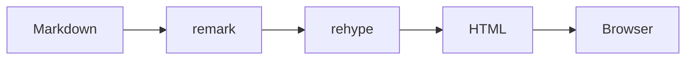
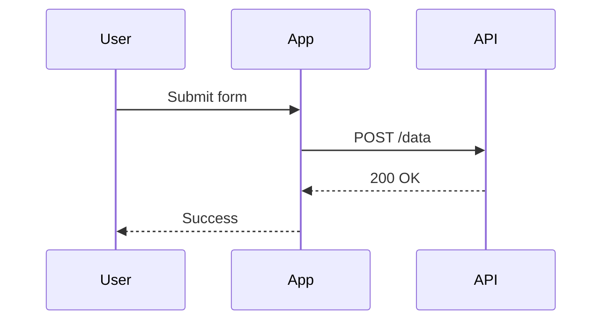

## Headers

# H1
## H2
### H3
#### H4
##### H5
###### H6

## Emphasis

Emphasis, aka italics, with *asterisks* or _underscores_.

Strong emphasis, aka bold, with **asterisks** or __underscores__.

Combined emphasis with **asterisks and _underscores_**.

Strikethrough uses two tildes. ~~Scratch this.~~

## Lists

### Ordered

1. First ordered list item
2. Another item
   1. Ordered sub-list
   2. Second sub-item
3. Actual numbers don't matter, just that it's a number
4. And another item

### Unordered

- Unordered list item
- Another item
  - Nested item
  - Another nested item
    - Deeper nested
- Back to top level

### Mixed

1. First ordered item
   - Unordered sub-item
   - Another sub-item
2. Second ordered item
   1. Ordered sub-item
   2. Another ordered sub-item

### Task lists

- [x] Completed task
- [x] Another completed task
- [ ] Incomplete task
- [ ] Another incomplete task
  - [x] Nested completed task
  - [ ] Nested incomplete task

## Links

[Inline link](https://www.example.com)

[Inline link with title](https://www.example.com "Example Site")

[Reference-style link][example ref]

URLs in angle brackets: <https://www.example.com>

[example ref]: https://www.example.com

## Images


HTML で幅指定もできる:


## Code

Inline `code` has `back-ticks around` it.

### JavaScript

```javascript
const greet = (name) => {
  console.log(`Hello, ${name}!`)
}
greet("World")
```

### Python

```python
def greet(name: str) -> None:
    print(f"Hello, {name}!")

greet("World")
```

### Shell

```bash
echo "Hello, World!"
curl -s https://api.example.com/data | jq '.results[]'
```

### Plain code block

```
No language indicated.
Just plain preformatted text.
```

### Diff

```diff
- const old = "removed"
+ const current = "added"
  const unchanged = "context"
```

## Mermaid





## Tables

| Left-aligned | Center-aligned | Right-aligned |
|:-------------|:--------------:|--------------:|
| Left         |    Center      |         Right |
| `code`       |    **bold**    |       *italic*|
| Link         | [example](https://example.com) | 123 |

### Simple table

Markdown | Less | Pretty
--- | --- | ---
*Still* | `renders` | **nicely**
1 | 2 | 3

## Blockquotes

> Blockquotes are very handy to emulate reply text.
> This line is part of the same quote.

Quote break.

> This is a very long line that will still be quoted properly when it wraps. Oh boy let's keep writing to make sure this is long enough to actually wrap for everyone. Oh, you can *put* **Markdown** into a blockquote.

### Nested blockquotes

> First level
>
> > Nested blockquote
> >
> > > Deeply nested
>
> Back to first level

## Blockquote Alerts (GitHub)

> [!NOTE]
> Useful information that users should know, even when skimming content.

> [!TIP]
> Helpful advice for doing things better or more easily.

> [!IMPORTANT]
> Key information users need to know to achieve their goal.

> [!WARNING]
> Urgent info that needs immediate user attention to avoid problems.

> [!CAUTION]
> Advises about risks or negative outcomes of certain actions.

## Horizontal Rules

Three or more...

---

Hyphens

***

Asterisks

___

Underscores

## Line Breaks

Here's a line for us to start with.

This line is separated from the one above by two newlines, so it will be a *separate paragraph*.

This line is also a separate paragraph, but...
This line is only separated by a single newline, so it's a separate line in the *same paragraph*.

## Inline HTML

<dl>
  <dt>Definition list</dt>
  <dd>Is something people use sometimes.</dd>

  <dt>Markdown in HTML</dt>
  <dd>Does <em>not</em> work <strong>very</strong> well. Use HTML tags.</dd>
</dl>

<details>
<summary>Click to expand</summary>

This is hidden content that can be toggled.

- Item 1
- Item 2
- Item 3

</details>

## Footnotes

Here's a sentence with a footnote[^1].

And another one[^note].

[^1]: This is the first footnote.
[^note]: This is a named footnote with more detail.

## Escaping

\*Not italic\* and \*\*not bold\*\*.

\# Not a heading

\- Not a list item

## Long content for scroll testing

Lorem ipsum dolor sit amet, consectetur adipiscing elit. Sed do eiusmod tempor incididunt ut labore et dolore magna aliqua. Ut enim ad minim veniam, quis nostrud exercitation ullamco laboris nisi ut aliquip ex ea commodo consequat.

Duis aute irure dolor in reprehenderit in voluptate velit esse cillum dolore eu fugiat nulla pariatur. Excepteur sint occaecat cupidatat non proident, sunt in culpa qui officia deserunt mollit anim id est laborum.
