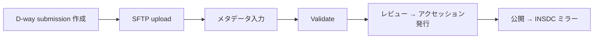

## DRA とは

DRA (DDBJ Sequence Read Archive) は、次世代シーケンサーから出力された生リード (raw reads) とアライメント情報を保存・公開するための、DDBJ が運営するアーカイブです。
研究の再現性確保と、データ再解析による新しい発見の支援を目的としています。

DRA は INSDC SRA の日本側メンバーであり、NCBI Sequence Read Archive (SRA) および EBI European Nucleotide Archive (ENA) と相互にミラーされます。
INSDC のいずれか 1 拠点に登録すれば、世界の研究者から横断的に参照できる状態になります。

> [!NOTE]
> 「どこに登録すべきか分からない」「DRA と JGA / GEA の境界が曖昧」 という場合は、[登録ナビ](/submit) でデータの性質に回答していくと、適切な登録先と前提となるリソース ([BioProject](/bioproject) / [BioSample](/biosample) など) が自動で組み立てられます。

> [!WARNING]
> DRA は公開アーカイブであり、アクセス制御 (制限公開) には対応していません。
> ヒト由来でアクセス制限が必要なデータは、NBDC ヒトデータ審査委員会の承認を経て [JGA](/jga) に登録します。

## 受け付けるデータ

DRA は主要な NGS プラットフォーム由来の生リードと、それに対するアライメント結果を受け付けます。
受理可能なファイル形式はプラットフォームごとに異なります。

| プラットフォーム | 受理形式 | 補足 |
| --- | --- | --- |
| Illumina | FASTQ / BAM | ペアエンドは forward / reverse の 2 ファイルに分割 |
| 454 | FASTQ / BAM | SFF からの変換が必要 |
| Ion Torrent | FASTQ | samtools で BAM から変換 |
| PacBio | BAM / FASTQ | `*.subreads.bam` などを Run 単位で 1 ファイル。HDF5 (`bas.h5` / `bax.h5`) は受け付け不可 |
| Oxford Nanopore | FASTQ / BAM | — |

### FASTQ の要件

- gzip 圧縮 (`.fastq.gz`) で提出する。
- Phred quality の ASCII offset は既定 33 (`!`)。offset 64 (`@`) を使う場合は Run XML の `ascii_offset` 属性で明示する。
- 各 read の 1 行目は `@` で始め、塩基行と quality 行は `+` で始まる行で区切る。
- ペアエンドは forward と reverse を別ファイルに分け、Run 内で対応付ける。

### BAM の要件

- **圧縮せずに** 提出する (BAM は内部で gzip 相当の圧縮が掛かっているため二重圧縮しない)。
- SAMtools / Picard で読める正しい BAM であること。
- ペアエンドは 1 つの BAM に両方の read を含め、FLAG を正しく設定する。
- アライメント済みの BAM では、ヘッダの `SN` 値と INSDC / RefSeq アクセッション (または multi-FASTA 配列名) を対応付けるテーブルを併せて提出する。

### ファイル命名と Analysis

- 使える文字は `A-Z` `a-z` `0-9` `_` `-` `.` のみ。空白や括弧などの記号、ディレクトリ構造を含むアーカイブは不可。
- 派生データ (de novo assembly、配列アノテーション、abundance 測定など、他に置き場のない処理済みデータ) は任意の **Analysis** オブジェクトとして登録できます。ただし Analysis は NCBI / EBI とは共有されません。

## アクセッション番号

DRA の登録は複数のオブジェクトから構成され、それぞれにアクセッション番号が発行されます。

| オブジェクト | プレフィックス | 役割 |
| --- | --- | --- |
| Submission | `DRA` | 登録全体をまとめる管理単位 |
| Experiment | `DRX` | ライブラリ + 機器のメタデータ。1 つの BioProject と 1 つの BioSample を参照 |
| Run | `DRR` | Experiment に紐付く実データファイルの束。read ID は `DRR<番号>.<連番>` に書き換えられる |
| Analysis | `DRZ` | 任意。派生・処理済みデータ |
| BioProject (参照) | `PRJDB######` | 事前に [BioProject](/bioproject) で取得 |
| BioSample (参照) | `SAMD########` | 事前に [BioSample](/biosample) で取得 |

アクセッション番号は、メタデータとファイルの検証およびスタッフによるレビューが完了した後に発行されます。

## 登録の流れ

1. **D-way アカウント取得** — D-way ポータルで DDBJ アカウントを作成します。
2. **公開鍵を登録** — 認証用の SSH 公開鍵をアカウントに紐付けます。これがないと SFTP アップロードが失敗します。
3. **BioProject / BioSample を先に登録** — DRA の Experiment はこれらを参照するため、`PRJDB######` と `SAMD########` を先に確保します。
4. **D-way で submission を作成** — `ftp-private.ddbj.nig.ac.jp` 上に submission ごとのディレクトリ (例: `~/test07-0040/`) が作られます。
5. **SFTP でデータをアップロード** — port 22 の SFTP で、submission ディレクトリの **直下** にファイルを置きます。サブディレクトリは作れません。
6. **メタデータ入力** — Web ツール (`Enter/Update metadata`) で入力するか、Excel テンプレートを記入して XML 化します。
7. **検証** — `Validate uploaded data files` で MD5・形式・整合性を確認します。`Submission Validated` まで進めばレビュー待ちです。
8. **DRA スタッフによるレビュー** — 承認されるとアクセッション番号 (`DRX` / `DRR` / `DRZ`) が発行されます。
9. **公開** — 設定した公開予定日に DDBJ FTP に配置され、DDBJ Search に索引化された後、INSDC パートナーに反映されます。

> [!IMPORTANT]
> 1 submission あたりの上限は BioSample 1,000 件、DRA Run 2,000 件です。
> これを超える場合は、同一 BioProject を共有しつつ submission を分割します。

## 事前準備

登録を始める前に、以下をすべて揃えてください。

- D-way の DDBJ アカウント。
- アカウントに登録済みの SSH 公開鍵。
- 取得済みの [BioProject](/bioproject) (`PRJDB######`)。
- 少なくとも 1 件の [BioSample](/biosample) (`SAMD########`)。
- 整形済みの読み込みファイル (gzip 圧縮 FASTQ または無圧縮 BAM、ディレクトリ構造を含まない、命名規約に従ったもの)。
- 各ファイルの MD5 チェックサム (Run メタデータに記入)。
- 公開・問い合わせ通知を受け取る担当者の連絡先メールアドレス。

> [!CAUTION]
> 研究対象者を直接特定し得る情報は、提出するメタデータから事前に取り除いてください。
> ヒト以外の試料であっても、識別子の混入には注意が必要です。

## 公開と embargo

DRA では、登録時に submission ごとに公開ポリシーを設定します。

- **Immediate Release** — レビュー完了後、速やかに公開します。
- **Hold Until (公開予定日)** — 指定した日付まで非公開とします。最長で登録から 4 年後まで設定でき、必要に応じて延長できます。

> [!IMPORTANT]
> 1 submission に含まれるデータは **同時に** 公開されます。Run 単位での段階的な公開はできません。
> また、[BioProject](/bioproject) / [BioSample](/biosample) / DRA / [GEA](/gea) のレコードは「連動公開」され、参照関係にあるオブジェクトのうち最も遅い公開予定日に揃えて公開されます。

非公開期間中に問い合わせへの応答が 3 か月以上途絶えた登録は、キャンセル扱いとなります。

## INSDC との共有

公開された DRA レコードは、以下の経路で世界に展開されます。

- DDBJ の公開 FTP に配置され、DDBJ Search に取り込まれます (数日以内)。
- NCBI SRA / EBI ENA に自動でミラーされ、`DRX` / `DRR` 等のアクセッションがそのまま検索できるようになります。
- 登録者は、登録が完了した Run の公開用 `.sra` / `.fastq.bz2` ファイルを受付サーバ (`ftp-private.ddbj.nig.ac.jp`) の `/report/dra/<DRA submission accession>/sra/` および `/report/dra/<DRA submission accession>/fastq/` で確認できます。これらのコピーは約 1 か月後に削除されます。

> [!NOTE]
> INSDC は公開アーカイブのみを対象とし、制限公開の枠組みを持ちません。
> アクセス制御を要するデータの登録先は [JGA](/jga) です ([humandbs](/humandbs) の審査が前提)。

## 他サービスとの使い分け

| データの性質 | 登録先 |
| --- | --- |
| 非ヒト試料の生 NGS リード、または公開可能なヒト由来生 NGS リード | **DRA** |
| アクセス制御が必要なヒト由来 NGS リード | [JGA](/jga) (NBDC 承認後、[humandbs](/humandbs) のフロー) |
| RNA-seq のカウントマトリクスなど、発現解析の処理済みデータ | [GEA](/gea) (生リードは DRA に先行登録) |
| 組立・アノテーション済み配列 | [DDBJ](/ddbj) (MSS / WGS / TLS / TSA) |
| メタボロームデータ | [MetaboBank](/metabobank) |

## 関連リソース

- [DRA 公式ページ (日本語)](https://www.ddbj.nig.ac.jp/dra/index.html)
- [DRA 公式ページ (英語)](https://www.ddbj.nig.ac.jp/dra/index-e.html)
- [DRA 登録手順 (日本語)](https://www.ddbj.nig.ac.jp/dra/submission.html)
- [DRA メタデータリファレンス](https://www.ddbj.nig.ac.jp/dra/metadata.html)
- [DRA データファイル仕様 (英語)](https://www.ddbj.nig.ac.jp/dra/datafile-e.html)
- [DDBJ アップロードガイド](https://www.ddbj.nig.ac.jp/upload.html)
- [DRA ファイル処理に関する FAQ](https://www.ddbj.nig.ac.jp/faq/en/data-files-sra-e.html)
- [INSDC データ公開ポリシー](https://www.ddbj.nig.ac.jp/insdc/data-release-policy.html)
- [D-way ポータル](https://ddbj.nig.ac.jp/D-way/)
- [NBDC ヒトデータベース (JGA 入口)](https://humandbs.dbcls.jp/data-submission)
