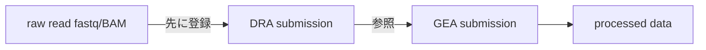

## GEA とは

GEA (Genomic Expression Archive) は、DDBJ Center の機能ゲノミクスデータの公開アーカイブです。遺伝子発現、エピゲノム解析、SNP array によるジェノタイピングなど、マイクロアレイおよびシークエンス由来の実験データを受け付けます。

GEA は [MIAME](http://fged.org/projects/miame/) (microarray) と [MINSEQE](http://fged.org/projects/minseqe/) (sequencing) のガイドラインに従い、メタデータを [MAGE-TAB](https://www.ebi.ac.uk/arrayexpress/help/magetab_spec.html) 形式で記述します。NCBI GEO や EBI ArrayExpress (現 BioStudies) と同じ役割を DDBJ で担うアーカイブですが、データのミラーリングは行わず、それぞれ独立のアクセッション番号空間を使います。

> [!NOTE]
> どの DDBJ サービスにどのデータを登録すべきか迷う場合は、[登録ナビ](/submit) で対話的に判断できます。

## 受け付けるデータ

GEA は以下の機能ゲノミクス実験を対象とします。

| 実験種別 | 例 | 経路 |
| --- | --- | --- |
| Microarray | 遺伝子発現アレイ、メチル化アレイ、SNP genotyping array | Microarray |
| High-throughput sequencing | RNA-seq、ChIP-seq、ATAC-seq などの発現・エピゲノム解析 | Sequencing |
| Single-cell | scRNA-seq などの単一細胞解析 | Sequencing |
| Spatial transcriptome (sequence-based) | 10x Genomics Visium | Sequencing |
| Spatial transcriptome (image-based) | 10x Genomics Xenium、MERFISH | Microarray |
| Transcriptome reference を用いた解析 | リファレンス参照型の発現定量 | Sequencing |

必須となるファイルは経路によって異なります。

- **Microarray**: raw data と processed data の両方を GEA にアップロードします。
- **Sequencing**: 解析済み (processed) データが GEA で必須です。raw read は [DRA](/dra) に登録し、GEA からは DRA submission を参照します。

> [!WARNING]
> BAM / SAM / BED のみを processed data として登録することはできません。発現量行列など定量的なデータが必要です。該当データしかない場合は GEA に事前相談してください。

> [!IMPORTANT]
> 1 つの submission に microarray と sequencing を混在させることはできません。両方のデータを登録する場合は submission を分けてください。1 submission あたり SDRF の assay は最大 1,000 までです。

## Microarray と Sequencing

GEA には 2 つの登録経路があり、事前に必要な参照物と raw data の置き場所が異なります。

| 観点 | Microarray | Sequencing |
| --- | --- | --- |
| Raw data の置き場所 | GEA | [DRA](/dra) |
| Processed data | GEA に必須 | GEA に必須 |
| 事前参照する登録物 | [BioProject](/bioproject) + [BioSample](/biosample) | [DRA](/dra) submission + [BioProject](/bioproject) (BioSample は DRA 経由) |
| SDRF テンプレート生成元 | BioSample | DRA submission |
| Array Design | `A-XXXX-n` (既存) または ADF をアップロードして新規発行 | 不要 |
| 空間トランスクリプトーム | Xenium、MERFISH 等 | Visium 等 |

## アクセッション番号

GEA で発行されるアクセッションは 3 種類あり、curation 完了時に発行されます。論文で引用するのは Experiment アクセッション (E-GEAD-n) です。

| 種別 | プレフィックス | 例 | 意味 |
| --- | --- | --- | --- |
| Experiment | `E-GEAD-` | `E-GEAD-100` | submission 全体。IDF の `Comment[GEAAccession]` に記載される |
| Array design | `A-GEAD-` | `A-GEAD-10` | GEA が新規発行する array design。ArrayExpress 由来の `A-AFFY-2` などの既存アクセッションも IDF / SDRF から参照可能 |
| Protocol | `P-GEAD-` | `P-GEAD-100` | IDF で定義された各 protocol。登録前は一時 ID (`ESUB000500_Protocol_1` 等) で、アクセッション発行後に置き換わる |

publication 前の査読者アクセス用に、任意で reviewer token を発行できます。

## 登録の流れ

1. **D-way アカウントでログイン** し、GEA submission ページから新規 submission を作成します。FTP アップロード用のディレクトリが払い出されます。
2. **事前登録物を参照** します。Microarray の場合は BioProject と BioSample を選択、Sequencing の場合は DRA submission と BioProject を選択します。
3. **IDF タブ** で実験全体のメタデータ (title / description / experiment type / design / protocol / publication / array design ref など) を入力します。
4. **SDRF タブ** で、BioSample または DRA submission と array design から自動生成されたテンプレートに、Material Type / Label / Factor Value / Array Data File と md5 値などを補完します。
5. **FTP でデータファイルをアップロード** します (raw / processed)。
6. **curation を受け**、必要なら修正対応を行います。完了後に E-GEAD-n / A-GEAD-n / P-GEAD-n が発行されます。

> [!TIP]
> 個別のウィザード手順は [登録ナビ](/submit) のステップカードで案内されます。本ページでは経路の全体像のみを示します。

## 事前準備 (MAGE-TAB)

GEA のメタデータは MAGE-TAB 形式が中心です。最低限 IDF と SDRF を準備し、新規 array を登録する場合は ADF も用意します。

| ファイル | 役割 | 備考 |
| --- | --- | --- |
| IDF (Investigation Description Format) | 実験全体の記述 (title、description、design、protocol、publication など) | 1 ファイル |
| SDRF (Sample and Data Relationship Format) | sample と data file の対応関係 | Factor Value 列は最右に配置 |
| ADF (Array Design Format) | 新規 array design の定義 | 既存 array を使う場合は不要 |

加えて、以下の登録物を先に準備しておきます。

- **D-way アカウント**: GEA submission UI にログインするために必要
- **[BioProject](/bioproject)**: Microarray・Sequencing どちらの経路でも 1 つ参照
- **[BioSample](/biosample)**: Microarray 経路で直接選択し、SDRF 自動生成の元になる (Sequencing 経路では DRA submission 経由で参照)
- **[DRA](/dra) submission**: Sequencing 経路で raw read を事前登録
- **Array Design**: Microarray 経路で `A-XXXX-n` を参照、無ければ ADF をアップロード
- **データファイル**: 各 assay の raw / processed ファイルと md5 値

> [!IMPORTANT]
> spreadsheet 形式のファイル (IDF / SDRF / 発現量行列など) は tab-delimited `.txt` で保存します。`.xls` / `.xlsx` は受け付けられません。ファイル名は英数字、`_`、`-`、`.` のみが使用可能で、スペースや括弧は使えません。

> [!NOTE]
> Two-color array では 1 つの raw data ファイルに 2 sample を紐付ける必要があります。SDRF の Label 列で Cy3 / Cy5 を区別してください。

## 空間トランスクリプトーム

空間トランスクリプトームは、プラットフォームによって登録経路が分かれます。

| プラットフォーム | Submission Type | Array Design | 備考 |
| --- | --- | --- | --- |
| 10x Genomics Visium | Sequencing | 不要 | raw read fastq/bam は DRA、画像 (`tissue_hires_image.png` 等)・スケール (`scalefactors_json.json`)・スポット座標 (`tissue_positions_list.csv`)・発現行列を tar でまとめて GEA processed data に登録 |
| 10x Genomics Xenium | Microarray | [`A-GEAD-246`](https://ddbj.nig.ac.jp/public/ddbj_database/gea/array/A-GEAD-000/A-GEAD-246/) | `morphology.ome.tif` などの raw と `cell_feature_matrix.h5` などの processed を tar でまとめて登録 |
| MERFISH / MERSCOPE | Microarray | [`A-GEAD-247`](https://ddbj.nig.ac.jp/public/ddbj_database/gea/array/A-GEAD-000/A-GEAD-247/) | dummy raw data ファイルと、同定された転写産物の processed data を登録 |

> [!WARNING]
> MERFISH の生画像や `.vzg` ファイルは GEA では受け付けません。汎用リポジトリ (Figshare / Zenodo 等) に登録してください。GEA には定量化済みの発現データのみを登録します。

## DRA との 2 段登録

Sequencing 経路は GEA 単独では完結せず、[DRA](/dra) との 2 段登録になります。

GEA submission 作成時に、自身のアカウントで登録した DRA submission を 1 つ選択します。SDRF テンプレートはその DRA submission の experiment / run 情報から自動生成されます。GEA 側には sample-level の processed data を登録することが強く推奨されます。

> [!IMPORTANT]
> GEA 自体は INSDC を構成するアーカイブではありませんが、Sequencing 経路では DRA / BioProject / BioSample という INSDC レイヤの上に乗ります。raw read を含む sequencing 実験は必ず DRA への事前登録が前提です。

## 関連リソース

- GEA トップ: <https://www.ddbj.nig.ac.jp/gea/index.html>
- Submission overview (EN): <https://www.ddbj.nig.ac.jp/gea/overview-e.html>
- Metadata 仕様 (EN): <https://www.ddbj.nig.ac.jp/gea/metadata-e.html>
- MAGE-TAB 記入例 (EN): <https://www.ddbj.nig.ac.jp/gea/example-e.html>
- Microarray submission: <https://www.ddbj.nig.ac.jp/gea/submit-array.html>
- Sequencing submission: <https://www.ddbj.nig.ac.jp/gea/submit-sequence.html>
- データファイル仕様: <https://www.ddbj.nig.ac.jp/gea/datafile.html>
- Spatial gene expression: <https://www.ddbj.nig.ac.jp/gea/spatial-gene-expression.html>
- NAR 2019 paper "DDBJ update: the Genomic Expression Archive (GEA) for functional genomics data": <https://academic.oup.com/nar/article/47/D1/D69/5144146>
- 関連サービス: [DRA](/dra) / [BioProject](/bioproject) / [BioSample](/biosample)
