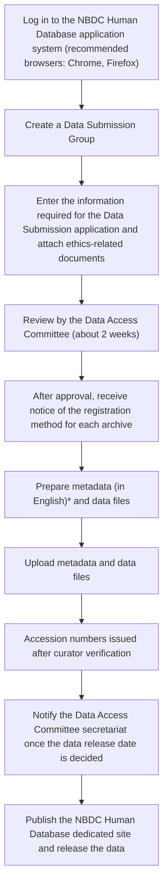
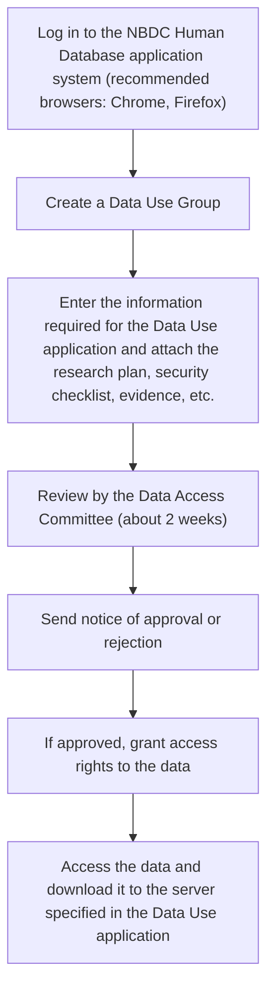

## What is the NBDC Human Database

The NBDC Human Database is a platform for sharing a wide range of human-related data. It accepts diverse human data — genome sequences, SNP arrays, epigenomic data, brain images, clinical information, summary statistics, pathology images, and more — and routes it to the appropriate archive ([DRA](/dra) / [GEA](/gea) / [JGA](/jga) / NHA, etc.) for storage and release, according to data type and access class.
It functions as **the review body for the sharing of analytical data produced by research conducted in accordance with laws and research ethics guidelines**, with the Data Access Committee (DAC) reviewing Data Submission and Data Use applications.

> [!NOTE]
> If you are unsure whether to register your data as controlled-access or as unrestricted access, refer to the suggestions provided by the [Submit Navigator](/submit). By selecting the data type and access class, it will suggest candidate destination archives based on whether the data corresponds to a personal identifier.

## Data Submission

## Archives for data registration

The archive to which your data is registered differs according to the data type, access class, and processing status. Main examples:

| Archive | Acronym | Primary data type | Access class |
|---|---|---|---|
| [Japanese Genotype-phenotype Archive](/jga) | JGA | Individual-level human data | Controlled-access |
| [DDBJ Sequence Read Archive](/dra) | DRA | Raw NGS reads (FASTQ / BAM) and processed data linked to raw reads (VCF) | Unrestricted |
| [Genomic Expression Archive](/gea) | GEA | Gene expression data (expression matrices, read counts, microarrays, spatial Tx) | Unrestricted |
| NBDC Human Data Archive | NHA | Data that cannot be handled by the other archives (audio data, images, statistics-only registrations, etc.) | Unrestricted |

When citing registered data in a paper or other publication, please cite the accession number issued when the data was stored in each database (DRR, E-GEAD, AP, JGAS/JGAD number).

## Data accepted

Any data derived from humans is within scope. Main examples:

- Next-generation sequencing data (whole genome / whole exome / RNA-seq)
- Genotyping data from SNP arrays
- Epigenomic data (DNA methylation, histone modification)
- Brain imaging data (MRI, PET) and pathology imaging data
- Clinical information, questionnaires, and psychological assessments from disease cohorts
- Variant data, gene expression arrays, biochemical values, audio data
- Summary statistics such as GWAS / meta-analysis statistics

Submitted data is routed to and stored in the appropriate archive according to its access class and data type.

## Preparing for a Data Submission application

- Read the latest versions of the [NBDC Human Data Sharing Guidelines](https://humandbs.dbcls.jp/en/guidelines/data-sharing-guidelines) and the [NBDC Human Database Security Guidelines (for Data Submitters)](https://humandbs.dbcls.jp/en/guidelines/security-guidelines-for-submitters), and confirm your rights and responsibilities
- Prepare the following information required for a Data Submission application
  - Information about the data being submitted
    - Outline of the research: purpose, methods, subjects, published papers, etc.
    - Data details: name and volume, information on the access-restriction level classification, planned release date, etc.
  - Information about the principal investigator (PI) for the Data Submission application
    - Name, affiliation information (institution name, title, location), contact information (phone number, email address)
  - Information about the head of institution
    - Name, title (the position corresponding to head of institution), contact information (phone number, email address)
    - The head of institution is the person who authorizes the execution of a research plan approved by the ethics review board
  - Information about the research in which the data to be submitted was produced
    - Research plan (ethics review application)
    - The explanatory document and consent form used for informed consent
      - Consideration of a Policy consistent with the content of the consent
    - A copy of the document (e.g., approval notice) showing that the head of institution authorized the conduct of the research after review and approval by the ethics review board of the institution
- Preparation for logging in to the NBDC Human Database application system
  - Create a DDBJ account and register an SSH public key
    - DDBJ accounts are required for the principal investigator of the Data Submission application, the applicant designated by the principal investigator (the person who carries out the Data Submission application procedures on the principal investigator's behalf), and the data upload contact
    - An account for the head of institution is not required
    - Name, institution, department, and title in Japanese, phone number, and the address, institution, department, and title of the department in English are required
    - It takes about 15 minutes for DDBJ account registration details to take effect
- Create a "Data Submission Group" in the NBDC Human Database application system
  - Include the principal investigator, applicants, and all data upload contacts of the Data Submission application in the group
  - Members granted Owner privileges can grant privileges and invite members
  - Grant "PI privileges" to the member who is the principal investigator of the Data Submission application

## Data Submission flow
See [here](/jga/submission-procedure) for the detailed procedure.

\* If you, as the data submitter, want to validate the XML in advance, you can run `excel2xml` via Singularity.

## Procedures after Data Submission approval

- **Deleting part of the data**: If you want to delete part of the data you have already registered
  - Prepare a list of the file names to be deleted
  - Contact the Data Access Committee secretariat

- **Replacing or adding data**: If you want to replace deleted data, or add data under the same Policy as data already registered, a **Data Submission Update application** is required
  - For "Research content (subjects, methods, ICD-10 disease classification codes)" and "Data types and volume (data type, file format, total data volume)," describe **only the information about the data being added** in this application
  - Prepare a "[detailed list of files to be updated or added](https://humandbs.dbcls.jp/public-files/data-submission/replace_filelist_e.xls)" and attach it to the application system
    - List one file per row
      - For data additions, columns B, E, F, and H through K are required
      - For replacements, columns G and L are also required in addition to B, E, F, and H through K
  - If ethics-related documents such as the research plan have been updated, attach them as well

## Policy

For controlled-access data, one Policy is linked to each Dataset. Even for data produced in a single study, if the content of consent regarding data sharing differs — for example, between a control group and a disease group — a Policy consistent with each group's consent content must be assigned. In such cases, the data is split into separate Datasets, and the appropriate Policy is assigned to each Dataset.

| Policy ID | Policy summary |
|---|---|
| `JGAP000001` | Data use in accordance with the NBDC Human Data Sharing Guidelines is required (NBDC Policy) |
| `JGAP000002` | NBDC Policy + "Limited to lung cancer research" |
| `JGAP000003` | NBDC Policy + "Use by persons affiliated with private companies is prohibited" |
| `JGAP000005` | NBDC Policy + "Limited to use in research aimed at elucidating the mechanisms of acquired resistance to tyrosine kinase inhibitors in gastrointestinal stromal tumors" |
| `JGAP000006` | NBDC Policy + "Prohibition of searching for or identifying blood relationships or family lineage, or attempting to do so, for purposes other than academic use" |
| `JGAP000007` | NBDC Policy + "Limited to research on the various factors affecting bone marrow transplantation outcomes and donor safety" + "Use by persons affiliated with private companies is prohibited" |
| `JGAP000008` | NBDC Policy + "Limited to cancer research" |
| `JGAP000009` | NBDC Policy + "Prohibition of searching for or identifying blood relationships or family lineage, or attempting to do so, for purposes other than academic use" + "Limited to use in research for promoting and developing appropriate treatment of related immunodeficiency disorders" |
| `JGAP000012` | NBDC Policy + "Prohibition of presenting individual sample-level genetic information such as SNPs when publishing in papers or other presentations" |

> [!NOTE]
> If none of the above apply and a new Policy needs to be set, please consult the Data Access Committee secretariat when submitting your Data Submission application.

## Data Use

**Unrestricted-access data**: After reviewing the description of "unrestricted-access data" in the [NBDC Human Data Sharing Guidelines](https://humandbs.dbcls.jp/en/guidelines/data-sharing-guidelines), please download it directly from the website and use it.

**Controlled-access data**: A Data Use application is required. Access to the data is granted after the Data Use application is reviewed and approved by the **Data Access Committee (DAC)**.

## Preparing for a Data Use application

- Read the latest versions of the [NBDC Human Data Sharing Guidelines](https://humandbs.dbcls.jp/guidelines/data-sharing-guidelines) and the [NBDC Human Database Security Guidelines (for Data Users)](https://humandbs.dbcls.jp/guidelines/security-guidelines-for-users), and confirm your rights and responsibilities
- Select the Dataset(s) you wish to use on the NBDC Human Database portal site and "add them to your cart"
  - Confirm that your intended use matches the Policy assigned to the Dataset (the intended purpose of use and user requirements described in the restrictions)
  - Confirm the Dataset's access level (controlled-access Type I or Type II) and put the necessary security measures in place
    - Download the [NBDC Human Data Handling Security Guidelines Checklist (for Data Users)](https://humandbs.dbcls.jp/public-files/guidelines/data-sharing-guidelines/security_checklist_for_users_e.xlsx) and record the status of your security measures
    - If you plan to use an off-premise server for data storage or analysis, obtain the security checklist (for off-premise server operators) published on the site of the institution operating the off-premise server, and confirm that the off-premise server satisfies the NBDC Human Data Handling Security Guidelines
    - For details on off-premise servers, see the [NBDC Human Data Sharing Guidelines](https://humandbs.dbcls.jp/guidelines/data-sharing-guidelines) and [this site](https://humandbs.dbcls.jp/off-premise-server)
- Prepare the following information required for a Data Use application: research collaborators affiliated with the same institution, as well as contractors, can be registered together in a single application
  - Information about the principal investigator and all research collaborators who wish to use the data
    - Name, affiliation information (institution name, title), contact information (phone number, email address), researcher ID, and whether ethics training has been completed
    - Data use information (principal investigator's name, institution, country/state, research title, ID of the data used, and use period) will be posted on each research content page
  - If there is a contractor for analysis or other work, information about the contractor
    - Contracted institution, and if determined, the contact person's name, title, email address, researcher ID, and whether ethics training has been completed
  - Evidence showing that the principal investigator has experience engaged in research related to the research content of the use application (information such as papers or conference presentations)
  - Information about the head of institution
    - Name, title (the position corresponding to head of institution), contact information (phone number, email address)
    - The head of institution is the person who authorizes the execution of a research plan approved by the ethics review board
  - Research plan (e.g., ethics review application) for the research that will use the acquired data
  - A copy of the document (e.g., approval notice) showing that the head of institution authorized the conduct of the research after review and approval by the ethics review board of the institution
- Preparation for logging in to the NBDC Human Database application system
  - Create a DDBJ account and register an SSH public key
    - DDBJ accounts are required for the principal investigator of the Data Use application, the applicant designated by the principal investigator (the person who carries out the Data Use application procedures on the principal investigator's behalf), and the data management contact (including data download)
    - An account for the head of institution is not required
    - Name, institution, department, and title in Japanese, phone number, and the address, institution, department, and title of the department in English are required
    - It takes about 15 minutes for DDBJ account registration details to take effect
  - Create the "public/private key pair for Dataset decryption" needed when transferring Datasets you are authorized to use
    - Registration of the "public key" is required at the time of the Data Use application
    - Create the key pair by referring to [Creating a public/private key pair for Dataset decryption](https://www.ddbj.nig.ac.jp/jga/download.html#key-for-decryption)
- Create a "Data Use Group" in the NBDC Human Database application system
  - Include the principal investigator, applicants, and all data management contacts of the Data Use application in the group
  - Members granted Owner privileges can change PI privileges and invite members
  - Grant "PI privileges" to the member who is the principal investigator of the Data Use application

## Data Use flow
See [here](/jga/datause-procedure) for the detailed procedure.

## Various procedures after Data Use approval

- **Annual report**: For research in which the data use period spans multiple years, a progress report is required once a year
  - From the list of Data Use applications in the application system, click the applicable [J-DU number]
  - From the select box to the left of the [Start Application] button, select **Data Use Report application** and create and submit the application form
    - Download the NBDC Human Data Handling Security Guidelines Checklist (for Data Users), record the status of security measures as of the time of the report, and attach it
    - If an off-premise server is used for data storage or analysis, download the security checklist (for off-premise server operators) published on the site of each off-premise server operating institution, confirm its contents, and attach it to the application system
    - Please note that if the report is delayed, you will no longer be able to use the data

- **Extension of the data use period**: If you wish to extend the data use period, a **Data Use Period Extension application** is required no later than one month before the use period expires
  - From the list of Data Use applications in the application system, click the applicable [J-DU number]
  - From the select box to the left of the [Start Application] button, select **Data Use Period Extension application** and create and submit the application form
    - Attach a document showing the research period authorized by the head of institution

- **Adding Datasets or research collaborators**: If you wish to add a Dataset or a research collaborator, an **application to add Datasets in use, etc.** is required
  - From the list of Data Use applications in the application system, click the applicable [J-DU number]
  - From the select box to the left of the [Start Application] button, select **application to add Datasets in use, etc.** and create and submit the application form
  - After a new Data Use application is approved, members can no longer be added to the Data Use Group using the group Owner's privileges. After the application to add Datasets in use, etc. is approved, the Data Access Committee secretariat will add the member

- **Distribution of processed data**: If you wish to distribute processed data, a **Processed Data Distribution application** is required
  - From the list of Data Use applications in the application system, click the applicable [J-DU number]
  - From the select box to the left of the [Start Application] button, select **Processed Data Distribution application** and create and submit the application form
  - For the definition of "processed data," see Section 5-3-3, Controlled-access Data 4, of the [NBDC Human Data Sharing Guidelines](https://humandbs.dbcls.jp/en/guidelines/data-sharing-guidelines)

- **Data Use Termination application**: To end your use of the data, a **Data Use Termination application** is required to report the status of data use and data disposal
  - From the list of Data Use applications in the application system, click the applicable [J-DU number]
  - From the select box to the left of the [Start Application] button, select **Data Use Termination application** and create and submit the application form
  - If you wish to retain secondary data such as tabulation or statistical analysis results produced through your use of the data, describe this data retention as well
  - If you wish to distribute processed data, describe the distribution of the processed data as well
  - Even if you did not use the data for any reason, you must still report the status of data use and data disposal

- **Change of affiliation**: A **new Data Use application** from your new institution is required
  - If your affiliation changes, promptly contact the Data Access Committee secretariat
  - If you continue to conduct research using data downloaded from JGA after changing your affiliation, you will need research authorization from the head of your new institution and a Data Use application from your new institution

## Related resources

- [NBDC Human Database top](https://humandbs.dbcls.jp/)
- [NBDC Human Database (English)](https://humandbs.dbcls.jp/en/)
- [Data Submission](https://humandbs.dbcls.jp/data-submission/)
- [Data Use](https://humandbs.dbcls.jp/data-use/)
- [Data Access Committee (DAC)](https://humandbs.dbcls.jp/dac/)
- [NBDC Data Sharing Policy](https://humandbs.dbcls.jp/nbdc-policy)
- [Aims of the NBDC Human Database](https://humandbs.dbcls.jp/aim)
- [Security Guidelines for Users (Ver. 7.0)](https://humandbs.dbcls.jp/en/guidelines/security-guidelines-for-users)
- [FAQ](https://humandbs.dbcls.jp/faq)
- [JGA (DDBJ Center)](https://www.ddbj.nig.ac.jp/jga/index.html)
- [JGA submission procedure](https://www.ddbj.nig.ac.jp/jga/submission.html)
- Related services: [JGA](/jga) / [DRA](/dra) / [DDBJ Center](/ddbj)
