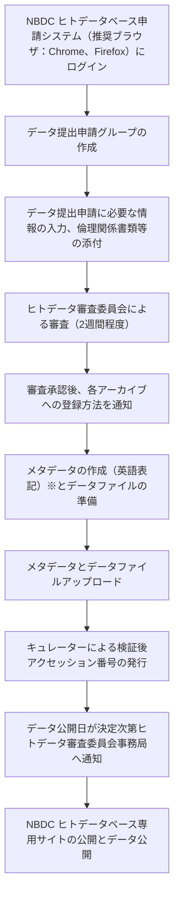
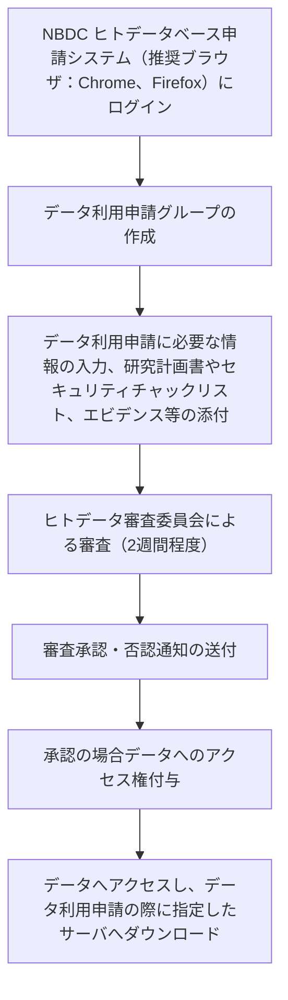

## NBDC ヒトデータベースとは

NBDC ヒトデータベース (NBDC Human Database) は、ヒトに関する様々なデータを共有するためのプラットフォームです。ゲノム配列、SNP アレイ、エピゲノム、脳画像、臨床情報、統計情報、病理画像など、多様なヒトデータを受け入れ、データ種別や公開区分に応じて、適切なアーカイブ ([DRA](/dra) / [GEA](/gea) / [JGA](/jga) / NHAなど) に振り分けられ、格納・公開されます。
**法令や研究倫理指針などに沿って実施された研究において産出された解析データの共有における審査機能**を持ち、ヒトデータ審査委員会にてデータ提供・利用申請の審査を行います。

> [!NOTE]
> データを「制限公開」として登録すべきか、「非制限公開」として登録すべきか判断に迷う場合は、[登録ナビゲーション](/submit) の提案をご参照ください。データ種別や公開区分を選択することで、個人識別符号該当性から登録先のアーカイブ候補が提示されます。

## データの提供

## データ登録先アーカイブ

データ種別、公開区分、データ加工状況により、データの登録先のアーカイブが異なります。主な例:

| アーカイブ | 略称 | 主なデータ種別 | 公開区分 |
|---|---|---|---|
| [Japanese Genotype-phenotype Archive](/jga) | JGA | ヒト個人レベルのデータ | 制限公開 |
| [DDBJ Sequence Read Archive](/dra) | DRA | NGS の生リード (FASTQ / BAM)、生リードに紐づく加工データ（vcf） | 非制限公開 |
| [Genomic Expression Archive](/gea) | GEA | 遺伝子発現データ (発現マトリクス、リードカウント、マイクロアレイ、空間 Tx) | 非制限公開 |
| NBDC Human Data Archive | NHA | ほかのアーカイブで扱えないデータ (音声データ、画像、統計情報のみの登録など) | 非制限公開|

登録したデータを投稿論文等に引用する場合は、各データベースへデータが格納された際に発行されるアクセッション番号（DRR、E-GEAD、AP、JGAS/JGAD 番号）をご記載ください。

## 受け入れデータ

ヒト由来のあらゆるデータを対象とします。主な例:

- 次世代シーケンス由来データ (whole genome / whole exome / RNA-seq)
- SNP アレイによるジェノタイピングデータ
- エピゲノムデータ (DNA メチル化、ヒストン修飾)
- 脳画像データ (MRI, PET)、病理画像データ
- 疾患コホートの臨床情報、質問票、心理学的評価
- 変異データ、遺伝子発現アレイ、生化学値、音声データ
- GWAS / メタ解析統計量などの統計情報

提供されたデータは、公開区分やデータ種別に応じて、適切なアーカイブに振り分けられ、格納されます。

## データ提供申請に向けた事前準備

- 「[NBDC ヒトデータ共有ガイドライン](https://humandbs.dbcls.jp/guidelines/data-sharing-guidelines)」「[NBDC ヒトデータベースセキュリティガイドライン（データ提供者向け）](https://humandbs.dbcls.jp/guidelines/security-guidelines-for-submitters)」の最新版を熟読し、権利や責務について確認する
- データ提供申請に必要な以下の情報の準備
  - 提供するデータに関する情報
    - 研究内容の概要：目的、方法、対象、発表論文など
    - データの種類：名称・量、アクセス制限レベルの分類に関する情報、公開可能日など
  - データ提供申請の際の研究代表者に関する情報
    - 氏名、所属情報（所属機関名、職名、所在地）、連絡先（電話番号、メールアドレス）
  - 所属機関の長に関する情報
    - 氏名、職名（機関の長に該当する役職名）、連絡先（電話番号、メールアドレス）
    - 所属機関の長とは、倫理審査委員会によって承認された研究計画の実施を許可する者を指す
  - 提供を予定しているデータを産出した際の研究に関する情報
    - 研究計画書（倫理審査申請書）
    - インフォームドコンセントの際の説明文書および同意文書のフォーム（書式）
      - 同意内容に沿ったポリシーの検討
    - 所属機関等の倫理審査委員会の審査・承認を受けた上で、所属機関の長が研究実施について許可したことが分かる書面（承認通知書など）の写し
- NBDC ヒトデータベース申請システムにログインするための準備
  - DDBJ アカウントを作成し、SSH 公開鍵を登録する
    - データ提供申請の際の研究代表者、研究代表者によって指名された申請者（研究代表者に代わってデータ提供申請手続きを実施する者）、データアップロード担当者のDDBJアカウントが必要となる
    - 所属機関の長のアカウントは不要
    - 日本語表記の氏名、所属機関、所属部署、職名、電話番号、英語表記の所属部署の住所、所属機関、所属部署、職名情報が必要
    - DDBJアカウントの登録内容の反映に15分程度要する
- NBDC ヒトデータベース申請システムにて「データ提出申請グループ」の作成
  - データ提供申請の際の研究代表者、申請者、データアップロード担当者全員をグループに含める
  - Owner権限が付与されているメンバーが、権限の付与やメンバ招待をすることができる
  - データ提供申請の際の研究代表者に該当するメンバに「PI 権限」を付与する

## データ提供の流れ
具体的な操作については、[こちら](/jga/submission-procedure)のページをご参照ください。

※データ提供者側で事前に XML の検証をしたい場合は、Singularity 経由で `excel2xml` を実行できます。

## 提供申請承認後の手続き

- **一部のデータの削除**：既に登録したデータの一部を削除したい場合
  - 削除したいファイル名一覧を作成
  - ヒトデータ審査委員会事務局へ連絡
  
- **データの差し替えや追加**：削除したデータの差し替えや、既に登録済みのデータと同じポリシーのデータを追加したい場合、**提供データ更新申請**が必要
  - 「研究内容（対象・方法・ICD10疾患分類コード）」「データの種類及び量（データの種類・タイプ・ファイル形式・総データ量）」については、当該申請にて**追加するデータに関する情報のみ**を記載する
  - 「[更新・追加いただくファイルに関する詳細一覧](https://humandbs.dbcls.jp/files/replace_filelist.xls)」を作成のうえ、申請システムへ添付する
    -  1 ファイルにつき 1 行で記載
      - データ追加の場合は、B・E・F・H～K列は必須
      - 差し替えの場合はB・E・F・H～K列に加え、G・L列も必須
  -  研究計画書など倫理関係書類が更新されている場合は、併せて添付する

## ポリシー

制限公開では、データセットごとに１つのポリシーが紐付きます。1つの研究において産出されたデータであっても、例えば対照群と疾患群間でデータ共有に係る同意内容が異なる場合などは、それぞれの同意内容に沿ったポリシーを付与する必要があります。その場合は、データセットを分け、それぞれのデータセットに適したポリシーを割り当てます。

| ポリシー ID | ポリシー概要 |
|---|---|
| `JGAP000001` | NBDC ヒトデータ共有ガイドラインに沿ったデータ利用が求められます（NBDC Policy） |
| `JGAP000002` | NBDC policy ＋「肺がん研究限定」 |
| `JGAP000003` | NBDC policy ＋「民間企業に所属する者による利用禁止」 |
| `JGAP000005` | NBDC policy ＋「消化管間質腫瘍のチロシンキナーゼ阻害剤に対する獲得耐性機構の解明を目的とした研究での利用に限定」 |
| `JGAP000006` | NBDC policy ＋「学術目的による利用以外での血縁関係の有無の探索や家系の同定及びそれらを試みる行為の禁止」 |
| `JGAP000007` | NBDC policy ＋「骨髄移植の成績やドナーの安全性に影響を与える様々な因子についての研究に限定」＋「民間企業に所属する者による利用禁止」 |
| `JGAP000008` | NBDC policy ＋「がん研究限定」 |
| `JGAP000009` | NBDC policy ＋「学術目的による利用以外での血縁関係の有無の探索や家系の同定及びそれらを試みる行為の禁止」＋「類縁免疫不全症の適切な治療推進および開発のための研究での利用に限定」 |
| `JGAP000012` | NBDC policy ＋「論文等で発表する際、個別サンプルのSNP等の遺伝情報の提示禁止」 |

> [!NOTE]
> 上記に当てはまらず新たなポリシーの設定が必要な場合は、データ提供申請の際にヒトデータ審査委員会事務局にご相談ください。

## データの利用

**非制限公開データ**：「[NBDC ヒトデータ共有ガイドライン](https://humandbs.dbcls.jp/guidelines/data-sharing-guidelines)」の「非制限公開データ」に関する記述を確認の上、ウェブサイトより直接ダウンロードしてご利用ください。

**制限公開データ**：データ利用申請が必要です。**ヒトデータ審査委員会** によるデータ利用申請の審査承認後、データへのアクセス権が付与されます。

## データ利用申請に向けた事前準備

- 「[NBDC ヒトデータ共有ガイドライン](https://humandbs.dbcls.jp/guidelines/data-sharing-guidelines)」「[NBDC ヒトデータベースセキュリティガイドライン（データ利用者向け）](https://humandbs.dbcls.jp/guidelines/security-guidelines-for-users)」の最新版を熟読し、権利や責務について確認する
- NBDCヒトデータベースポータルサイトにおいて利用を希望するデータセットを選定し「カートに追加」する
  - データセットに付与されているポリシー（制限事項に記載されている、利用目的・利用者要件）に合致するか確認する
  - データセットのアクセスレベル（制限公開 Type I または Type II）を確認し、必要なセキュリティ対策を整える
    - [NBDCヒトデータ取り扱いセキュリティガイドラインチェックリスト（データ利用者向け）](https://humandbs.dbcls.jp/files/security_checklist_for_users.xlsx)をダウンロードし、セキュリティ対策実施状況を記載する
    - データの保管・解析に機関外サーバの利用を予定している場合は、機関外サーバ運用機関のサイトから公開されているセキュリティチェックリスト（機関外サーバ運用責任者向け）を入手した上で、当該機関外サーバがNBDCヒトデータ取扱いセキュリティガイドラインを満たしていることを確認する
    - 機関外サーバの詳細は「[NBDC ヒトデータ共有ガイドライン](https://humandbs.dbcls.jp/guidelines/data-sharing-guidelines)」ならびに[こちらのサイト](https://humandbs.dbcls.jp/off-premise-server)をご参照ください。
- データ利用申請に必要な以下の情報を準備：同一機関に所属する研究分担者、ならびに受託者を1回の申請で登録することが可能
  - 研究代表者およびデータ利用を希望する全研究分担者の情報
    - 氏名、所属情報（機関名、職名）、連絡先（電話番号、メールアドレス）、研究者ID、倫理講習受講の有無
    - データ利用に関する情報（研究代表者氏名、所属機関、国・州名、研究題目、利用データのID、利用期間）が各研究内容のページに掲載されます。
  - 解析等受託先がある場合は受託者の情報
    - 受託機関、決まっている場合は担当者名・職名・メールアドレス・研究者ID・倫理講習受講の有無
  - 利用申請の研究内容に関連した研究に従事した経験があることがわかる研究代表者のエビデンス（論文や学会発表等の情報）
  - 所属機関の長に関する情報
    - 氏名、職名（機関の長に該当する役職名）、連絡先（電話番号、メールアドレス）
    - 所属機関の長とは、倫理審査委員会によって承認された研究計画の実施を許可する者を指す
  - 取得したデータを使用する研究の研究計画書（倫理審査申請書など）
  - 所属機関等の倫理審査委員会の審査・承認を受けた上で、所属機関の長が研究実施について許可したことが分かる書面（承認通知書など）の写し
- NBDC ヒトデータベース申請システムにログインするための準備
  - DDBJ アカウントを作成し、SSH 公開鍵を登録する
    - データ利用申請の際の研究代表者、研究代表者によって指名された申請者（研究代表者に代わってデータ利用申請手続きを実施する者）、データ管理担当者（データのダウンロード含む）のDDBJアカウントが必要となる
    - 所属機関の長のアカウントは不要
    - 日本語表記の氏名、所属機関、所属部署、職名、電話番号、英語表記の所属部署の住所、所属機関、所属部署、職名情報が必要
    - DDBJアカウントの登録内容の反映に15分程度要する
  - 利用を許可されたデータセット転送時に必要となる「データセット復号用公開鍵・秘密鍵ペア」の作成
    - データ利用申請の際に「公開鍵」の登録が必要
    - [データセット復号用公開鍵・秘密鍵ペアの作成](https://www.ddbj.nig.ac.jp/jga/download.html#key-for-decryption)を参照のうえ作成する
- NBDC ヒトデータベース申請システムにて「データ利用申請グループ」の作成
  - データ利用申請の際の研究代表者、申請者、データ管理担当者全員をグループに含める
  - Owner権限が付与されているメンバーが、PI 権限の変更やメンバ招待をすることができる
  - データ利用申請の際の研究代表者に該当するメンバに「PI 権限」を付与する

## データ利用の流れ
具体的な操作については、[こちら](/jga/datause-procedure)のページをご参照ください。

## 利用申請承認後の各種手続き

- **年次報告**：データ利用期間が複数年にわたる研究の場合、年に 1 度の進捗報告が必要
  - 申請システムのデータ利用申請一覧から該当する [J-DU 番号] を押下
  - [申請開始] ボタンの左側にあるセレクトボックスから**データ利用報告申請**を選択し、申請書を作成・申請する
    - データ利用報告時点でのセキュリティ対策実施状況について、NBDCヒトデータ取り扱いセキュリティガイドラインチェックリスト（データ利用者向け）をダウンロードして記載のうえ添付する
    - データの保管・解析に機関外サーバを利用している場合は、各機関外サーバ運用機関のサイトから公開されているセキュリティチェックリスト（機関外サーバ運用責任者向け）をダウンロードし、内容を確認したうえで、申請システムに添付する
    - 報告が遅れた場合、データを利用できなくなるのでご留意ください。

- **データ利用期間の延長**：データの利用期間の延長を希望する場合、利用期間満了の 1 ヶ月前までに**データ利用期間延長申請**が必要
  - 申請システムのデータ利用申請一覧から、該当する [J-DU番号] を押下
  - [申請開始] ボタンの左側にあるセレクトボックスから**データ利用期間延長申請**を選択し、申請書を作成・申請する
    - 所属機関の長より許可されている研究期間がわかる書類を添付する

- **データセットや研究分担者の追加**：データセットの追加や研究分担者の追加を希望する場合、**利用データセット等追加申請**が必要
  - 申請システムのデータ利用申請一覧から、該当する [J-DU番号] を押下
  - [申請開始] ボタンの左側にあるセレクトボックスから**利用データセット等追加申請**を選択し、申請書を作成・申請する
  - 新規データ利用申請承認後は、グループOwner権限によるデータ利用申請グループへのメンバ追加はできません。利用データセット等追加申請承認後、ヒトデータ審査委員会事務局にて追加します。

- **加工したデータの配布**：加工データの配布を希望する場合、**加工データ配布申請**が必要
  - 申請システムのデータ利用申請一覧から、該当する [J-DU番号] を押下
  - [申請開始] ボタンの左側にあるセレクトボックスから**加工データ配布申請**を選択し、申請書を作成・申請する
  - 「加工データ」の定義については[NBDCヒトデータ共有ガイドライン](/guidelines/data-sharing-guidelines)の 5-3-3 制限公開データ 4 を参照のこと

- **データ利用終了申請**：データ利用を終了する場合、データの利用状況ならびにデータの破棄状況の報告のため**データ利用終了申請**が必要
  - 申請システムのデータ利用申請一覧から、該当する [J-DU番号] を押下
  - [申請開始] ボタンの左側にあるセレクトボックスから**データ利用終了申請**を選択し、申請書を作成・申請する
  - データを利用することによって生じた集計・統計解析結果等の二次データの保管を希望する場合は、データ保管についても記載する
  - 加工データの配布を希望する場合は、加工データの配布についても記載する
  - 何らかの理由でデータを利用しなかった場合も、データの利用状況ならびにデータの破棄状況の報告は必要

- **所属機関の変更**：移動先の所属機関からの**新規利用申請**が必要
  - 所属機関に変更が生じた場合は、速やかにヒトデータ審査委員会事務局へ連絡
  - 所属機関の変更後も、引き続きJGAからダウンロードしたデータを利用して研究を遂行する場合は、新しい所属機関の長による研究実施許可および新しい所属機関からのデータ利用申請が必要となります。

## 関連リソース

- [NBDC ヒトデータベース トップ](https://humandbs.dbcls.jp/)
- [NBDC ヒトデータベース (English)](https://humandbs.dbcls.jp/en/)
- [データ提供](https://humandbs.dbcls.jp/data-submission/)
- [データ利用](https://humandbs.dbcls.jp/data-use/)
- [ヒトデータ審査委員会 (DAC)](https://humandbs.dbcls.jp/dac/)
- [NBDC データ共有ポリシー](https://humandbs.dbcls.jp/nbdc-policy)
- [NBDC ヒトデータベースの目的・意義](https://humandbs.dbcls.jp/aim)
- [セキュリティガイドライン (利用者向け) Ver. 5.0](https://humandbs.dbcls.jp/security-guidelines-for-users-v5)
- [FAQ](https://humandbs.dbcls.jp/faq)
- [JGA (DDBJ Center)](https://www.ddbj.nig.ac.jp/jga/index.html)
- [JGA 登録手順](https://www.ddbj.nig.ac.jp/jga/submission.html)
- 関連サービス: [JGA](/jga) / [DRA](/dra) / [DDBJ Center](/ddbj)
