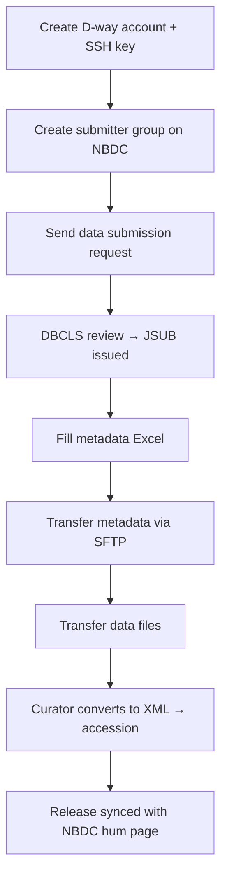

## About JGA

The Japanese Genotype-phenotype Archive (JGA) is a controlled-access archive for individual-level human genetic and phenotypic data. It is hosted by the Bioinformation and DDBJ Center, while both data submission and data use applications are received through the [NBDC Human Database](/humandbs) and reviewed by its Data Access Committee. JGA holds and shares human data that cannot be made openly public beyond the scope of participant consent, under explicit data use policies.

JGA is the same kind of controlled-access archive as EBI EGA and NCBI dbGaP, but no data is exchanged among the three archives. Summary metadata for Study, Dataset, and Policy objects is openly browsable on DDBJ Search, but sequence files and other primary data can only be downloaded by approved data users.

> [!NOTE]
> In the [Submit Navigator](/submit), selecting "individual-level controlled-access human data" guides you through the data submission application at the NBDC Human Database and the subsequent JGA submission.

## Data accepted

Only de-identified data derived from human individuals is accepted. Data that could re-identify research participants cannot be submitted.

| Data type | Main format | Linked object | Notes |
|-----------|-------------|---------------|-------|
| NGS reads | FASTQ (gzip / bzip2) | Data | Paired-end reads require `/1` and `/2` suffixes |
| Aligned reads | BAM | Data | BAM containing unaligned reads is preferred; do not recompress |
| 454 reads | SFF | Data | Submit uncompressed |
| Variants | VCF | Analysis | VCF is the recommended format for sequence variations |
| Microarray | Genotyping / SNP / expression arrays | Analysis | GEA-compliant format is recommended |
| Metabolome | MetaboBank submission format | Analysis | |
| Proteome | SDRF-Proteomics compliant | Analysis | |

File-level constraints include: no spaces in file names, do not bundle multiple files into a ZIP archive, and do not recompress BAM files (they are already a compressed format).

> [!WARNING]
> JGA only accepts de-identified data covered by a data use policy that has been approved by DBCLS. Data without an approved policy, or data that could identify individuals, is not accepted.

## Data model

JGA does not use the BioProject / BioSample model adopted by [DRA](/dra). Its metadata model is built by extending that of the [Sequence Read Archive](https://www.ddbj.nig.ac.jp/dra/metadata-e.html) and consists of seven content object types — Study, Sample, Experiment, Data, Analysis, Dataset, Policy — plus a Submission object that represents the registration transaction. Each object receives an independent accession number.

| Object | Role |
|--------|------|
| Submission | Registration transaction unit; data is released per Submission |
| Study | Metadata for the overall research project; used as the citation unit in papers |
| Sample | Description of an individual de-identified sample (typically one sample = one participant) |
| Experiment | Library preparation and platform details for an NGS or array experiment |
| Data | Primary data files such as raw NGS reads |
| Analysis | Analysis result files such as VCF, microarray, or other derived data |
| Dataset | Distribution unit subject to data use applications; linked to one Policy |
| Policy | Description of a data use policy (DAA: Data Access Agreement) |

Access control is enforced through the **Dataset x Policy** pair, and data users apply to DBCLS on a per-Policy basis. Each Dataset is linked to exactly one Policy. When a Study contains data with different policies (e.g. control vs. case), the Dataset must be split per policy.

## Accession numbers

Once the submission request is approved, a working Submission ID (e.g. `JSUB000353`) is issued and a submission directory is created on the JGA server. Final accession numbers are issued after the curator completes Excel-to-XML conversion and xsd validation.

| Prefix | Object | Digits | Example |
|--------|--------|--------|---------|
| `JGA` | Submission | 6 | `JGA000001` |
| `JGAS` | Study | 6 | `JGAS000001` |
| `JGAN` | Sample | 9 | `JGAN000000001` |
| `JGAX` | Experiment | 9 | `JGAX000000001` |
| `JGAR` | Data | 9 | `JGAR000000001` |
| `JGAZ` | Analysis | 9 | `JGAZ000000001` |
| `JGAD` | Dataset | 6 | `JGAD000001` |
| `JGAP` | Policy | 6 | `JGAP000001` |

`JGAP` (Policy) numbers are issued when a non-NBDC policy is registered at DBCLS; the Dataset then references the issued `JGAP######`. When only the NBDC Policy applies, no new Policy object needs to be created.

> [!TIP]
> The Study accession (`JGAS######`) is recommended for citation in papers. It serves as the entry point to all Datasets and Policies linked to the Study.

## Submission flow

Metadata must be written in English. Submitters who want to validate XML in advance can run `excel2xml` via Singularity.

## Prerequisites

- Obtain policy approval at the [NBDC Human Database](/humandbs) (mandatory prerequisite)
- Create a DDBJ (D-way) account and register an SSH public key
- Create a "data submitter group" on the NBDC application system and include the PI and all submitters as members
- Prepare de-identified data whose disclosure and use restrictions can be confirmed against participant consent forms
- Prepare an English-writing environment for the metadata (the Excel template must be filled in English)

## Relationship with the NBDC Human Database

JGA is coupled with the [NBDC Human Database](/humandbs) at two stages.

- **Before submission**: The data use policy applied to the study must be applied for on the NBDC Human Database side and approved by DBCLS before JGA submission can proceed. Data without an approved policy is not accepted by JGA.
- **At release**: JGA data is released when the corresponding NBDC Human Database research page (hum###### number) is published. Submitters cannot control the release on their own schedule; the release timing is aligned with the publication status on the NBDC Human Database side.

> [!IMPORTANT]
> JGA, NCBI dbGaP, and EBI EGA are the same kind of controlled-access archive for human data, but no data is exchanged among the three ([official FAQ](https://www.ddbj.nig.ac.jp/faq/en/jga-dbgap-ega-e.html)).

## Related resources

- [JGA official page (Japanese)](https://www.ddbj.nig.ac.jp/jga/index.html)
- [JGA official page (English)](https://www.ddbj.nig.ac.jp/jga/index-e.html)
- [JGA submission guide](https://www.ddbj.nig.ac.jp/jga/submission-e.html)
- [JGA submission step-by-step (EN)](https://www.ddbj.nig.ac.jp/jga/submission-step-e.html)
- [FAQ: data exchange among JGA / dbGaP / EGA](https://www.ddbj.nig.ac.jp/faq/en/jga-dbgap-ega-e.html)
- [submission-excel2xml (Excel-to-XML converter)](https://github.com/ddbj/submission-excel2xml)
- [JGA XML schema (xsd)](https://github.com/ddbj/pub/tree/master/docs/jga)
- [Example JGA Dataset entry on DDBJ Search](https://ddbj.nig.ac.jp/search/entry/jga-dataset/JGAD000948)
- [NBDC Human Database](/humandbs) (policy approval before submission and release coupling)
- [DRA](/dra) (sibling service for open human and non-human data)
