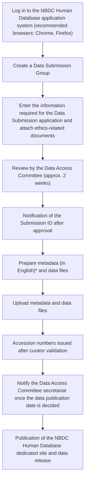
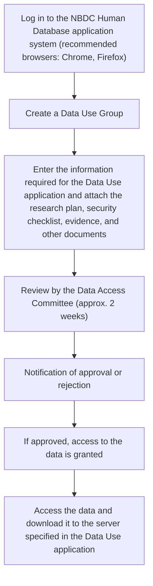

## About JGA

JGA is a controlled-access archive for sharing, under certain conditions, analysis data produced by research that uses human-derived biospecimens. Submitting or using raw data such as sequence data requires review and approval by the Data Access Committee (DAC). Both Data Submission and Data Use require compliance with the NBDC Guidelines for Human Data Sharing and the NBDC Security Guidelines for the Handling of Human Data. In addition, every dataset carries a Policy that defines its conditions of use, and the data may be used only for research purposes and under conditions that satisfy that Policy.

JGA is a controlled-access archive of the same kind as the European Genome-phenome Archive (EGA), operated by the European Bioinformatics Institute (EBI), and the database of Genotypes and Phenotypes (dbGaP), operated by the National Center for Biotechnology Information (NCBI). Because data submission and data use review must be conducted in accordance with the laws and regulations of each country or region, no mechanism exists for exchanging data itself among JGA, EGA, and dbGaP ([FAQ](https://www.ddbj.nig.ac.jp/faq/en/jga-dbgap-ega-e.html)). In addition, **none of these archives can issue access tokens for reviewers**.

Among the metadata, Study, Dataset, and Policy objects are openly browsable by anyone through DDBJ Search. Raw read data such as sequence files, and other metadata, can only be accessed by users whose Data Use application has been approved.

> [!NOTE]
> In the [Submit Navigator](/submit), selecting "Human" + "Prefer restricted access" / "Contains a personal identifier" / "Research under laws and ethics guidelines" guides you through the path from the Data Submission application at the NBDC Human Database to registration in JGA.

## Data Submission

## Data accepted

For data derived from human individuals, only data that has already been de-identified is accepted; data containing information that could re-identify research participants is not accepted.

| Data type | Main format | Linked object | Notes |
|-----------|-------------|----------------|-------|
| NGS reads | FASTQ (gzip / bzip2) | Data | Paired-end reads use the `/1` and `/2` suffixes |
| Aligned reads | BAM | Data | BAM containing unaligned reads is recommended; do not recompress |
| 454 reads | SFF | Data | Submit uncompressed |
| Variants | VCF | Analysis | VCF is recommended for sequence variations |
| Microarray | Genotyping / SNP / expression intensity data | Analysis | GEA-compliant format is recommended |
| Metabolome | Compliant with the MetaboBank submission format | Analysis | |
| Proteome | Compliant with SDRF-Proteomics | Analysis | |

File-level constraints include: do not include spaces in file names, do not submit multiple files bundled into a ZIP archive, and do not recompress BAM files with gzip or similar tools, since BAM is already a compressed format.

## Prerequisites for Data Submission

See the [NBDC Human Database](/humandbs) page.

## Submission flow

See [here](/jga/submission-procedure) for the detailed procedure.

\* If data submitters want to validate the XML in advance, they can run `excel2xml` via Singularity.

## Data structure

JGA does not adopt the BioProject / BioSample model used by [DRA](/dra). Instead it has its own entity model, extending the metadata model of the [Sequence Read Archive](https://www.ddbj.nig.ac.jp/dra/metadata-e.html). It consists of seven metadata object types — Study, Sample, Experiment, Data, Analysis, Dataset, Policy — plus a Submission that represents the registration transaction, and each of these receives an independent accession number.

| Object | Role |
|--------|------|
| Submission | Unit of the registration transaction; data is released at this unit |
| Study | Overview of the whole research project; this unit is used for citation in papers |
| Sample | Description of a de-identified individual sample (typically one sample = one individual) |
| Experiment | Describes the experimental method, such as library preparation and platform for NGS or array experiments |
| Data | Primary data files such as raw NGS read data |
| Analysis | Analysis data files such as VCF, derived data, and summary statistics |
| Dataset | Distribution unit subject to a Data Use application; linked to one Policy |
| Policy | Description of the Policy that defines the conditions of data use |

Data users specify the data they wish to use at the Dataset level. When different Policies apply within the same Study, the data must be split into separate Datasets, one per Policy.

## Accession numbers

After the Data Submission application is approved, a Submission ID (e.g. `JSUB000353`) is issued and a registration directory is created on the JGA server. Accession numbers are issued once the curator completes XML conversion and xsd validation of the metadata and the data is stored in the archive.

| Prefix | Object | Digits | Example |
|--------|--------|--------|---------|
| `JGA` | Submission | 6 | `JGA000001` |
| `JGAS` | Study | 6 | `JGAS000001` |
| `JGAN` | Sample | 9 | `JGAN000000001` |
| `JGAX` | Experiment | 9 | `JGAX000000001` |
| `JGAR` | Data | 9 | `JGAR000000001` |
| `JGAZ` | Analysis | 9 | `JGAZ000000001` |
| `JGAD` | Dataset | 6 | `JGAD000001` |
| `JGAP` | Policy | 6 | `JGAP000001` |

> [!TIP]
> Using the Study ID (`JGAS######`) for citation in papers is recommended.

## Data Use

## Prerequisites for a Data Use application

See the [NBDC Human Database](/humandbs) page.

## Data Use flow

See [here](/jga/datause-procedure) for the detailed procedure.

## Related resources

- [JGA official page (Japanese)](https://www.ddbj.nig.ac.jp/jga/index.html)
- [JGA official page (English)](https://www.ddbj.nig.ac.jp/jga/index-e.html)
- [JGA Submission guide](https://www.ddbj.nig.ac.jp/jga/submission-e.html)
- [JGA Submission step-by-step (EN)](https://www.ddbj.nig.ac.jp/jga/submission-step-e.html)
- [FAQ: data exchange among JGA / dbGaP / EGA](https://www.ddbj.nig.ac.jp/faq/en/jga-dbgap-ega-e.html)
- [submission-excel2xml (Excel-to-XML converter)](https://github.com/ddbj/submission-excel2xml)
- [JGA XML schema (xsd)](https://github.com/ddbj/pub/tree/master/docs/jga)
- [Example JGA Dataset search on DDBJ Search](https://ddbj.nig.ac.jp/search/entry/jga-dataset/JGAD000948)
- [NBDC Human Database](/humandbs) (review of Data Submission and Data Use applications; publication of submitted data overviews and dataset pages)
