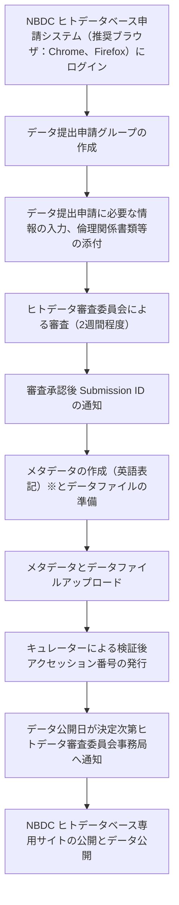
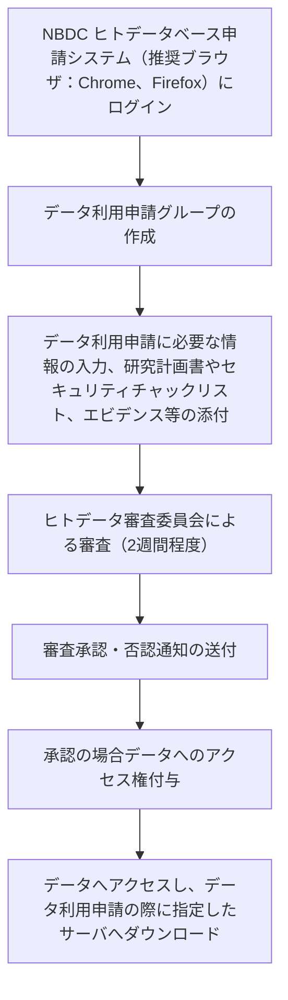

## JGA とは

ヒト由来試料を用いた研究で産出された解析データを一定の条件の下で共有するための制限公開データアーカイブです。シークエンスデータ等の生データを提供・利用する際には、ヒトデータ審査委員会による審査承認を受ける必要があります。データの提供・利用には、「NBDCヒトデータ共有ガイドライン」および「NBDCヒトデータ取扱いセキュリティガイドライン」の遵守が求められます。また、各データには利用条件を定めたPolicyが付与されており、そのPolicyを満たす研究目的・利用条件の範囲内でデータを利用する必要があります。

JGAは、European Bioinformatics Institute（EBI）が運用するEuropean Genome-phenome Archive（EGA）や、National Center for Biotechnology Information（NCBI）が運用するdatabase of Genotypes and Phenotypes（dbGaP）と同様の制限公開データを管理・共有するためのアーカイブです。各国・地域の法令等に基づいたデータ提供・利用審査を行う必要があるため、JGA、EGA、dbGaPの三極間でデータそのものを相互に交換する仕組みは設けていません([FAQ](https://www.ddbj.nig.ac.jp/faq/en/jga-dbgap-ega-e.html))。併せて、いずれのアーカイブでも**査読者用のアクセストークンを発行することはできません**。

メタデータのうち、Study、Dataset、Policyは、DDBJ Searchを通じて誰でも閲覧できます。一方で、シークエンスファイル等の生リードデータや、その他のメタデータについては、データ利用申請が承認された利用者のみがアクセスできます。

> [!NOTE]
> [登録ナビゲーション](/submit) で「ヒト」＋「制限公開を希望する」/「個人識別符号を含む」/「法令・倫理指針に沿った研究」を選ぶと、NBDC ヒトデータベースへのデータ提供申請から JGA への登録までの経路が案内されます。

## データの提供

## 受け付けるデータ

ヒト個人由来のデータの場合は匿名化を実施済みデータのみを受け付け、研究参加者を再特定し得る情報を含むデータは受け付けません。

| データ種別 | 主なフォーマット | 紐付け先オブジェクト | 補足 |
|-----------|------------------|--------------------|------|
| NGS リード | FASTQ (gzip / bzip2) | Data | paired-end は `/1` `/2` サフィックスを付ける |
| アラインメント済みリード | BAM | Data | unaligned reads を含む BAM 推奨。再圧縮しない |
| 454 リード | SFF | Data | uncompressed のまま submit |
| バリアント | VCF | Analysis | sequence variations は VCF 推奨 |
| アレイ | genotyping / SNP / 発現 intensity data | Analysis | GEA 準拠の形式を推奨 |
| メタボローム | MetaboBank submission format 準拠 | Analysis | |
| プロテオーム | SDRF-Proteomics 準拠 | Analysis | |

ファイル仕様の制約として、ファイル名にスペースを含めない、複数ファイルを ZIP でまとめて提出しない、BAM はそれ自体が圧縮形式なので gzip 等で再圧縮しない、などがあります。

## データ登録事前準備

[NBDC ヒトデータベースのページ](/humandbs)を参照のこと

## 登録の流れ

具体的な操作については、[こちら](/jga/submission-procedure)のページをご参照ください。

※データ提供者側で事前に XML の検証をしたい場合は、Singularity 経由で `excel2xml` を実行できます。

## データ構造

JGA は [DRA](/dra) で使われる BioProject / BioSample のモデルを採用せず、[Sequence Read Archive](https://www.ddbj.nig.ac.jp/dra/metadata.html) のメタデータモデルを拡張した独自のエンティティモデルを持ちます。Study / Sample / Experiment / Data / Analysis / Dataset / Policy の 7 種類のメタデータオブジェクトに加え、登録トランザクションを表す Submission があり、それぞれに独立したアクセッション番号が発行されます。

| オブジェクト | 役割 |
|------------|------|
| Submission | 登録トランザクションの単位。この単位で公開される |
| Study | 研究全体の概要。論文への引用はこの単位を使う |
| Sample | 匿名化された個別サンプルの記述 (通常 1 サンプル = 1 個人) |
| Experiment | 実験手法（NGS / アレイ実験のライブラリ調製・プラットフォーム）などを記述 |
| Data | NGS の生リードデータ等のプライマリデータファイル |
| Analysis | VCF / 派生データ / 統計情報などの解析データファイル |
| Dataset | 利用申請の対象となる配布単位。1 つの Policy に紐付く |
| Policy | データの利用条件を定めたPolicyの記述 |

データ利用申請者は Dataset にて利用したいデータを指定します。Study 内で適用されるPolicy が異なる場合は、Policy ごとにDataset を分割する必要があります。

## アクセッション番号

データ提供申請承認後、Submission ID (例 `JSUB000353`) が払い出され、JGA サーバ上に登録用ディレクトリが作成されます。アクセッション番号は、キュレータによるメタデータの XML 変換と xsd バリデーション完了後、データがアーカイブに格納された時点で発行されます。

| Prefix | オブジェクト | 桁数 | 例 |
|--------|------------|----|-----|
| `JGA` | Submission | 6 | `JGA000001` |
| `JGAS` | Study | 6 | `JGAS000001` |
| `JGAN` | Sample | 9 | `JGAN000000001` |
| `JGAX` | Experiment | 9 | `JGAX000000001` |
| `JGAR` | Data | 9 | `JGAR000000001` |
| `JGAZ` | Analysis | 9 | `JGAZ000000001` |
| `JGAD` | Dataset | 6 | `JGAD000001` |
| `JGAP` | Policy | 6 | `JGAP000001` |

> [!TIP]
> 論文への引用には Study ID (`JGAS######`) を使うことを推奨しています。

## データの利用

## データ利用申請に向けた事前準備

 [NBDC ヒトデータベースのページ](/humandbs)を参照のこと

## データ利用の流れ

具体的な操作については、[こちら](/jga/datause-procedure)のページをご参照ください。

## 関連リソース

- [JGA 公式ページ (日本語)](https://www.ddbj.nig.ac.jp/jga/index.html)
- [JGA 公式ページ (英語)](https://www.ddbj.nig.ac.jp/jga/index-e.html)
- [JGA Submission ガイド](https://www.ddbj.nig.ac.jp/jga/submission.html)
- [JGA Submission step-by-step (EN)](https://www.ddbj.nig.ac.jp/jga/submission-step-e.html)
- [FAQ: JGA / dbGaP / EGA の相互交換について](https://www.ddbj.nig.ac.jp/faq/en/jga-dbgap-ega-e.html)
- [submission-excel2xml (Excel → XML 変換ツール)](https://github.com/ddbj/submission-excel2xml)
- [JGA XML schema (xsd)](https://github.com/ddbj/pub/tree/master/docs/jga)
- [DDBJ Search での JGA Dataset 検索例](https://ddbj.nig.ac.jp/search/entry/jga-dataset/JGAD000948)
- [NBDC ヒトデータベース](/humandbs) (データ提供・利用申請の審査、登録データの概要・データセットページの公開)

