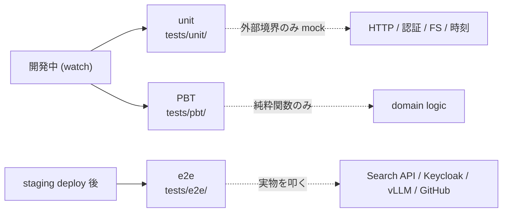
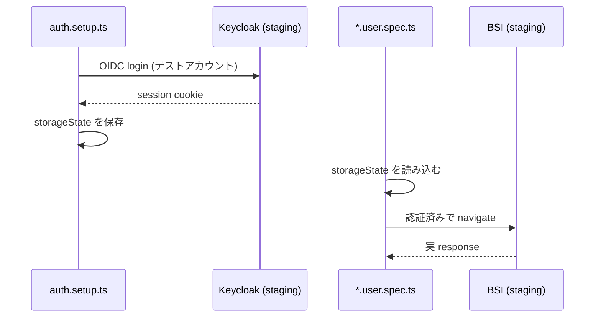

# Testing

テストの 3 階層 (unit / PBT / e2e)、 mock の境界、 テスト間の独立性、 カバレッジの位置付け。

## Overview

BSI のテストは目的の違う 3 階層を併走させる。 開発中は unit と PBT を保存ごとに回し、 deploy 後は staging 上で e2e を回す。 単一のピラミッドにせず、 「速いフィードバック」 と 「本物との接続」 を分けて維持する。



テストは 「バグを見つけるため」 に書く。 正常系を薄くなぞるだけの 「通すためのテスト」 は書かない。 境界値・エッジケース・異常系を必ず含める。

## Unit

純粋関数・component・loader / action の単体検証を、 watch モードで保存ごとに回せる速度で書く。 1 ファイル数十〜数百テストがミリ秒単位で完走する規模を保つ。

- ファイル名は `*.test.ts(x)`、 配置は対象ファイルの隣か `tests/unit/` 配下にミラー
- describe / it の入れ子は浅く保つ。 ネストで条件分岐を表現しない
- test 名は `<対象>_<条件>_<期待結果>` の形で、 読むだけで検証内容が分かるようにする
- React Router の loader / action は `createRoutesStub` で route + loader / action を組んだ状態で render する。 loader 自体を mock せず、 loader 内の HTTP を msw で境界 mock する

ツールは Vitest / @testing-library/react / msw。 msw の handler は `tests/unit/mocks/handlers.ts` に集約し、 個別 test では `server.use(...)` で override する。

## PBT

純粋関数の不変量を fast-check で網羅検証する。 example-based test を置き換えるのではなく補完する位置付けで、 同じ対象に対して両方書く。 対象は `tests/pbt/` 配下、 arbitrary は `tests/pbt/arbitraries/` に集約する。

- 「例外を投げない」 は不変量として書かない。 入出力の意味のある制約を書く
- `fc.sample` で生成例を確認し、 入力空間がドメインを覆っているかを目視する
- shrink で縮小された反例を debug の起点にする
- 実行時間が許容できれば `numRuns` を default の 100 から増やして探索幅を稼ぐ

ツールは `@fast-check/vitest`。 vitest と同じ runner で動くため、 unit と同じ watch ループに乗る。

## E2E

staging に deploy 済みの実物に対して Playwright でシナリオを貫通させる。 dev コンテナや CI では回さず、 staging 上の e2e 専用コンテナから公開 URL を叩く。

- host・project 構成・外部依存 URL の SSOT は `tests/e2e/playwright.config.ts`
- 外部境界 (Search API / Keycloak / GitHub / vLLM) を mock しない
- シナリオは実装より先に `tests/e2e/scenarios.md` に書く。 シナリオ ID 体系・ペルソナ・必須要素 (前提 / 手順 / 期待) は同ファイルが SSOT
- 設計上の制約・ハマりどころ・retry / wait 戦略は `tests/e2e/notes.md` に集約する
- ペルソナの認証状態は setup project が事前に Keycloak で取得した storage state を読み込む形で実現する

`*.user.spec.ts` の suffix は認証済みペルソナで走るシナリオ、 suffix なしは未認証シナリオを表す。



## Mock 境界

mock してよいのは BSI の外側にあるものだけ。 内部構造を mock した瞬間にテストは設計の鏡ではなくなる。

| 区分 | 対象 |
|---|---|
| mock してよい | HTTP (Search API / GitHub / vLLM) |
| mock してよい | OIDC redirect / token validation |
| mock してよい | ファイルシステム |
| mock してよい | 時刻 / 乱数 |
| mock しない | 内部関数 / module / component |
| mock しない | Zod schema / TypeScript 型 |
| mock しない | Tailwind config / CSS |
| mock しない | React Router loader / action |

内部の mock が必要に見えるなら、 テストではなく設計が悪い。 結合度を下げる側で直す。

## Isolation

テスト間で状態を共有しない。 並列実行・shuffle・shard で全件通る状態を常に保つ。

- localStorage / cookie / msw handler / module-level state を test 間で共有しない
- `vitest --shuffle` および `playwright --shard` で全件 green を維持する
- helper や fixture は vitest の collection から外すため `_helpers.ts` / `_fixtures.ts` のように `_` prefix で配置する
- 認証は e2e の storage state、 unit の `tests/unit/_helpers/` に閉じ込め、 spec 本体から直接 cookie を組み立てない

## 実行

unit と PBT は dev コンテナの中で回す。 ホストの node から直接叩かない。

```bash
docker compose exec app npm test                # unit + pbt 全実行
docker compose exec app npm run test:unit       # unit のみ
docker compose exec app npm run test:pbt        # pbt のみ
docker compose exec app npm test -- --watch     # watch モード
```

e2e は staging 上で別コンテナから回す。 起動方法・対象 host・認証 storage の更新手順は `tests/e2e/notes.md` を参照する。
